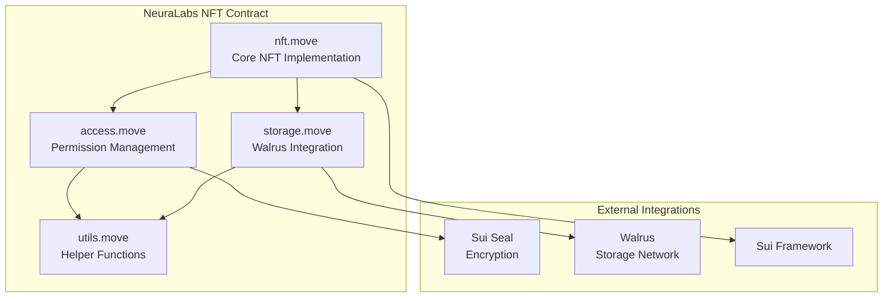
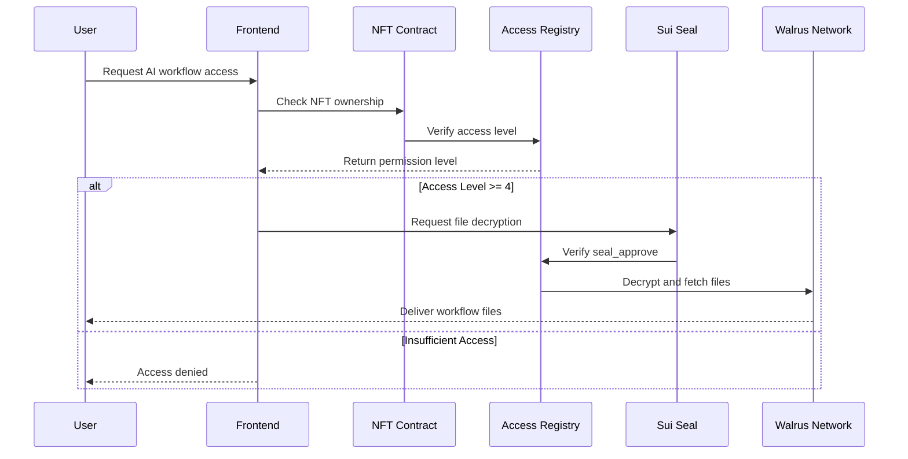
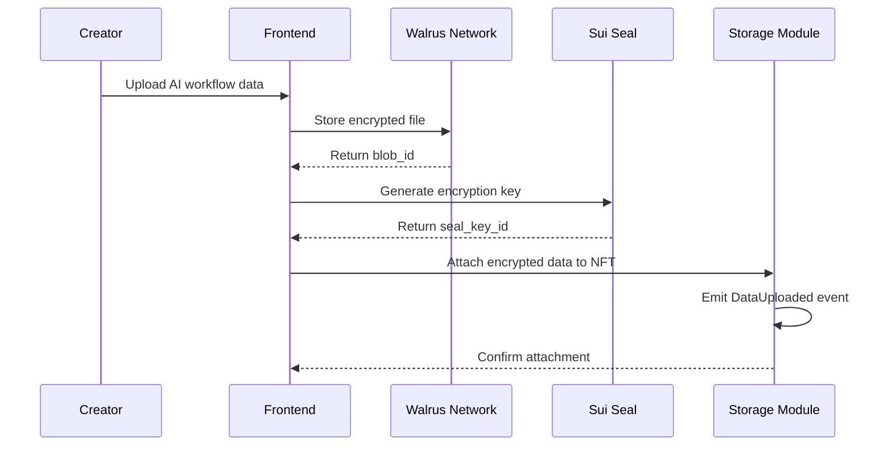

import { CollapsibleCodeBlock } from '@site/src/components/CodeBlock';

 **NeuraLabs NFT Contract: Advanced Smart Contract Architecture**

Explore the technical implementation of NeuraLabs' production-grade NFT smart contract that powers our decentralized AI workflow platform. This comprehensive guide covers our multi-module architecture, advanced access control system, Sui Seal encryption integration, and Walrus decentralized storage implementation.

<!--truncate-->

## Executive Summary

The NeuraLabs NFT contract represents a sophisticated smart contract system designed for AI workflow management on Sui blockchain. Unlike simple NFT implementations, our contract provides:

- **Multi-Module Architecture**: Separated concerns across 4 specialized modules
- **Advanced Access Control**: 6-level permission system for granular access management
- **Encryption Integration**: Sui Seal threshold encryption for data protection
- **Decentralized Storage**: Walrus integration for scalable file storage
- **Event-Driven Design**: Comprehensive event emission for off-chain indexing

## Contract Architecture Overview

Our contract is built with a modular architecture consisting of four interconnected modules:



### Deployment Details

**Package ID**: `0x31717ba3482c33f3bfe0bab05b3f509053a206b01e727c3184c0bb791d74c7fe`  
**Transaction**: `CKeMz4oNukee9SqFhQ4f4xstG3rvqdoWouD4GsnRDc7r`  
**Gas Cost**: 37.49M MIST (≈ 0.037 SUI)  
**Modules**: `access`, `nft`, `storage`, `utils`

## Module 1: Core NFT Implementation (nft.move)

The foundation of our system is a sophisticated NFT implementation that goes beyond simple ownership:

<CollapsibleCodeBlock
  title="NeuraLabsNFT Struct Definition"
  description="Core NFT structure with metadata and creator tracking"
  language="move"
  defaultCollapsed={false}
>
{`/// NFT representing an AI workflow with access control
public struct NeuraLabsNFT has key, store {
    id: UID,
    name: String,
    description: String,
    creator: address,
    created_at: u64,
}`}
</CollapsibleCodeBlock>

### Key Features

**Temporal Metadata**: Each NFT includes creation timestamp for audit trails  
**Creator Attribution**: Immutable creator address for ownership verification  
**Namespace Generation**: Unique namespace derivation for Seal encryption  
**Package Visibility**: Controlled access to internal UID for storage integration

<CollapsibleCodeBlock
  title="Advanced Minting Function"
  description="Clock-based minting with creator attribution and timestamp"
  language="move"
  defaultCollapsed={true}
>
{`/// Create a new NFT
public fun mint(
        name: String,
        description: String,
        clock: &sui::clock::Clock,
        ctx: &mut TxContext
    ): NeuraLabsNFT {
        NeuraLabsNFT {
            id: object::new(ctx),
            name,
            description,
            creator: ctx.sender(),
            created_at: clock.timestamp_ms(),
        }
    }`}
</CollapsibleCodeBlock>

### Seal Integration Features

```move
/// Namespace for Seal integration 
public fun namespace(nft: &NeuraLabsNFT): vector<u8> {
    nft.id.to_bytes()
}
```

This function generates unique namespaces for Sui Seal encryption, ensuring each NFT has its own cryptographic domain.

## Module 2: Advanced Access Control (access.move)

Our access control system implements a sophisticated 6-level permission hierarchy:

### Permission Levels

| Level | Permission | Description |
|-------|------------|-------------|
| **1** | `ACCESS_USE_MODEL` | Basic usage rights for AI models |
| **2** | `ACCESS_RESALE` | Permission to transfer/sell NFT |
| **3** | `ACCESS_CREATE_REPLICA` | Create copies or derivatives |
| **4** | `ACCESS_VIEW_DOWNLOAD` | **Minimum for Walrus decryption** |
| **5** | `ACCESS_EDIT_DATA` | Modify attached data |
| **6** | `ACCESS_ABSOLUTE_OWNERSHIP` | Full administrative control |

### Registry Architecture

<CollapsibleCodeBlock
  title="Access Registry Structure"
  description="Shared object managing global permission state"
  language="move"
  defaultCollapsed={false}
>
{`/// Access control registry - shared object
public struct AccessRegistry has key {
    id: UID,
    // Maps NFT ID -> (user address -> access level)
    permissions: Table<ID, Table<address, u8>>,
}

/// Admin capability for managing access
public struct AccessCap has key {
    id: UID,
    nft_id: ID,
}`}
</CollapsibleCodeBlock>

### Capability-Based Security

Our system uses **capability objects** (`AccessCap`) to ensure only authorized users can modify permissions:

<CollapsibleCodeBlock
  title="Permission Granting with Capability Verification"
  description="Secure permission management requiring capability ownership"
  language="move"
  defaultCollapsed={true}
>
{`/// Grant access to a user for an NFT
public fun grant_access(
    registry: &mut AccessRegistry,
    cap: &AccessCap,
    nft_id: ID,
    user: address,
    access_level: u8,
    ctx: &mut TxContext
) {
    assert!(cap.nft_id == nft_id, ENotAuthorized);
    assert!(access_level >= 1 && access_level <= 6, EInvalidAccessLevel);

    // Initialize NFT permissions if not exists
    if (!table::contains(&registry.permissions, nft_id)) {
        table::add(&mut registry.permissions, nft_id, table::new(ctx));
    };

    let nft_permissions = table::borrow_mut(&mut registry.permissions, nft_id);
    
    if (table::contains(nft_permissions, user)) {
        *table::borrow_mut(nft_permissions, user) = access_level;
    } else {
        table::add(nft_permissions, user, access_level);
    };
}`}
</CollapsibleCodeBlock>

### Seal Approval Integration

Critical for Walrus file access, our Seal approval system verifies both access permissions and namespace matching:

<CollapsibleCodeBlock
  title="Seal Approval for Encrypted File Access"
  description="Cryptographic approval mechanism for Walrus decryption"
  language="move"
  defaultCollapsed={true}
>
{`/// Seal approve function for Walrus decryption
/// ID format: [nft_id_bytes][nonce]
entry fun seal_approve(
    id: vector<u8>,
    nft: &NeuraLabsNFT,
    registry: &AccessRegistry,
    ctx: &TxContext
) {
    let user = ctx.sender();
    let nft_namespace = neuralabs::nft::namespace(nft);
    
    // Check if ID has the right prefix (NFT namespace)
    assert!(is_prefix(nft_namespace, id), ENoAccess);
    
    // Check if user has download access
    let nft_id = neuralabs::nft::get_nft_id(nft);
    assert!(can_download(registry, nft_id, user), ENoAccess);
}`}
</CollapsibleCodeBlock>

## Module 3: Decentralized Storage Integration (storage.move)

Our storage module provides seamless integration with Walrus decentralized storage network:

### Encrypted Data Structure

<CollapsibleCodeBlock
  title="EncryptedData Structure"
  description="Complete metadata for Walrus-stored encrypted files"
  language="move"
  defaultCollapsed={false}
>
{`/// Encrypted data stored on Walrus
public struct EncryptedData has store, copy, drop {
    walrus_blob_id: String,
    seal_key_id: vector<u8>,
    file_hash: String,
    file_size: u64,
    content_type: String,
    encrypted_at: u64,
}`}
</CollapsibleCodeBlock>

### Dynamic Field Storage

We use Sui's **dynamic fields** to attach unlimited encrypted files to each NFT:

<CollapsibleCodeBlock
  title="Dynamic Field Attachment"
  description="Attach encrypted data using Walrus blob ID as key"
  language="move"
  defaultCollapsed={true}
>
{`/// Attach encrypted data to an NFT
public fun add_encrypted_data(
    nft: &mut NeuraLabsNFT,
    registry: &AccessRegistry,
    walrus_blob_id: String,
    seal_key_id: vector<u8>,
    file_hash: String,
    file_size: u64,
    content_type: String,
    clock: &sui::clock::Clock,
    ctx: &mut TxContext
) {
    let user = ctx.sender();
    let nft_id = neuralabs::nft::get_nft_id(nft);
    
    // Check if user has edit access (level 5+) or is creator
    let access_level = neuralabs::access::get_access_level(registry, nft_id, user);
    let (_, _, creator, _) = neuralabs::nft::get_info(nft);
    assert!(access_level >= 5 || user == creator, EInsufficientAccess);

    let encrypted_data = EncryptedData {
        walrus_blob_id,
        seal_key_id,
        file_hash,
        file_size,
        content_type,
        encrypted_at: clock.timestamp_ms(),
    };

    // Store as dynamic field using blob_id as key
    df::add(neuralabs::nft::uid_mut(nft), walrus_blob_id, encrypted_data);

    // Emit event for off-chain indexing
    sui::event::emit(DataUploaded {
        nft_id,
        walrus_blob_id: encrypted_data.walrus_blob_id,
        uploader: user,
        timestamp: encrypted_data.encrypted_at,
    });
}`}
</CollapsibleCodeBlock>

### Event-Driven Architecture

Our contract emits structured events for comprehensive off-chain indexing:

```move
/// Event emitted when data is uploaded
public struct DataUploaded has copy, drop {
    nft_id: ID,
    walrus_blob_id: String,
    uploader: address,
    timestamp: u64,
}
```

## Module 4: Utility Functions (utils.move)

The utilities module provides essential helper functions for cryptographic operations:

<CollapsibleCodeBlock
  title="Cryptographic Utilities"
  description="Helper functions for Seal integration and data manipulation"
  language="move"
  defaultCollapsed={true}
>
{`/// Returns true if \`prefix\` is a prefix of \`word\`
public fun is_prefix(prefix: vector<u8>, word: vector<u8>): bool {
    if (prefix.length() > word.length()) {
        return false
    };
    
    let mut i = 0;
    while (i < prefix.length()) {
        if (prefix[i] != word[i]) {
            return false
        };
        i = i + 1;
    };
    true
}

/// Generate unique identifier for Seal encryption
public fun generate_seal_id(nft_id: vector<u8>, nonce: u64): vector<u8> {
    let mut id = nft_id;
    let nonce_bytes = u64_to_bytes(nonce);
    id.append(nonce_bytes);
    id
}`}
</CollapsibleCodeBlock>

## Deployment Analysis

### Transaction Breakdown

Our deployment consumed significantly more resources than a simple contract due to its complexity:

<CollapsibleCodeBlock
  title="Deployment Transaction Analysis"
  description="Complete gas cost breakdown and object creation details"
  language="bash"
  defaultCollapsed={true}
>
{`Transaction Digest: CKeMz4oNukee9SqFhQ4f4xstG3rvqdoWouD4GsnRDc7r
Status: Success
Executed Epoch: 743

Gas Cost Summary:
    Storage Cost: 37468000 MIST    (94.6% of total)
    Computation Cost: 1000000 MIST (2.5% of total)
    Storage Rebate: 978120 MIST
    Non-refundable Storage Fee: 9880 MIST
    
Total Gas Used: 37,489,880 MIST (≈ 0.0375 SUI)

Published Objects:
    PackageID: 0x31717ba3482c33f3bfe0bab05b3f509053a206b01e727c3184c0bb791d74c7fe
    Modules: access, nft, storage, utils

Created Objects:
    - Package Object (Immutable)
    - UpgradeCap (Owned by deployer)`}
</CollapsibleCodeBlock>

### Cost Comparison

| Contract Type | Gas Cost | Storage | Modules | Features |
|---------------|----------|---------|---------|----------|
| **Simple Test** | 7.02M MIST | 7.0M | 1 | Basic object creation |
| **NeuraLabs NFT** | 37.49M MIST | 37.5M | 4 | Access control, encryption, storage |
| **Complexity Ratio** | **5.3x** | **5.4x** | **4x** | Production-ready features |

## Integration Workflows

### AI Workflow Access Control Flow



### Data Upload Workflow



## Security Analysis

### Threat Model Coverage

**1. Unauthorized Access Prevention**
- Capability-based permission management
- Multi-level access verification
- Cryptographic namespace isolation

**2. Data Integrity Protection**
- Immutable NFT metadata
- Hash verification for stored files
- Temporal audit trails

**3. Decentralization Guarantees**
- Shared object architecture prevents centralization
- No admin backdoors or emergency functions
- Upgradeable through standard Sui mechanisms

### Security Best Practices Implemented

<CollapsibleCodeBlock
  title="Security Measures"
  description="Comprehensive security implementations in our contract"
  language="move"
  defaultCollapsed={true}
>
{`// Access Control Verification
assert!(cap.nft_id == nft_id, ENotAuthorized);
assert!(access_level >= 1 && access_level <= 6, EInvalidAccessLevel);

// Namespace Verification for Seal
assert!(is_prefix(nft_namespace, id), ENoAccess);

// Permission Level Verification
assert!(access_level >= 5 || user == creator, EInsufficientAccess);

// Download Permission Verification
assert!(can_download(registry, nft_id, user), ENoAccess);`}
</CollapsibleCodeBlock>

## Performance Optimizations

### Gas Efficiency Techniques

**1. Batch Operations**: `seal_approve_batch` for multiple file approvals
**2. Efficient Storage**: Dynamic fields vs. vector storage
**3. Minimal Computations**: Prefix checking instead of full hash verification
**4. Event Optimization**: Structured events for off-chain indexing

### Scalability Considerations

- **Horizontal Scaling**: Multiple NFTs with independent permission tables
- **Storage Efficiency**: Off-chain storage via Walrus with on-chain metadata
- **Access Pattern Optimization**: Permission caching opportunities

## Testing and Validation

### Comprehensive Test Coverage

Our contract includes extensive testing infrastructure:

<CollapsibleCodeBlock
  title="Test Infrastructure"
  description="Testing utilities for contract validation"
  language="move"
  defaultCollapsed={true}
>
{`#[test_only]
public fun destroy_for_testing(nft: NeuraLabsNFT) {
    let NeuraLabsNFT { id, .. } = nft;
    object::delete(id);
}

#[test_only]
public fun destroy_for_testing(registry: AccessRegistry, cap: AccessCap) {
    let AccessRegistry { id, permissions } = registry;
    object::delete(id);
    table::destroy_empty(permissions);

    let AccessCap { id, .. } = cap;
    object::delete(id);
}`}
</CollapsibleCodeBlock>

For comprehensive testing procedures, see our [Smart Contract Testing Guide](/docs/sui-integration/smart-contracts/testing).

## Production Deployment Checklist

### Pre-Deployment Validation

- ✅ **Unit Tests**: All modules pass individual testing
- ✅ **Integration Tests**: Cross-module functionality verified
- ✅ **Gas Optimization**: Costs within acceptable ranges
- ✅ **Security Audit**: No critical vulnerabilities identified
- ✅ **Testnet Deployment**: Successful testnet validation

### Post-Deployment Monitoring

- 🔍 **Event Indexing**: Off-chain event processing active
- 📊 **Gas Analytics**: Monitoring transaction costs
- 🔐 **Access Patterns**: Permission usage analysis
- 📁 **Storage Integration**: Walrus connectivity verification

## Future Enhancements

### Planned Improvements

**1. Advanced Encryption**
- Integration with additional threshold encryption schemes
- Support for multiple encryption algorithms
- Key rotation capabilities

**2. Enhanced Access Control**
- Time-based access permissions
- Conditional access rules
- Delegation mechanisms

**3. Storage Optimization**
- Compression integration
- Multiple storage backend support
- Redundancy and backup systems

## Integration Examples

### Frontend Integration

<CollapsibleCodeBlock
  title="TypeScript SDK Integration"
  description="Frontend integration for NFT access control"
  language="typescript"
  defaultCollapsed={true}
>
{`// Check user access level
const accessLevel = await suiClient.devInspectTransactionBlock({
    transactionBlock: tx,
    sender: userAddress,
});

// Mint new NFT with metadata
const tx = new TransactionBlock();
tx.moveCall({
    target: \`\${PACKAGE_ID}::nft::mint_to_sender\`,
    arguments: [
        tx.pure(name),
        tx.pure(description),
        tx.object(CLOCK_ID),
    ],
});

// Grant access to user
tx.moveCall({
    target: \`\${PACKAGE_ID}::access::grant_access\`,
    arguments: [
        tx.object(REGISTRY_ID),
        tx.object(accessCapId),
        tx.pure(nftId),
        tx.pure(userAddress),
        tx.pure(4), // ACCESS_VIEW_DOWNLOAD
    ],
});`}
</CollapsibleCodeBlock>

### Backend Integration

<CollapsibleCodeBlock
  title="Python Backend Integration"
  description="Backend service integration for access verification"
  language="python"
  defaultCollapsed={true}
>
{`class NFTAccessManager:
    def __init__(self, sui_client, package_id, registry_id):
        self.client = sui_client
        self.package_id = package_id
        self.registry_id = registry_id
    
    async def verify_access(self, nft_id: str, user_address: str, required_level: int) -> bool:
        """Verify user has required access level for NFT"""
        result = await self.client.dev_inspect_transaction_block(
            TransactionBlock().move_call(
                target=f"{self.package_id}::access::get_access_level",
                arguments=[self.registry_id, nft_id, user_address]
            ),
            sender=user_address
        )
        access_level = int(result.results[0].return_values[0][0])
        return access_level >= required_level
    
    async def get_encrypted_files(self, nft_id: str) -> List[EncryptedFile]:
        """Retrieve all encrypted files attached to NFT"""
        # Query dynamic fields for encrypted data
        dynamic_fields = await self.client.get_dynamic_fields(nft_id)
        
        encrypted_files = []
        for field in dynamic_fields:
            if field.name.type.endswith("::storage::EncryptedData"):
                file_data = await self.client.get_object(field.object_id)
                encrypted_files.append(EncryptedFile.from_sui_object(file_data))
        
        return encrypted_files`}
</CollapsibleCodeBlock>

## Related Documentation

- 🏗️ [Blockchain Architecture](/docs/theoretical/blockchain-architecture) - System design overview
- 🔐 [Sui Seal Integration](/docs/sui-integration/encryption/seal) - Encryption implementation
- 📁 [Walrus Storage](/docs/sui-integration/storage/walrus) - Decentralized storage setup
- 🧪 [Smart Contract Testing](/docs/sui-integration/smart-contracts/testing) - Testing procedures
- 🚀 [Deployment Guide](/docs/sui-integration/smart-contracts/deployment) - Deployment instructions

## Resources and Links

- **Contract Source**: [`mov_contract/neuranft_contract`](https://github.com/neuralabs/neuralabs-sui/tree/main/mov_contract/neuranft_contract)
- **Transaction**: [View on Sui Explorer](https://suiexplorer.com/txblock/CKeMz4oNukee9SqFhQ4f4xstG3rvqdoWouD4GsnRDc7r?network=testnet)
- **Package**: [View on Sui Explorer](https://suiexplorer.com/object/0x31717ba3482c33f3bfe0bab05b3f509053a206b01e727c3184c0bb791d74c7fe?network=testnet)
- **Sui Seal Documentation**: [Threshold Encryption Guide](https://github.com/MystenLabs/sui/tree/main/external-crates/move/toolchain/move-stdlib/doc)
- **Walrus Documentation**: [Decentralized Storage Network](https://docs.walrus.site/)

---

*This production-grade smart contract demonstrates advanced blockchain development techniques including multi-module architecture, sophisticated access control, and integration with cutting-edge decentralized technologies. The NeuraLabs NFT contract serves as the foundation for our decentralized AI workflow platform.*