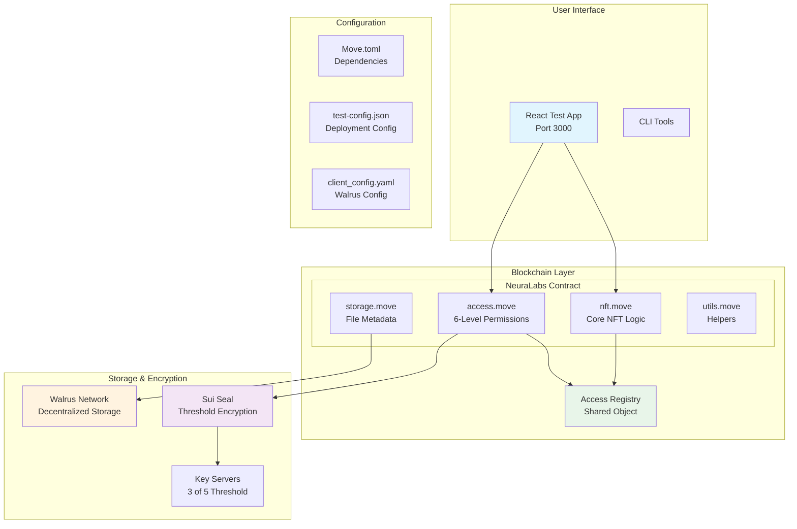
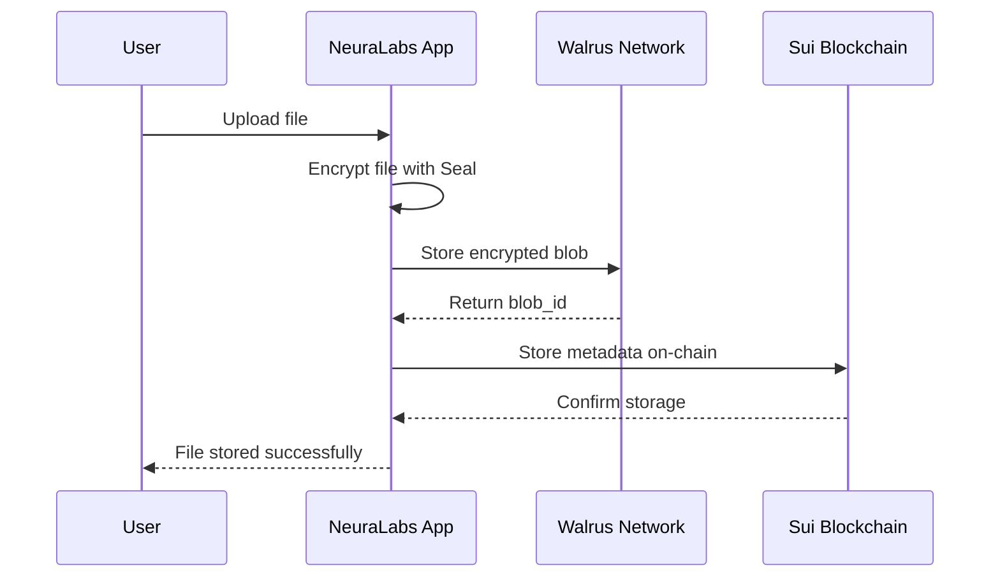
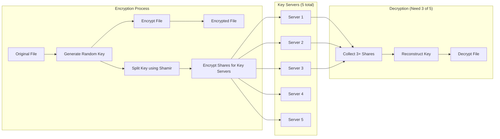

import { CollapsibleCodeBlock, InlineCodeCard } from '@site/src/components/CodeBlock';
import { Callout } from '@site/src/components/Callout';

 **Complete Guide: Building & Deploying NeuraLabs NFT Smart Contract**

This comprehensive guide walks you through every step of building, deploying, and integrating the NeuraLabs NFT smart contract on Sui blockchain. We'll cover Walrus decentralized storage integration, Sui Seal threshold encryption, and provide detailed configuration instructions perfect for developers new to Sui.

<!--truncate-->

## Table of Contents

1. [Overview & Architecture](#overview--architecture)
2. [Environment Setup](#environment-setup)
3. [Understanding the Smart Contract](#understanding-the-smart-contract)
4. [Building the Contract](#building-the-contract)
5. [Deployment Process](#deployment-process)
6. [Walrus Integration](#walrus-integration)
7. [Seal Encryption Integration](#seal-encryption-integration)
8. [Testing with GUI](#testing-with-gui)
9. [Configuration Files Explained](#configuration-files-explained)
10. [Troubleshooting & Tips](#troubleshooting--tips)

## Overview & Architecture

### System Architecture Diagram

### What We're Building

The NeuraLabs NFT contract is a production-grade smart contract system that provides:

- **NFT-based Access Control**: 6-level permission system for AI workflows
- **Encrypted File Storage**: Integration with Walrus for decentralized storage
- **Threshold Encryption**: Sui Seal integration for secure data access
- **Dynamic Metadata**: Attach multiple encrypted files to each NFT

## Environment Setup

<Callout type="info">
This guide assumes you're starting from scratch. We'll install everything needed step by step.
</Callout>

### Step 1: Install Prerequisites

<CollapsibleCodeBlock
  title="Install Rust and Cargo"
  description="Required for building Sui and Move contracts"
  language="bash"
  defaultCollapsed={false}
>
{`# Install Rust (if not already installed)
curl --proto '=https' --tlsv1.2 -sSf https://sh.rustup.rs | sh
source $HOME/.cargo/env

# Verify installation
rustc --version
cargo --version`}
</CollapsibleCodeBlock>

### Step 2: Install Sui CLI

<CollapsibleCodeBlock
  title="Install Sui CLI for Your Platform"
  description="Choose the installation method for your operating system"
  language="bash"
  defaultCollapsed={false}
>
{`# For macOS (using Homebrew)
brew install sui

# For Linux/WSL2 (from source)
cargo install --locked --git https://github.com/MystenLabs/sui.git --branch testnet sui

# For Ubuntu/Debian (pre-built binary)
wget -O sui https://github.com/MystenLabs/sui/releases/download/testnet-v1.35.0/sui-x86_64-unknown-linux-gnu
chmod +x sui
sudo mv sui /usr/local/bin/

# Verify installation
sui --version`}
</CollapsibleCodeBlock>

### Step 3: Setup Sui Wallet

<CollapsibleCodeBlock
  title="Create and Fund Your Sui Wallet"
  description="Create a new wallet and get test SUI tokens"
  language="bash"
  defaultCollapsed={false}
>
{`# Create a new Sui address
sui client new-address ed25519

# Switch to testnet
sui client new-env --alias testnet --rpc https://fullnode.testnet.sui.io:443
sui client switch --env testnet

# Check your address
sui client active-address

# Get test SUI from faucet
curl --location --request POST 'https://faucet.testnet.sui.io/gas' \
--header 'Content-Type: application/json' \
--data-raw '{
    "FixedAmountRequest": {
        "recipient": "<YOUR_SUI_ADDRESS>"
    }
}'

# Verify balance (should show 1 SUI = 1,000,000,000 MIST)
sui client gas`}
</CollapsibleCodeBlock>

### Step 4: Install Python Environment

<CollapsibleCodeBlock
  title="Setup Python with Conda"
  description="Create isolated Python environment for scripts"
  language="bash"
  defaultCollapsed={true}
>
{`# Install Miniconda (if not installed)
wget https://repo.anaconda.com/miniconda/Miniconda3-latest-Linux-x86_64.sh
bash Miniconda3-latest-Linux-x86_64.sh -b -p $HOME/miniconda3
export PATH="$HOME/miniconda3/bin:$PATH"

# Create conda environment
conda create -n neuralabs-exec python=3.12 -y
conda activate neuralabs-exec

# Install required packages
pip install pysui python-dotenv aiohttp`}
</CollapsibleCodeBlock>

### Step 5: Install Node.js and npm

<CollapsibleCodeBlock
  title="Setup Node.js for GUI Testing"
  description="Required for running the React test application"
  language="bash"
  defaultCollapsed={true}
>
{`# Install Node.js 18+ (using NodeSource)
curl -fsSL https://deb.nodesource.com/setup_18.x | sudo -E bash -
sudo apt-get install -y nodejs

# Verify installation
node --version  # Should be 18.x or higher
npm --version   # Should be 9.x or higher`}
</CollapsibleCodeBlock>

## Understanding the Smart Contract

### Contract Structure Explained

The NeuraLabs contract consists of four interconnected Move modules:

#### 1. **nft.move** - Core NFT Module

<CollapsibleCodeBlock
  title="NFT Module Structure"
  description="Core NFT implementation with metadata and ownership"
  language="move"
  defaultCollapsed={false}
>
{`module neuralabs::nft {
    use sui::object::{Self, UID, ID};
    use sui::transfer;
    use sui::tx_context::{Self, TxContext};
    use sui::clock::{Self, Clock};
    use std::string::String;

    /// The NFT struct that represents an AI workflow
    public struct NeuraLabsNFT has key, store {
        id: UID,                // Unique identifier
        name: String,           // NFT name
        description: String,    // NFT description
        creator: address,       // Original creator
        created_at: u64,       // Timestamp of creation
    }

    /// Create a new NFT
    public fun mint(
        name: String,
        description: String,
        clock: &Clock,
        ctx: &mut TxContext
    ): NeuraLabsNFT {
        NeuraLabsNFT {
            id: object::new(ctx),
            name,
            description,
            creator: tx_context::sender(ctx),
            created_at: clock::timestamp_ms(clock),
        }
    }

    /// Generate namespace for Seal encryption
    public fun namespace(nft: &NeuraLabsNFT): vector<u8> {
        object::id_to_bytes(&nft.id)
    }
}`}
</CollapsibleCodeBlock>

#### 2. **access.move** - Permission Management

This module implements a sophisticated 6-level permission system:

| Level | Constant Name | Permission | Description |
|-------|--------------|------------|-------------|
| 1 | `ACCESS_USE_MODEL` | Use AI Model | Basic usage rights |
| 2 | `ACCESS_RESALE` | Resell NFT | Transfer ownership |
| 3 | `ACCESS_CREATE_REPLICA` | Create Copy | Make derivatives |
| 4 | `ACCESS_VIEW_DOWNLOAD` | Download Files | **Required for Walrus decryption** |
| 5 | `ACCESS_EDIT_DATA` | Edit Data | Modify attached files |
| 6 | `ACCESS_ABSOLUTE_OWNERSHIP` | Full Control | Admin access |

<Callout type="warning">
Level 4 (`ACCESS_VIEW_DOWNLOAD`) is the minimum required for decrypting files stored on Walrus!
</Callout>

#### 3. **storage.move** - Walrus Integration

<CollapsibleCodeBlock
  title="Storage Module - Walrus Integration"
  description="Manages encrypted file metadata stored on Walrus"
  language="move"
  defaultCollapsed={true}
>
{`module neuralabs::storage {
    /// Metadata for files stored on Walrus
    public struct EncryptedData has store, copy, drop {
        walrus_blob_id: String,      // Walrus storage identifier
        seal_key_id: vector<u8>,     // Seal encryption key ID
        file_hash: String,           // SHA-256 hash of original file
        file_size: u64,              // File size in bytes
        content_type: String,        // MIME type (e.g., "application/pdf")
        encrypted_at: u64,           // Timestamp of encryption
    }

    /// Attach encrypted file to NFT
    public fun upload_encrypted_data(
        nft: &mut NeuraLabsNFT,
        registry: &AccessRegistry,
        walrus_blob_id: String,
        seal_key_id: vector<u8>,
        file_hash: String,
        file_size: u64,
        content_type: String,
        clock: &Clock,
        ctx: &mut TxContext
    ) {
        // Verify user has edit permissions (level 5+)
        // Store as dynamic field on NFT
        // Emit event for indexing
    }
}`}
</CollapsibleCodeBlock>

#### 4. **utils.move** - Helper Functions

Contains utility functions for:
- Prefix checking for Seal ID validation
- Byte array conversions
- ID generation for encryption

### Move.toml Configuration

<CollapsibleCodeBlock
  title="Move.toml - Package Configuration"
  description="Complete Move.toml file with all settings explained"
  language="toml"
  defaultCollapsed={false}
>
{`[package]
name = "neuralabs"              # Package name
version = "0.0.1"               # Semantic version
edition = "2024.beta"           # Move edition

[dependencies]
# Sui framework dependency
Sui = { git = "https://github.com/MystenLabs/sui.git", subdir = "crates/sui-framework/packages/sui-framework", rev = "framework/testnet" }

[addresses]
neuralabs = "0x0"               # Placeholder, replaced during publish

[dev-dependencies]
# Additional dependencies for testing

[dev-addresses]
# Test addresses for development`}
</CollapsibleCodeBlock>

### Key Configuration Values Explained

1. **Package Name**: Must match module declarations
2. **Edition**: Use `2024.beta` for latest Move features
3. **Dependencies**: Always use testnet revision for testnet deployment
4. **Addresses**: Start with `0x0`, gets replaced with actual address after deployment

## Building the Contract

### Step 1: Clone and Navigate to Contract

<InlineCodeCard
  title="Navigate to Contract Directory"
  description="Change to the contract directory"
  language="bash"
  code={`cd mov_contract/neuranft_contract`}
/>

### Step 2: Build the Contract

<CollapsibleCodeBlock
  title="Build Process with Detailed Output"
  description="Build the Move package and understand the output"
  language="bash"
  defaultCollapsed={false}
>
{`# Build the contract
sui move build

# Expected output:
INCLUDING DEPENDENCY Sui
INCLUDING DEPENDENCY MoveStdlib
BUILDING neuralabs
Total number of dependencies: 2
Updating manifest with new dependencies

# What happens during build:
# 1. Downloads Sui framework dependencies
# 2. Compiles all .move files in sources/
# 3. Generates bytecode in build/neuralabs/bytecode_modules/
# 4. Creates build/neuralabs/BuildInfo.yaml with metadata

# Verify build artifacts
ls -la build/neuralabs/bytecode_modules/
# Should show: access.mv, nft.mv, storage.mv, utils.mv`}
</CollapsibleCodeBlock>

### Step 3: Run Tests

<CollapsibleCodeBlock
  title="Run Move Unit Tests"
  description="Execute all tests to ensure contract correctness"
  language="bash"
  defaultCollapsed={true}
>
{`# Run all tests
sui move test

# Run specific test
sui move test --filter test_access_control

# Run with gas profiling
sui move test --gas-report

# Expected output:
Running Move unit tests
[ PASS    ] neuralabs::access_tests::test_grant_access
[ PASS    ] neuralabs::nft_tests::test_mint_nft
[ PASS    ] neuralabs::storage_tests::test_upload_data
Test result: OK. Total tests: 3; passed: 3`}
</CollapsibleCodeBlock>

## Deployment Process

### Step 1: Prepare for Deployment

<CollapsibleCodeBlock
  title="Pre-deployment Checklist"
  description="Ensure everything is ready before deployment"
  language="bash"
  defaultCollapsed={false}
>
{`# 1. Check wallet balance (need at least 0.1 SUI)
sui client gas

# 2. Verify correct network
sui client active-env
# Should show: testnet

# 3. Check current address
sui client active-address

# 4. Estimate gas cost
sui move build --skip-fetch-latest-git-deps
# Check build size in build/neuralabs/`}
</CollapsibleCodeBlock>

### Step 2: Deploy the Contract

<CollapsibleCodeBlock
  title="Deploy Contract to Testnet"
  description="Publish the contract and save important addresses"
  language="bash"
  defaultCollapsed={false}
>
{`# Deploy with sufficient gas budget
sui client publish --gas-budget 100000000

# IMPORTANT: Save the output! You'll see something like:

╭─────────────────────────────────────────────────────────────────────╮
│ Object Changes                                                      │
├─────────────────────────────────────────────────────────────────────┤
│ Created Objects:                                                    │
│  ┌──                                                                │
│  │ ObjectID: 0x65306f2042f8359...                                  │
│  │ Owner: Account Address ( 0x1234... )                            │
│  │ ObjectType: 0x2::package::UpgradeCap                           │
│  │ Version: 1                                                      │
│  └──                                                                │
│ Published Objects:                                                  │
│  ┌──                                                                │
│  │ PackageID: 0x31717ba3482c33f3bfe0bab05b3f509053a206b0...       │
│  │ Version: 1                                                      │
│  │ Digest: CKeMz4oNukee9SqFhQ4f4xstG3rvqdoWouD4GsnRDc7r         │
│  │ Modules: access, nft, storage, utils                           │
│  └──                                                                │
╰─────────────────────────────────────────────────────────────────────╯

# Save the PackageID! You'll need it for all interactions`}
</CollapsibleCodeBlock>

### Step 3: Initialize Access Registry

<CollapsibleCodeBlock
  title="Create the Shared Access Registry"
  description="Initialize the global permission registry"
  language="bash"
  defaultCollapsed={false}
>
{`# Replace PACKAGE_ID with your deployed package ID
export PACKAGE_ID=0x31717ba3482c33f3bfe0bab05b3f509053a206b0...

# Initialize registry using Sui CLI
sui client call \
  --package $PACKAGE_ID \
  --module access \
  --function init_registry \
  --gas-budget 10000000

# Or use the Python initialization script
cd mov_contract/scripts
python initialize.py

# Save the Registry object ID from output!
export REGISTRY_ID=0xb01b33f8038a78532a946b3d9093616cf050f23f...`}
</CollapsibleCodeBlock>

### Step 4: Save Deployment Configuration

<CollapsibleCodeBlock
  title="Create deployment-config.json"
  description="Save all deployment information for future reference"
  language="json"
  defaultCollapsed={true}
>
{`{
  "network": "testnet",
  "package_id": "0x31717ba3482c33f3bfe0bab05b3f509053a206b0...",
  "registry_id": "0xb01b33f8038a78532a946b3d9093616cf050f23f...",
  "upgrade_cap_id": "0x65306f2042f8359...",
  "deployer": "0x1234...",
  "deployment_digest": "CKeMz4oNukee9SqFhQ4f4xstG3rvqdoWouD4GsnRDc7r",
  "deployment_epoch": 743,
  "deployment_timestamp": "2024-05-24T10:30:00Z",
  "modules": ["access", "nft", "storage", "utils"],
  "gas_used": {
    "storage_cost": 37468000,
    "computation_cost": 1000000,
    "total_mist": 37489880
  }
}`}
</CollapsibleCodeBlock>

## Walrus Integration

### Understanding Walrus Storage

Walrus is a decentralized storage network that works perfectly with Sui blockchain:

### Walrus Configuration

<CollapsibleCodeBlock
  title="Configure Walrus Client"
  description="Setup Walrus client configuration file"
  language="yaml"
  defaultCollapsed={false}
>
{`# Create ~/.config/walrus/client_config.yaml
system_object: 0x3074353313b5c9a8f41996a8a046f636d8d9a5aca23fda31a69f3535bb1a0480
staking_object: 0x1848d55e18aeb3e94662b45200b6d88b45e65d96de0f2dd3fd14c7ffc90d60f6
exchange_object: 0x0b90393df449f5b65a0d9540e18d4fa0456b0c5dd2c30eab5b6b9c8098b08bbc

# Testnet configuration
rpc_url: https://fullnode.testnet.sui.io:443
wallet_path: ~/.sui/sui_config/sui.keystore

# Walrus endpoints
aggregator_url: https://testnet-agg.walrus.site
publisher_url: https://testnet-pub.walrus.site
cache_url: https://testnet-cache.walrus.site

# Storage settings
default_epochs: 5           # How long to store files
max_blob_size: 10485760    # 10MB default limit`}
</CollapsibleCodeBlock>

### Installing Walrus CLI

<CollapsibleCodeBlock
  title="Install Walrus Binary"
  description="Download and setup Walrus command-line tool"
  language="bash"
  defaultCollapsed={false}
>
{`# Download Walrus binary for your platform
# For Ubuntu/Linux
wget https://bin.walrus.site/walrus-testnet-latest-ubuntu-x86_64
chmod +x walrus-testnet-latest-ubuntu-x86_64
sudo mv walrus-testnet-latest-ubuntu-x86_64 /usr/local/bin/walrus

# For macOS (Intel)
wget https://bin.walrus.site/walrus-testnet-latest-macos-x86_64
chmod +x walrus-testnet-latest-macos-x86_64
sudo mv walrus-testnet-latest-macos-x86_64 /usr/local/bin/walrus

# Verify installation
walrus --version

# Get testnet WAL tokens
walrus get-wal

# Check your WAL balance
walrus wallet status`}
</CollapsibleCodeBlock>

### Storing Files on Walrus

<CollapsibleCodeBlock
  title="Upload Files to Walrus"
  description="Store encrypted files on Walrus network"
  language="bash"
  defaultCollapsed={true}
>
{`# Store a file for 5 epochs
walrus store myfile.pdf --epochs 5

# Output:
Blob ID: 4BKcDC0Ih5RJ8R0tFMz3MZVR1pv4po3sTj1ii8cPdBs
Stored until epoch: 123
Storage cost: 0.5 WAL
Available at: https://testnet-cache.walrus.site/4BKcDC0Ih5RJ8R0tFMz3MZVR1pv4po3sTj1ii8cPdBs

# Store with encryption (using Seal)
# This happens automatically in the NeuraLabs app

# Delete a blob (if supported by API)
walrus delete 4BKcDC0Ih5RJ8R0tFMz3MZVR1pv4po3sTj1ii8cPdBs`}
</CollapsibleCodeBlock>

### Walrus Technical Details

<Callout type="info">
**How Walrus Works:**
- Uses erasure coding (Red Stuff algorithm) for redundancy
- Splits files into shards distributed across storage nodes
- Only needs 4-5x replication (vs 100x for traditional blockchains)
- Metadata stored on Sui, actual data on Walrus nodes
- Supports files up to 10GB on testnet
</Callout>

## Seal Encryption Integration

### Understanding Sui Seal

Sui Seal provides threshold encryption for secure data sharing:

### Seal Encryption Algorithms

<CollapsibleCodeBlock
  title="Encryption Algorithms Used by Seal"
  description="Technical details of cryptographic algorithms"
  language="text"
  defaultCollapsed={false}
>
{`1. Identity-Based Encryption (IBE):
   - Algorithm: Boneh-Franklin over BLS12-381 curve
   - Key Generation: H(identity)^masterSecret
   - Pairing-based cryptography for key derivation

2. Symmetric Encryption (DEM):
   - Default: AES-256-GCM for standard encryption
   - On-chain: HMAC-SHA3-256 CTR mode (Move compatible)
   - Block size: 32 bytes
   - MAC validation for authenticated encryption

3. Secret Sharing:
   - Algorithm: Shamir's Secret Sharing
   - Field: GF(2^8) - same as AES
   - Polynomial degree: threshold - 1
   - Lagrange interpolation for reconstruction

4. Key Derivation:
   - Function: HKDF-SHA3-256
   - Input: GT element from pairing + nonce + identity
   - Output: 32-byte symmetric key`}
</CollapsibleCodeBlock>

### Three Requirements for Seal

<Callout type="warning">
**Critical Requirements for Using Seal:**

1. **Deploy Access Control Contract** - Must implement `seal_approve` function
2. **Select Trusted Key Servers** - Choose at least 3 of 5 for threshold
3. **Design Identity Format** - Structure: `[package_id][nft_id][nonce]`
</Callout>

### Seal Integration Code

<CollapsibleCodeBlock
  title="Seal Approval Implementation"
  description="How NeuraLabs implements Seal access control"
  language="move"
  defaultCollapsed={false}
>
{`/// Seal approval function in access.move
entry fun seal_approve(
    id: vector<u8>,           // Identity requesting decryption
    nft: &NeuraLabsNFT,       // NFT containing encrypted data
    registry: &AccessRegistry, // Permission registry
    ctx: &TxContext
) {
    let user = tx_context::sender(ctx);
    let nft_namespace = neuralabs::nft::namespace(nft);
    
    // Verify identity format: [nft_id_bytes][nonce]
    assert!(
        neuralabs::utils::is_prefix(nft_namespace, id), 
        ENoAccess
    );
    
    // Check user has download permission (level 4+)
    let nft_id = neuralabs::nft::get_nft_id(nft);
    assert!(
        can_download(registry, nft_id, user), 
        ENoAccess
    );
    
    // If we reach here, decryption is approved
}`}
</CollapsibleCodeBlock>

### Checking Seal Components

<CollapsibleCodeBlock
  title="Verify Seal Components"
  description="How to check individual Seal encryption components"
  language="typescript"
  defaultCollapsed={true}
>
{`// 1. Check Key Server Health
async function checkKeyServers() {
    const keyServers = [
        "https://seal-key-server-1.com",
        "https://seal-key-server-2.com",
        "https://seal-key-server-3.com",
        "https://seal-key-server-4.com",
        "https://seal-key-server-5.com"
    ];
    
    for (const server of keyServers) {
        try {
            const response = await fetch(\`\${server}/health\`);
            console.log(\`\${server}: \${response.ok ? 'UP' : 'DOWN'}\`);
        } catch (e) {
            console.log(\`\${server}: DOWN\`);
        }
    }
}

// 2. Verify Encryption Setup
function verifyEncryption(nftId: string, nonce: number) {
    // Generate identity
    const identity = new Uint8Array([
        ...hexToBytes(nftId),
        ...numberToBytes(nonce, 8)
    ]);
    
    // Check identity format
    console.log("Identity length:", identity.length);
    console.log("NFT ID portion:", identity.slice(0, 32));
    console.log("Nonce portion:", identity.slice(32));
    
    return identity;
}

// 3. Test Threshold Decryption
async function testDecryption(encryptedData, keyServers) {
    const threshold = 3;
    const responses = [];
    
    // Request from all servers
    for (const server of keyServers) {
        try {
            const response = await requestDerivedKey(server, identity);
            responses.push(response);
        } catch (e) {
            console.log(\`Server \${server} failed\`);
        }
    }
    
    // Need at least threshold responses
    if (responses.length >= threshold) {
        const key = reconstructSecret(responses.slice(0, threshold));
        return decrypt(encryptedData, key);
    }
    
    throw new Error("Not enough key shares");
}`}
</CollapsibleCodeBlock>

## Testing with GUI

### Setting Up the Test Application

<CollapsibleCodeBlock
  title="Setup React Test Application"
  description="Install and configure the testing GUI"
  language="bash"
  defaultCollapsed={false}
>
{`# Navigate to test app
cd mov_contract/test-app

# Install dependencies
npm install

# Create environment file
cat > .env << EOF
VITE_PACKAGE_ID=0x31717ba3482c33f3bfe0bab05b3f509053a206b0...
VITE_COLLECTION_ID=0xb01b33f8038a78532a946b3d9093616cf050f23f...
VITE_SUI_NETWORK=testnet
VITE_WALRUS_ENDPOINT=https://testnet-agg.walrus.site
EOF

# Start the application
npm start

# Access at http://localhost:3000`}
</CollapsibleCodeBlock>

### GUI Components Overview

The test application provides these interfaces:

1. **Contract Info Tab**
   - Displays deployed contract addresses
   - Shows current configuration
   - Network connection status

2. **NFT Manager Tab**
   - Create new NFTs
   - View owned NFTs
   - Transfer NFTs

3. **Access Control Tab**
   - Grant permissions (6 levels)
   - Revoke access
   - View current permissions

4. **Seal Encryption Tab**
   - Encrypt files with threshold encryption
   - Select key servers
   - Test decryption

5. **Walrus Storage Tab**
   - Upload encrypted files
   - View stored files
   - Download with proper permissions

### Testing Workflow

<CollapsibleCodeBlock
  title="Complete Testing Workflow"
  description="Step-by-step testing procedure using the GUI"
  language="text"
  defaultCollapsed={false}
>
{`1. Connect Wallet
   - Click "Connect Wallet" button
   - Select Sui Wallet or Suiet
   - Approve connection

2. Create an NFT
   - Go to NFT Manager tab
   - Enter name: "My AI Workflow"
   - Enter description: "Test workflow for GPT-4 integration"
   - Click "Create NFT"
   - Confirm transaction in wallet

3. Set Access Permissions
   - Go to Access Control tab
   - Select your NFT from dropdown
   - Enter user address to grant access to
   - Select Level 4 (VIEW_DOWNLOAD) or higher
   - Click "Grant Access"

4. Encrypt and Upload File
   - Go to Seal Encryption tab
   - Select file to encrypt
   - Choose 3 of 5 threshold
   - Select key servers (at least 5)
   - Click "Encrypt File"
   
5. Store on Walrus
   - Go to Walrus Storage tab
   - Select encrypted file
   - Set storage duration (epochs)
   - Click "Upload to Walrus"
   - Save the blob ID

6. Test Decryption
   - Switch to different wallet with access
   - Go to Walrus Storage tab
   - Enter blob ID
   - Click "Download and Decrypt"
   - Verify file downloads correctly`}
</CollapsibleCodeBlock>

### GUI Configuration Files

<CollapsibleCodeBlock
  title="App Configuration in React"
  description="Configuration object in the React app"
  language="javascript"
  defaultCollapsed={true}
>
{`// src/App.jsx configuration
const CONFIG = {
    PACKAGE_ID: import.meta.env.VITE_PACKAGE_ID,
    REGISTRY_ID: import.meta.env.VITE_COLLECTION_ID,
    SUI_NETWORK: import.meta.env.VITE_SUI_NETWORK,
    
    // Seal key servers
    KEY_SERVERS: [
        {
            url: "https://seal-testnet-1.mystenlabs.com",
            publicKey: "0x..."
        },
        {
            url: "https://seal-testnet-2.mystenlabs.com", 
            publicKey: "0x..."
        },
        // ... more servers
    ],
    
    // Walrus configuration
    WALRUS: {
        aggregator: "https://testnet-agg.walrus.site",
        publisher: "https://testnet-pub.walrus.site",
        cache: "https://testnet-cache.walrus.site",
        defaultEpochs: 5,
        maxFileSize: 10 * 1024 * 1024, // 10MB
    },
    
    // Access level mappings
    ACCESS_LEVELS: {
        1: "Use Model",
        2: "Resale",
        3: "Create Replica",
        4: "View/Download",
        5: "Edit Data",
        6: "Absolute Ownership"
    }
};`}
</CollapsibleCodeBlock>

## Configuration Files Explained

### 1. Move.toml (Contract Configuration)

<CollapsibleCodeBlock
  title="Complete Move.toml Reference"
  description="All possible configurations in Move.toml"
  language="toml"
  defaultCollapsed={false}
>
{`[package]
name = "neuralabs"                    # Must match module names
version = "0.0.1"                     # Semantic versioning
edition = "2024.beta"                 # Move language edition
license = "Apache-2.0"                # Optional: license
authors = ["team@neuralabs.ai"]      # Optional: authors

[dependencies]
# Framework dependencies
Sui = { git = "https://github.com/MystenLabs/sui.git", subdir = "crates/sui-framework/packages/sui-framework", rev = "framework/testnet" }

# Custom dependencies (example)
# SealFramework = { git = "https://github.com/MystenLabs/seal.git", rev = "main" }

[addresses]
neuralabs = "0x0"                     # Replaced during publish
std = "0x1"                           # Standard library
sui = "0x2"                           # Sui framework

[dev-dependencies]
# Test-only dependencies

[dev-addresses]
# Test addresses`}
</CollapsibleCodeBlock>

### 2. test-config.json (Testing Configuration)

<CollapsibleCodeBlock
  title="Test Configuration Structure"
  description="Complete test configuration for all components"
  language="json"
  defaultCollapsed={false}
>
{`{
  "network": {
    "type": "testnet",
    "rpc": "https://fullnode.testnet.sui.io:443",
    "ws": "wss://fullnode.testnet.sui.io:443"
  },
  
  "contracts": {
    "package_id": "0x31717ba3482c33f3bfe0bab05b3f509053a206b0...",
    "registry_id": "0xb01b33f8038a78532a946b3d9093616cf050f23f...",
    "modules": {
      "nft": "neuralabs::nft",
      "access": "neuralabs::access",
      "storage": "neuralabs::storage",
      "utils": "neuralabs::utils"
    }
  },
  
  "walrus": {
    "aggregator": "https://testnet-agg.walrus.site",
    "publisher": "https://testnet-pub.walrus.site", 
    "cache": "https://testnet-cache.walrus.site",
    "system_object": "0x3074353313b5c9a8f41996a8a046f636d8d9a5aca23fda31a69f3535bb1a0480",
    "staking_object": "0x1848d55e18aeb3e94662b45200b6d88b45e65d96de0f2dd3fd14c7ffc90d60f6"
  },
  
  "seal": {
    "threshold": 3,
    "total_servers": 5,
    "servers": [
      {
        "name": "Testnet Server 1",
        "url": "https://seal-testnet-1.mystenlabs.com",
        "public_key": "0x...",
        "weight": 1
      }
      // ... more servers
    ]
  },
  
  "test_accounts": [
    {
      "name": "Alice",
      "address": "0x...",
      "key": "base64_encoded_key"
    }
  ],
  
  "gas_budget": {
    "default": 10000000,
    "publish": 100000000,
    "mint_nft": 5000000
  }
}`}
</CollapsibleCodeBlock>

### 3. Walrus Client Configuration

<CollapsibleCodeBlock
  title="Walrus client_config.yaml"
  description="Complete Walrus client configuration"
  language="yaml"
  defaultCollapsed={true}
>
{`# ~/.config/walrus/client_config.yaml

# System objects (from Walrus team)
system_object: 0x3074353313b5c9a8f41996a8a046f636d8d9a5aca23fda31a69f3535bb1a0480
staking_object: 0x1848d55e18aeb3e94662b45200b6d88b45e65d96de0f2dd3fd14c7ffc90d60f6
exchange_object: 0x0b90393df449f5b65a0d9540e18d4fa0456b0c5dd2c30eab5b6b9c8098b08bbc

# Network configuration
network: testnet
rpc_url: https://fullnode.testnet.sui.io:443

# Wallet configuration
wallet_path: ~/.sui/sui_config/sui.keystore
active_address: 0x...

# API endpoints
aggregator_url: https://testnet-agg.walrus.site
publisher_url: https://testnet-pub.walrus.site
cache_urls:
  - https://testnet-cache.walrus.site
  - https://testnet-cache-2.walrus.site

# Storage settings
default_epochs: 5
max_blob_size: 10485760      # 10MB
min_blob_size: 1             # 1 byte

# Performance tuning
parallel_uploads: 4
timeout_seconds: 30
retry_attempts: 3

# Cost settings (in WAL)
storage_price_per_byte_epoch: 0.000001`}
</CollapsibleCodeBlock>

### 4. Environment Variables

<CollapsibleCodeBlock
  title="Complete Environment Variable Reference"
  description="All environment variables used in the project"
  language="bash"
  defaultCollapsed={true}
>
{`# Contract addresses
export PACKAGE_ID=0x31717ba3482c33f3bfe0bab05b3f509053a206b0...
export REGISTRY_ID=0xb01b33f8038a78532a946b3d9093616cf050f23f...
export UPGRADE_CAP_ID=0x65306f2042f8359...

# Network configuration
export SUI_NETWORK=testnet
export SUI_RPC_URL=https://fullnode.testnet.sui.io:443

# Walrus configuration
export WALRUS_AGGREGATOR=https://testnet-agg.walrus.site
export WALRUS_PUBLISHER=https://testnet-pub.walrus.site
export WALRUS_CACHE=https://testnet-cache.walrus.site

# Seal configuration
export SEAL_THRESHOLD=3
export SEAL_TOTAL_SERVERS=5

# Application ports
export FRONTEND_PORT=3000
export BACKEND_PORT=8000
export EXECUTOR_PORT=8001

# Python environment
export CONDA_ENV=neuralabs-exec

# Gas budgets (in MIST)
export DEFAULT_GAS_BUDGET=10000000
export PUBLISH_GAS_BUDGET=100000000`}
</CollapsibleCodeBlock>

## Troubleshooting & Tips

### Common Issues and Solutions

<CollapsibleCodeBlock
  title="Troubleshooting Guide"
  description="Solutions to common problems during development"
  language="text"
  defaultCollapsed={false}
>
{`1. "Insufficient gas" error
   Solution: Increase gas budget
   sui client call --gas-budget 50000000 ...

2. "Package not found" error
   Solution: Verify package ID is correct
   sui client object $PACKAGE_ID --json

3. "No permission" in Seal
   Solution: Check access level is 4+
   - Verify with get_access_level call
   - Ensure correct NFT ID

4. Walrus upload fails
   Solution: Check file size and WAL balance
   - Max file size: 10MB on testnet
   - Get more WAL: walrus get-wal

5. Build fails with dependency error
   Solution: Update dependencies
   sui move build --fetch-latest-git-deps

6. Transaction takes too long
   Solution: Check network status
   - Visit: https://sui.io/networkstatus
   - Try different RPC endpoint

7. Wallet connection issues
   Solution: Check wallet network
   - Ensure wallet is on testnet
   - Clear browser cache
   - Try different wallet

8. "Object not found" error
   Solution: Wait for transaction finality
   - Transactions take 2-3 seconds
   - Use --json flag for details`}
</CollapsibleCodeBlock>

### Performance Optimization Tips

<CollapsibleCodeBlock
  title="Optimization Best Practices"
  description="Tips for optimizing contract and application performance"
  language="text"
  defaultCollapsed={true}
>
{`1. Gas Optimization
   - Batch operations when possible
   - Use references instead of copying
   - Minimize storage writes
   - Profile with: sui move test --gas-report

2. Walrus Optimization
   - Compress files before encryption
   - Use appropriate epoch duration
   - Batch small files together
   - Cache blob IDs locally

3. Seal Optimization
   - Cache derived keys (with TTL)
   - Use minimum required threshold
   - Batch approval requests
   - Pre-select healthy key servers

4. Frontend Optimization
   - Lazy load contract data
   - Cache permission checks
   - Use WebSocket for events
   - Implement optimistic updates

5. Testing Optimization
   - Run tests in parallel
   - Use test fixtures
   - Mock external services
   - Profile slow tests`}
</CollapsibleCodeBlock>

### Security Best Practices

<Callout type="warning">
**Critical Security Considerations:**

1. **Never share private keys** - Use hardware wallets for mainnet
2. **Validate all inputs** - Both on-chain and off-chain
3. **Use time locks** - For sensitive operations
4. **Implement rate limiting** - Prevent spam attacks
5. **Audit before mainnet** - Get professional security review
</Callout>

## Network Availability

### Current Network Status

| Network | Status | Walrus | Seal | Use Case |
|---------|--------|--------|------|----------|
| **Testnet** | ✅ Active | ✅ Available | ✅ Available | Development & Testing |
| **Devnet** | ✅ Active | ⚠️ Limited | ⚠️ Limited | Experimental Features |
| **Mainnet** | ✅ Active | 🚧 Coming 2025 | ❌ Not Ready | Production (contracts only) |

### Testnet Configuration

<InlineCodeCard
  title="Testnet RPC Endpoints"
  description="Available RPC endpoints for testnet"
  language="text"
  code={`Primary: https://fullnode.testnet.sui.io:443
Backup: https://testnet.sui.io
WebSocket: wss://fullnode.testnet.sui.io:443`}
/>

## Complete Integration Example

Here's a complete example showing how all components work together:

<CollapsibleCodeBlock
  title="End-to-End Integration Example"
  description="Complete workflow from NFT creation to file decryption"
  language="typescript"
  defaultCollapsed={false}
>
{`import { SuiClient } from '@mysten/sui.js/client';
import { TransactionBlock } from '@mysten/sui.js/transactions';
import { WalrusClient } from '@walrus/sdk';
import { SealClient } from '@seal/sdk';

// Initialize clients
const suiClient = new SuiClient({ url: 'https://fullnode.testnet.sui.io:443' });
const walrusClient = new WalrusClient({ 
    aggregator: 'https://testnet-agg.walrus.site' 
});
const sealClient = new SealClient({ threshold: 3, servers: [...] });

async function createAndShareWorkflow(workflowData: File) {
    // Step 1: Create NFT
    const tx = new TransactionBlock();
    const [nft] = tx.moveCall({
        target: \`\${PACKAGE_ID}::nft::mint_to_sender\`,
        arguments: [
            tx.pure("AI Workflow"),
            tx.pure("GPT-4 Integration Workflow"),
            tx.object(CLOCK_ID)
        ]
    });
    
    // Execute transaction
    const result = await suiClient.signAndExecuteTransactionBlock({
        transactionBlock: tx,
        signer: keypair,
        options: { showObjectChanges: true }
    });
    
    const nftId = result.objectChanges.find(
        obj => obj.type === 'created' && 
        obj.objectType.includes('NeuraLabsNFT')
    ).objectId;
    
    // Step 2: Grant access to users
    const accessTx = new TransactionBlock();
    accessTx.moveCall({
        target: \`\${PACKAGE_ID}::access::grant_access\`,
        arguments: [
            accessTx.object(REGISTRY_ID),
            accessTx.object(accessCapId),
            accessTx.pure(nftId),
            accessTx.pure(userAddress),
            accessTx.pure(4) // VIEW_DOWNLOAD
        ]
    });
    await suiClient.signAndExecuteTransactionBlock({ 
        transactionBlock: accessTx, 
        signer: keypair 
    });
    
    // Step 3: Encrypt file with Seal
    const identity = new Uint8Array([
        ...hexToBytes(nftId),
        ...numberToBytes(Date.now(), 8) // nonce
    ]);
    
    const { encryptedData, sealKeyId } = await sealClient.encrypt(
        workflowData,
        identity,
        selectedServers
    );
    
    // Step 4: Upload to Walrus
    const blobId = await walrusClient.store(encryptedData, { epochs: 5 });
    
    // Step 5: Store metadata on-chain
    const storageTx = new TransactionBlock();
    storageTx.moveCall({
        target: \`\${PACKAGE_ID}::storage::upload_encrypted_data\`,
        arguments: [
            storageTx.object(nftId),
            storageTx.object(REGISTRY_ID),
            storageTx.pure(blobId),
            storageTx.pure(Array.from(sealKeyId)),
            storageTx.pure(await hashFile(workflowData)),
            storageTx.pure(workflowData.size),
            storageTx.pure(workflowData.type),
            storageTx.object(CLOCK_ID)
        ]
    });
    await suiClient.signAndExecuteTransactionBlock({ 
        transactionBlock: storageTx, 
        signer: keypair 
    });
    
    console.log(\`Workflow stored successfully!
    NFT ID: \${nftId}
    Blob ID: \${blobId}
    Access granted to: \${userAddress}\`);
}

// Decryption flow for authorized user
async function downloadWorkflow(nftId: string, blobId: string) {
    // Step 1: Verify access
    const hasAccess = await checkAccess(nftId, userAddress);
    if (!hasAccess) throw new Error("No download permission");
    
    // Step 2: Get encrypted data from Walrus
    const encryptedData = await walrusClient.retrieve(blobId);
    
    // Step 3: Request decryption keys from Seal
    const identity = getIdentityFromMetadata(nftId, encryptedData);
    const derivedKeys = await sealClient.requestKeys(identity, nftId);
    
    // Step 4: Decrypt file
    const decryptedData = await sealClient.decrypt(
        encryptedData,
        derivedKeys
    );
    
    return decryptedData;
}`}
</CollapsibleCodeBlock>

## Summary

Congratulations! You now have a complete understanding of:

✅ **Smart Contract Architecture** - Multi-module design with separation of concerns  
✅ **Building & Deployment** - Step-by-step process with gas optimization  
✅ **Walrus Integration** - Decentralized storage setup and configuration  
✅ **Seal Encryption** - Threshold encryption with 3-of-5 key servers  
✅ **Access Control** - 6-level permission system with NFT-based authorization  
✅ **Testing Infrastructure** - GUI application and comprehensive test suite  
✅ **Configuration Management** - All config files and environment variables  

### Next Steps

1. **Deploy to Testnet** - Follow this guide to deploy your own instance
2. **Customize Access Levels** - Modify the 6-level system for your needs
3. **Integrate Frontend** - Use the React example as a starting point
4. **Add Features** - Extend with time-based access, delegation, etc.
5. **Security Audit** - Get professional review before mainnet deployment

### Resources

- 📚 [Move Book](https://move-book.com/) - Learn Move programming
- 🔗 [Sui Documentation](https://docs.sui.io/) - Official Sui docs
- 📦 [Walrus Docs](https://docs.walrus.site/) - Storage network guide
- 🔐 [Seal Repository](https://github.com/MystenLabs/seal) - Encryption examples
- 💬 [Discord Community](https://discord.gg/sui) - Get help and support

---

*This comprehensive guide provides everything needed to build, deploy, and integrate advanced NFT smart contracts on Sui blockchain. The NeuraLabs contract demonstrates production-ready patterns for access control, encryption, and decentralized storage.*