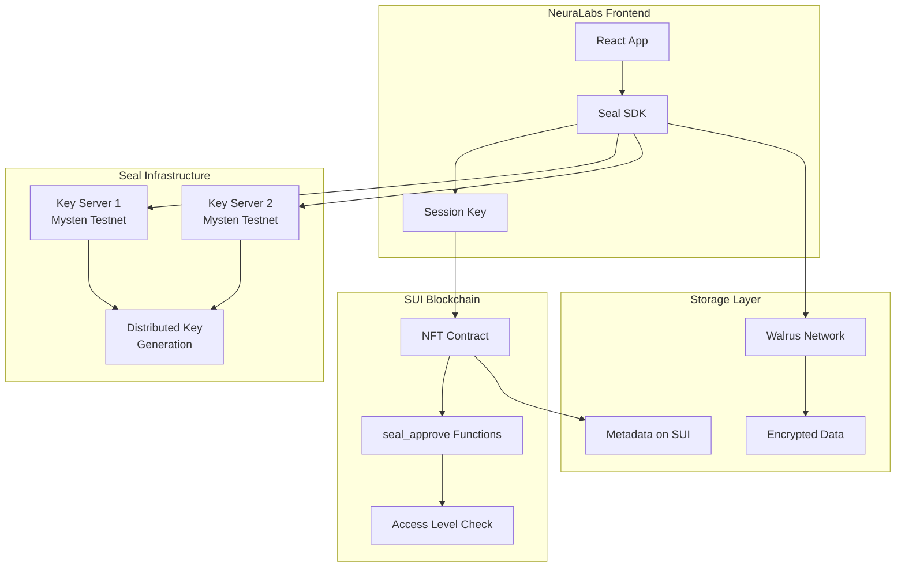

import { Card, CardHeader, CardTitle, CardDescription } from '@site/src/components/Card';

# Seal Threshold Encryption

Integrate SUI Seal for decentralized threshold encryption, enabling secure data management with distributed key generation and access control.

## Overview

Seal is a decentralized secrets management (DSM) service that uses threshold encryption to secure sensitive data. In the NeuraLabs platform, Seal enables secure storage of AI workflows on Walrus while maintaining fine-grained access control through NFT ownership levels.

<div className="card padding--md mt-4">
  <h3>Seal Key Features</h3>
  <ul>
    <li><strong>Threshold Encryption:</strong> t-out-of-n key servers for fault tolerance</li>
    <li><strong>Distributed Key Generation (DKG):</strong> No single point of failure</li>
    <li><strong>SUI-based Access Control:</strong> Leverages NFT ownership for permissions</li>
    <li><strong>Client-side Encryption:</strong> Data never exposed in plaintext to servers</li>
    <li><strong>Identity-based Keys:</strong> Automatic key derivation per workflow/user</li>
  </ul>
</div>

## Architecture



## Seal Key Servers

### Mysten Labs Key Servers

For testnet development, NeuraLabs uses Mysten Labs managed key servers:

<div className="grid grid-cols-1 md:grid-cols-2 gap-4 mt-4">
  <Card>
    <CardHeader>
      <CardTitle>
        
        Testnet Key Server 1
      </CardTitle>
      <CardDescription>
        URL: https://seal-key-server-testnet-1.mystenlabs.com<br/>
        Object ID: 0x1ee708e0d09c31593a60bee444f8f36a5a3ce66f1409a9dfb12eb11ab254b06b
      </CardDescription>
    </CardHeader>
  </Card>

  <Card>
    <CardHeader>
      <CardTitle>
        
        Testnet Key Server 2
      </CardTitle>
      <CardDescription>
        URL: https://seal-key-server-testnet-2.mystenlabs.com<br/>
        Object ID: 0x2ff809f1e1ad42604a71cff555f9f47b6b4df77g5109b0efc23fc22bc365c17c
      </CardDescription>
    </CardHeader>
  </Card>
</div>

### Threshold Configuration

<div className="card padding--md mt-4">
  <h3>Recommended Thresholds</h3>
  <ul>
    <li><strong>Development:</strong> 1-of-2 threshold for low latency testing</li>
    <li><strong>Staging:</strong> 2-of-2 threshold for reliability testing</li>
    <li><strong>Production:</strong> 2-of-3 or higher for maximum security</li>
  </ul>
</div>

## Installation and Setup

### 1. Install Seal SDK

```bash
# Frontend dependencies
npm install @mysten/seal @mysten/sui.js

# Backend dependencies (if needed)
pip install sui-python-sdk
```

### 2. Environment Configuration

```bash
# .env configuration
REACT_APP_SEAL_NETWORK=testnet
REACT_APP_SEAL_KEY_SERVER_1=0x1ee708e0d09c31593a60bee444f8f36a5a3ce66f1409a9dfb12eb11ab254b06b
REACT_APP_SEAL_KEY_SERVER_2=0x2ff809f1e1ad42604a71cff555f9f47b6b4df77g5109b0efc23fc22bc365c17c
REACT_APP_SEAL_THRESHOLD=1
REACT_APP_PACKAGE_ID=0x926de4be791b165822a8a213540c0606bb0d52450e5f8b6531097d9cd2c4dc64
```

## Implementation

### 1. Seal Client Setup

```typescript
// sealClient.ts
import { SealClient } from '@mysten/seal';
import { SuiClient, getFullnodeUrl } from '@mysten/sui.js/client';

export class NeuraLabsSealClient {
  private sealClient: SealClient;
  private suiClient: SuiClient;
  
  constructor() {
    this.suiClient = new SuiClient({ 
      url: getFullnodeUrl('testnet') 
    });
    
    const keyServerIds = [
      process.env.REACT_APP_SEAL_KEY_SERVER_1!,
      process.env.REACT_APP_SEAL_KEY_SERVER_2!,
    ];
    
    this.sealClient = new SealClient({
      suiClient: this.suiClient,
      serverObjectIds: keyServerIds,
      verifyKeyServers: false, // Set to true for production
    });
  }
  
  async encryptWorkflow(
    workflowId: string,
    data: Uint8Array,
    threshold: number = 1
  ) {
    const packageId = process.env.REACT_APP_PACKAGE_ID!;
    
    try {
      const { encryptedObject, key: backupKey } = await this.sealClient.encrypt({
        threshold,
        packageId: fromHEX(packageId),
        id: fromHEX(workflowId),
        data,
      });
      
      return {
        encryptedData: encryptedObject,
        backupKey, // Store securely for disaster recovery
        success: true,
      };
    } catch (error) {
      console.error('Encryption failed:', error);
      return { success: false, error };
    }
  }
  
  async decryptWorkflow(
    encryptedData: Uint8Array,
    sessionKey: SessionKey,
    workflowId: string
  ) {
    const packageId = process.env.REACT_APP_PACKAGE_ID!;
    
    try {
      // Create transaction for seal_approve
      const tx = new Transaction();
      tx.moveCall({
        target: `${packageId}::nft::seal_approve`,
        arguments: [
          tx.pure.vector("u8", fromHEX(workflowId)),
          // Additional arguments based on your contract
        ],
      });
      
      const txBytes = tx.build({ 
        client: this.suiClient, 
        onlyTransactionKind: true 
      });
      
      const decryptedData = await this.sealClient.decrypt({
        data: encryptedData,
        sessionKey,
        txBytes,
      });
      
      return {
        decryptedData,
        success: true,
      };
    } catch (error) {
      console.error('Decryption failed:', error);
      return { success: false, error };
    }
  }
}
```

### 2. Session Key Management

```typescript
// sessionManager.ts
import { SessionKey } from '@mysten/seal';
import { fromHEX } from '@mysten/sui.js/utils';

export class SessionManager {
  private sessionKey: SessionKey | null = null;
  
  async createSession(
    userAddress: string,
    packageId: string,
    signer: any,
    ttlMinutes: number = 10
  ) {
    try {
      this.sessionKey = new SessionKey({
        address: userAddress,
        packageId: fromHEX(packageId),
        ttlMin: ttlMinutes,
      });
      
      const message = this.sessionKey.getPersonalMessage();
      const { signature } = await signer.signPersonalMessage(message);
      
      this.sessionKey.setPersonalMessageSignature(signature);
      
      // Optionally store in IndexedDB for cross-tab persistence
      this.storeSession();
      
      return { success: true, sessionKey: this.sessionKey };
    } catch (error) {
      console.error('Session creation failed:', error);
      return { success: false, error };
    }
  }
  
  getSession(): SessionKey | null {
    if (!this.sessionKey) {
      this.loadSession();
    }
    return this.sessionKey;
  }
  
  private storeSession() {
    if (this.sessionKey) {
      const exportedSession = this.sessionKey.export();
      localStorage.setItem('seal_session', JSON.stringify(exportedSession));
    }
  }
  
  private loadSession() {
    const stored = localStorage.getItem('seal_session');
    if (stored) {
      try {
        const sessionData = JSON.parse(stored);
        this.sessionKey = SessionKey.import(sessionData);
      } catch (error) {
        console.error('Failed to load session:', error);
        this.clearSession();
      }
    }
  }
  
  clearSession() {
    this.sessionKey = null;
    localStorage.removeItem('seal_session');
  }
}
```

### 3. Smart Contract Integration

The smart contract must implement `seal_approve` functions for access control:

```move
// In nft.move
entry fun seal_approve(
    id: vector<u8>,
    nft: &NFT,
    ctx: &TxContext
) {
    let caller = tx_context::sender(ctx);
    let nft_id = object::id(nft);
    
    // Check if caller has required access level (4 or above for decryption)
    let access_level = access::get_user_access_level(caller, nft_id);
    assert!(access_level >= 4, EInsufficientAccess);
    
    // Additional validation logic
    let nft_owner = nft::get_owner(nft);
    assert!(caller == nft_owner || access_level >= 4, EUnauthorized);
    
    // Function succeeds if all checks pass
    // Seal key servers will use this to validate access
}

// Alternative seal_approve with additional parameters
entry fun seal_approve_with_params(
    id: vector<u8>,
    nft: &NFT,
    required_level: u8,
    ctx: &TxContext
) {
    let caller = tx_context::sender(ctx);
    let access_level = access::get_user_access_level(caller, object::id(nft));
    
    assert!(access_level >= required_level, EInsufficientAccess);
    
    // Additional business logic
}
```

### 4. React Hook Integration

```typescript
// useSealEncryption.ts
import { useState, useCallback } from 'react';
import { useWallet } from '@mysten/wallet-kit';
import { NeuraLabsSealClient } from './sealClient';
import { SessionManager } from './sessionManager';

export const useSealEncryption = () => {
  const { currentWallet } = useWallet();
  const [sealClient] = useState(() => new NeuraLabsSealClient());
  const [sessionManager] = useState(() => new SessionManager());
  const [isLoading, setIsLoading] = useState(false);
  
  const createSession = useCallback(async () => {
    if (!currentWallet) return { success: false, error: 'No wallet connected' };
    
    setIsLoading(true);
    try {
      const result = await sessionManager.createSession(
        currentWallet.address,
        process.env.REACT_APP_PACKAGE_ID!,
        currentWallet.signer,
        10 // 10 minutes TTL
      );
      
      return result;
    } finally {
      setIsLoading(false);
    }
  }, [currentWallet, sessionManager]);
  
  const encryptData = useCallback(async (
    workflowId: string,
    data: Uint8Array,
    threshold: number = 1
  ) => {
    setIsLoading(true);
    try {
      const result = await sealClient.encryptWorkflow(workflowId, data, threshold);
      return result;
    } finally {
      setIsLoading(false);
    }
  }, [sealClient]);
  
  const decryptData = useCallback(async (
    encryptedData: Uint8Array,
    workflowId: string
  ) => {
    const session = sessionManager.getSession();
    if (!session) {
      return { success: false, error: 'No active session' };
    }
    
    setIsLoading(true);
    try {
      const result = await sealClient.decryptWorkflow(
        encryptedData,
        session,
        workflowId
      );
      return result;
    } finally {
      setIsLoading(false);
    }
  }, [sealClient, sessionManager]);
  
  return {
    createSession,
    encryptData,
    decryptData,
    isLoading,
    clearSession: () => sessionManager.clearSession(),
  };
};
```

## Encryption Workflow

### 1. Encrypting AI Workflow Data

```typescript
// Example: Encrypting a complete AI workflow
const encryptWorkflow = async (workflow: AIWorkflow) => {
  const { encryptData } = useSealEncryption();
  
  // Prepare workflow data
  const workflowData = {
    model: workflow.model,
    config: workflow.config,
    dependencies: workflow.dependencies,
    metadata: workflow.metadata,
  };
  
  // Serialize to bytes
  const data = new TextEncoder().encode(JSON.stringify(workflowData));
  
  // Encrypt with Seal
  const result = await encryptData(
    workflow.id,
    data,
    1 // 1-of-2 threshold for testing
  );
  
  if (result.success) {
    // Store encrypted data on Walrus
    const blobId = await storeOnWalrus(result.encryptedData);
    
    // Store metadata on blockchain
    await storeMetadataOnChain({
      workflowId: workflow.id,
      blobId,
      encryptionInfo: {
        threshold: 1,
        keyServers: 2,
        backupKey: result.backupKey, // Store securely
      },
    });
    
    return { success: true, blobId };
  }
  
  return result;
};
```

### 2. Decrypting AI Workflow Data

```typescript
// Example: Decrypting AI workflow data
const decryptWorkflow = async (workflowId: string) => {
  const { decryptData, createSession } = useSealEncryption();
  
  // Ensure we have an active session
  const sessionResult = await createSession();
  if (!sessionResult.success) {
    return sessionResult;
  }
  
  try {
    // Get metadata from blockchain
    const metadata = await getWorkflowMetadata(workflowId);
    
    // Fetch encrypted data from Walrus
    const encryptedData = await fetchFromWalrus(metadata.blobId);
    
    // Decrypt with Seal
    const result = await decryptData(encryptedData, workflowId);
    
    if (result.success) {
      // Parse decrypted data
      const workflowData = JSON.parse(
        new TextDecoder().decode(result.decryptedData)
      );
      
      return { success: true, workflow: workflowData };
    }
    
    return result;
  } catch (error) {
    return { success: false, error };
  }
};
```

## Access Control Integration

### 1. NFT-Based Access Levels

```typescript
// Access level checking
const checkDecryptionAccess = async (
  userAddress: string,
  nftId: string
): Promise<boolean> => {
  const accessLevel = await getUserAccessLevel(userAddress, nftId);
  
  // Level 4 or above required for decryption
  return accessLevel >= 4;
};

// Access level constants
export const ACCESS_LEVELS = {
  USE_MODEL: 1,
  RESALE: 2,
  CREATE_REPLICA: 3,
  VIEW_DOWNLOAD: 4, // Minimum for Seal decryption
  EDIT_DATA: 5,
  ABSOLUTE_OWNERSHIP: 6,
} as const;
```

### 2. Conditional Encryption

```typescript
// Encrypt only if user has sufficient access
const conditionalEncrypt = async (
  workflowId: string,
  data: Uint8Array,
  userAddress: string,
  nftId: string
) => {
  // Check access level first
  const hasAccess = await checkDecryptionAccess(userAddress, nftId);
  
  if (!hasAccess) {
    return { 
      success: false, 
      error: 'Insufficient access level for encryption' 
    };
  }
  
  // Proceed with encryption
  return await encryptData(workflowId, data);
};
```

## Performance Optimization

### 1. Key Caching

```typescript
// Cache decryption keys for better performance
class SealKeyCache {
  private cache = new Map<string, any>();
  private ttl = 5 * 60 * 1000; // 5 minutes
  
  async getKey(id: string, fetchFn: () => Promise<any>) {
    const cached = this.cache.get(id);
    if (cached && Date.now() - cached.timestamp < this.ttl) {
      return cached.key;
    }
    
    const key = await fetchFn();
    this.cache.set(id, { key, timestamp: Date.now() });
    return key;
  }
  
  clear() {
    this.cache.clear();
  }
}
```

### 2. Batch Operations

```typescript
// Batch key fetching for multiple workflows
const batchFetchKeys = async (workflowIds: string[]) => {
  const { sealClient } = useSealEncryption();
  
  // Create multi-command transaction
  const tx = new Transaction();
  
  workflowIds.forEach(id => {
    tx.moveCall({
      target: `${packageId}::nft::seal_approve`,
      arguments: [tx.pure.vector("u8", fromHEX(id))],
    });
  });
  
  const txBytes = tx.build({ 
    client: suiClient, 
    onlyTransactionKind: true 
  });
  
  // Fetch all keys in one request
  return await sealClient.fetchKeys({
    ids: workflowIds,
    txBytes,
    sessionKey: session,
    threshold: 1,
  });
};
```

## Testing and Validation

### 1. Unit Tests

```typescript
// seal.test.ts
import { describe, it, expect } from 'vitest';
import { NeuraLabsSealClient } from './sealClient';

describe('Seal Integration', () => {
  it('should encrypt and decrypt data successfully', async () => {
    const sealClient = new NeuraLabsSealClient();
    const testData = new TextEncoder().encode('test workflow data');
    
    // Encrypt
    const encrypted = await sealClient.encryptWorkflow(
      'test-workflow-id',
      testData,
      1
    );
    
    expect(encrypted.success).toBe(true);
    expect(encrypted.encryptedData).toBeDefined();
    
    // Decrypt (requires session setup)
    // ... decryption test
  });
  
  it('should validate access levels correctly', async () => {
    // Test access level validation
    const hasAccess = await checkDecryptionAccess(
      'test-address',
      'test-nft-id'
    );
    
    expect(typeof hasAccess).toBe('boolean');
  });
});
```

### 2. Integration Tests

```bash
# Run comprehensive Seal integration tests
npm test seal-integration

# Test different threshold configurations
npm run test:seal-thresholds

# Performance testing
npm run test:seal-performance
```

## Troubleshooting

### Common Issues

<div className="card padding--md mt-4">
  <h3>Common Seal Issues</h3>
  
  **Key Server Timeout**
  ```bash
  # Increase timeout in configuration
  REACT_APP_SEAL_TIMEOUT=30000
  ```
  
  **Access Denied Errors**
  ```typescript
  // Verify access level and session validity
  const accessLevel = await getUserAccessLevel(userAddress, nftId);
  console.log('Access level:', accessLevel); // Should be >= 4
  ```
  
  **Session Expiry**
  ```typescript
  // Check and refresh session
  if (sessionExpired) {
    await createSession();
  }
  ```
</div>

## Security Considerations

<div className="card padding--md mt-4" style={{ borderLeft: '4px solid #ff6b6b' }}>
  <h3>Security Best Practices</h3>
  <ul>
    <li><strong>Session Management:</strong> Use appropriate TTL and secure storage</li>
    <li><strong>Key Servers:</strong> Verify key server authenticity in production</li>
    <li><strong>Backup Keys:</strong> Store backup keys securely for disaster recovery</li>
    <li><strong>Access Control:</strong> Always validate access levels before operations</li>
    <li><strong>Threshold Selection:</strong> Use higher thresholds for production</li>
  </ul>
</div>

## Next Steps

1. **Complete [Walrus Integration](./walrus)** for decentralized storage
2. **Test end-to-end encryption/decryption flows**
3. **Configure production key servers** (if needed)
4. **Implement comprehensive monitoring**
5. **Plan disaster recovery procedures**

## References

- [Seal Documentation](https://github.com/MystenLabs/seal)
- [Seal TypeScript SDK](https://www.npmjs.com/package/@mysten/seal)
- [Seal Examples](https://github.com/MystenLabs/seal/tree/main/examples)
- [Using Seal Guide](https://github.com/MystenLabs/seal/blob/main/UsingSeal.md)
- [Seal Security Best Practices](https://github.com/MystenLabs/seal/blob/main/SecurityBestPractices.md)