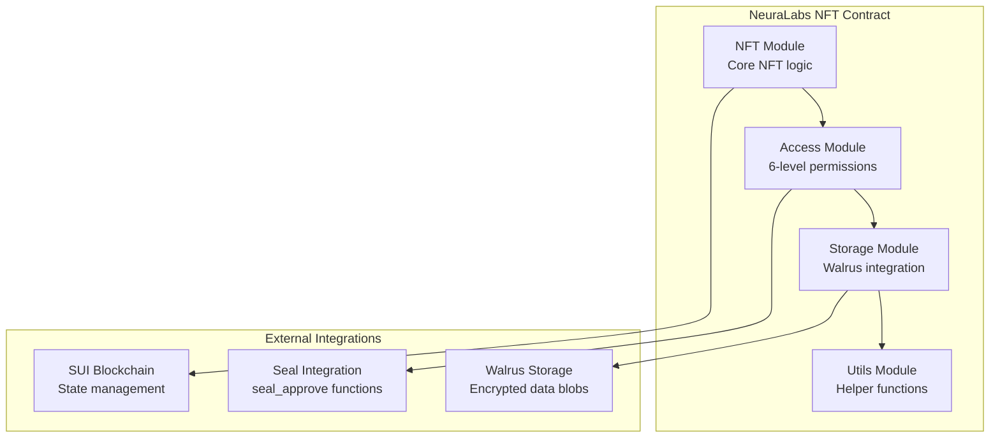

import { Card, CardHeader, CardTitle, CardDescription } from '@site/src/components/Card';

# Smart Contracts

Deploy and configure SUI Move contracts for NFT-based access control with Seal integration and Walrus storage.

## Overview

The NeuraLabs smart contract system implements a sophisticated NFT-based access control mechanism with 6 permission levels, integrated with Seal threshold encryption for secure data management. The contract architecture consists of 4 modular components for easy maintenance and extensibility.

## Contract Architecture



## Contract Modules

### 1. NFT Module (`nft.move`)
Core NFT functionality with access control integration.

### 2. Access Module (`access.move`)
Implements 6-level access control system:

<div className="grid grid-cols-2 md:grid-cols-3 gap-4 mt-4">
  <Card>
    <CardHeader>
      <CardTitle>Level 1: USE_MODEL</CardTitle>
      <CardDescription>Basic usage rights</CardDescription>
    </CardHeader>
  </Card>
  
  <Card>
    <CardHeader>
      <CardTitle>Level 2: RESALE</CardTitle>
      <CardDescription>Can resell the NFT</CardDescription>
    </CardHeader>
  </Card>
  
  <Card>
    <CardHeader>
      <CardTitle>Level 3: CREATE_REPLICA</CardTitle>
      <CardDescription>Can create copies</CardDescription>
    </CardHeader>
  </Card>
  
  <Card>
    <CardHeader>
      <CardTitle>Level 4: VIEW_DOWNLOAD</CardTitle>
      <CardDescription>Can decrypt files (Seal minimum)</CardDescription>
    </CardHeader>
  </Card>
  
  <Card>
    <CardHeader>
      <CardTitle>Level 5: EDIT_DATA</CardTitle>
      <CardDescription>Can modify encrypted data</CardDescription>
    </CardHeader>
  </Card>
  
  <Card>
    <CardHeader>
      <CardTitle>Level 6: ABSOLUTE_OWNERSHIP</CardTitle>
      <CardDescription>Full control and admin rights</CardDescription>
    </CardHeader>
  </Card>
</div>

### 3. Storage Module (`storage.move`)
Manages encrypted data storage with Walrus integration.

### 4. Utils Module (`utils.move`)
Helper functions for the contract system.

## Prerequisites

### Development Environment

```bash
# Install Rust and Sui CLI
curl --proto '=https' --tlsv1.2 -sSf https://sh.rustup.rs | sh
source ~/.bashrc

# Install Sui CLI dependencies (Ubuntu/Debian)
sudo apt update
sudo apt install -y clang libclang-dev llvm-dev librocksdb-dev

# Install Sui CLI
cargo install --locked --git https://github.com/MystenLabs/sui.git --branch testnet sui

# Verify installation
sui --version
```

### Network Configuration

```bash
# Configure Sui client for testnet
sui client new-env --alias testnet --rpc https://fullnode.testnet.sui.io:443
sui client switch --env testnet

# Create and fund account
sui client new-address secp256k1
sui client faucet --address $(sui client active-address)

# Verify setup
sui client balance
sui client envs
```

## Project Setup

### 1. Initialize Move Project

```bash
# Create project directory
mkdir neuralabs-sui-contracts
cd neuralabs-sui-contracts

# Initialize Move.toml
cat > Move.toml << EOF
[package]
name = "neuranft"
version = "0.1.0"
edition = "2024.beta"

[dependencies]
Sui = { git = "https://github.com/MystenLabs/sui.git", subdir = "crates/sui-framework/packages/sui-framework", rev = "framework/testnet" }

[addresses]
neuranft = "0x0"

[dev-dependencies]

[dev-addresses]
EOF

# Create source directory
mkdir -p sources
```

### 2. Contract Source Files

The contract files are located in the repository at `/mov_contract/neuranft_contract/sources/`:

#### Core Contract Files

```bash
# Copy contract files from repository
cp /path/to/neuralabs-sui/mov_contract/neuranft_contract/sources/* ./sources/

# Verify files
ls -la sources/
# Expected files:
# - nft.move
# - access.move  
# - storage.move
# - utils.move
```

#### Contract Structure Overview

```move
// nft.move - Core NFT functionality
module neuranft::nft {
    use sui::object::{Self, UID};
    use sui::transfer;
    use sui::tx_context::{Self, TxContext};
    
    struct NFT has key, store {
        id: UID,
        name: String,
        description: String,
        access_level: u8,
        // Additional fields...
    }
    
    // Core functions
    public entry fun create_nft(...)
    public entry fun grant_access(...)
    
    // Seal integration
    entry fun seal_approve(id: vector<u8>, ...)
}
```

### 3. Update Configuration

```bash
# Update Move.toml with your address
YOUR_ADDRESS=$(sui client active-address)
sed -i "s/neuranft = \"0x0\"/neuranft = \"$YOUR_ADDRESS\"/" Move.toml

echo "Updated Move.toml with address: $YOUR_ADDRESS"
```

## Compilation and Testing

### 1. Compile Contract

```bash
# Build the contract
sui move build

# Check for errors
echo $?  # Should return 0 if successful
```

### 2. Run Tests

```bash
# Run Move unit tests
sui move test

# Run specific test
sui move test test_nft_creation

# Run with verbose output
sui move test -v
```

### 3. Test Coverage

```bash
# Generate test coverage report
sui move test --coverage
```

## Deployment

### 1. Deploy to Testnet

<div className="card padding--md mt-4" style={{ borderLeft: '4px solid #17a2b8' }}>
  <h3>Gas Requirements</h3>
  <p>Deployment requires significant gas. Ensure you have sufficient testnet SUI tokens (recommended: at least 1 SUI).</p>
</div>

```bash
# Deploy the contract
sui client publish --gas-budget 100000000

# Save the output - you'll need the Package ID!
# Example output:
# Package published at: 0x926de4be791b165822a8a213540c0606bb0d52450e5f8b6531097d9cd2c4dc64
```

### 2. Save Deployment Information

```bash
# Extract Package ID from deployment output
PACKAGE_ID="0x926de4be791b165822a8a213540c0606bb0d52450e5f8b6531097d9cd2c4dc64"

# Save to configuration file
cat > deployment-config.json << EOF
{
  "package_id": "$PACKAGE_ID",
  "deployer_address": "$(sui client active-address)",
  "network": "testnet",
  "deployed_at": "$(date -Iseconds)"
}
EOF

echo "Deployment completed. Package ID: $PACKAGE_ID"
```

## Contract Initialization

### 1. Initialize Access Registry

The AccessRegistry manages user permissions across the system:

```bash
# Create initialization script
cat > scripts/initialize.py << EOF
#!/usr/bin/env python3
import subprocess
import json
import sys

def initialize_access_registry():
    package_id = "$PACKAGE_ID"
    
    # Call the initialization function
    cmd = [
        "sui", "client", "call",
        "--package", package_id,
        "--module", "access",
        "--function", "create_access_registry", 
        "--gas-budget", "10000000"
    ]
    
    result = subprocess.run(cmd, capture_output=True, text=True)
    
    if result.returncode == 0:
        print("Access Registry initialized successfully")
        print(result.stdout)
    else:
        print("Failed to initialize Access Registry")
        print(result.stderr)
        sys.exit(1)

if __name__ == "__main__":
    initialize_access_registry()
EOF

# Run initialization
python3 scripts/initialize.py
```

### 2. Create Test NFT

```bash
# Create a test NFT with level 6 access
sui client call \
  --package $PACKAGE_ID \
  --module nft \
  --function create_nft \
  --args "Test AI Model" "A test AI model for demonstration" 6 \
  --gas-budget 10000000
```

## Seal Integration

### 1. Seal Approve Function

The contract includes `seal_approve` functions that follow Seal's conventions:

```move
// Example seal_approve function
entry fun seal_approve(
    id: vector<u8>,
    nft: &NFT,
    ctx: &TxContext
) {
    // Verify caller has sufficient access level
    let caller = tx_context::sender(ctx);
    let access_level = get_user_access_level(caller, object::id(nft));
    
    // Require level 4 or above for file decryption
    assert!(access_level >= 4, EInsufficientAccess);
    
    // Additional access control logic...
}
```

### 2. Testing Seal Integration

```bash
# Test seal_approve function
sui client call \
  --package $PACKAGE_ID \
  --module nft \
  --function seal_approve \
  --args "test-id-vector" $NFT_OBJECT_ID \
  --gas-budget 5000000
```

## Configuration Files

### 1. Contract Configuration

```json
// contract-config.json
{
  "package_id": "0x926de4be791b165822a8a213540c0606bb0d52450e5f8b6531097d9cd2c4dc64",
  "access_levels": {
    "USE_MODEL": 1,
    "RESALE": 2, 
    "CREATE_REPLICA": 3,
    "VIEW_DOWNLOAD": 4,
    "EDIT_DATA": 5,
    "ABSOLUTE_OWNERSHIP": 6
  },
  "seal_integration": {
    "min_access_level_for_decryption": 4,
    "key_servers": [
      "0x1ee708e0d09c31593a60bee444f8f36a5a3ce66f1409a9dfb12eb11ab254b06b",
      "0x2ff809f1e1ad42604a71cff555f9f47b6b4df77g5109b0efc23fc22bc365c17c"
    ]
  }
}
```

### 2. Environment Configuration

```bash
# .env file for development
SUI_NETWORK=testnet
PACKAGE_ID=0x926de4be791b165822a8a213540c0606bb0d52450e5f8b6531097d9cd2c4dc64
SUI_RPC_URL=https://fullnode.testnet.sui.io:443
WALRUS_PUBLISHER_URL=https://publisher.walrus-testnet.walrus.space
WALRUS_AGGREGATOR_URL=https://aggregator.walrus-testnet.walrus.space
```

## Testing and Validation

### 1. Integration Tests

Create comprehensive tests for contract functionality:

```python
# test_contract.py
import asyncio
from sui_python_sdk import SuiClient, Ed25519Keypair
import json

async def test_nft_lifecycle():
    # Initialize client
    client = SuiClient("https://fullnode.testnet.sui.io:443")
    
    # Test NFT creation
    result = await create_test_nft()
    assert result.is_success(), "NFT creation failed"
    
    # Test access control
    await test_access_levels()
    
    # Test Seal integration
    await test_seal_approve()
    
    print("All tests passed!")

async def create_test_nft():
    # Implementation for NFT creation test
    pass

async def test_access_levels():
    # Test all 6 access levels
    pass

async def test_seal_approve():
    # Test Seal integration
    pass

if __name__ == "__main__":
    asyncio.run(test_nft_lifecycle())
```

### 2. Performance Testing

```bash
# Performance test script
python3 scripts/performance_test.py

# Expected metrics:
# - NFT creation: < 2 seconds
# - Access grant/revoke: < 1 second  
# - Seal approve: < 500ms
```

### 3. Security Validation

```bash
# Run security tests
python3 scripts/security_tests.py

# Check for:
# - Access control bypasses
# - Integer overflow/underflow
# - Reentrancy attacks
# - Gas limit issues
```

## Frontend Integration

### 1. TypeScript Integration

```typescript
// Contract integration
import { SuiClient, getFullnodeUrl } from '@mysten/sui.js/client';
import { TransactionBlock } from '@mysten/sui.js/transactions';

const client = new SuiClient({ url: getFullnodeUrl('testnet') });
const packageId = '0x926de4be791b165822a8a213540c0606bb0d52450e5f8b6531097d9cd2c4dc64';

// Create NFT function
export async function createNFT(
  name: string,
  description: string,
  accessLevel: number,
  signer: any
) {
  const tx = new TransactionBlock();
  
  tx.moveCall({
    target: `${packageId}::nft::create_nft`,
    arguments: [
      tx.pure.string(name),
      tx.pure.string(description),
      tx.pure.u8(accessLevel),
    ],
  });
  
  const result = await client.signAndExecuteTransactionBlock({
    signer,
    transactionBlock: tx,
    options: { showEffects: true, showEvents: true },
  });
  
  return result;
}

// Grant access function
export async function grantAccess(
  nftId: string,
  userAddress: string,
  accessLevel: number,
  signer: any
) {
  const tx = new TransactionBlock();
  
  tx.moveCall({
    target: `${packageId}::access::grant_access`,
    arguments: [
      tx.object(nftId),
      tx.pure.address(userAddress),
      tx.pure.u8(accessLevel),
    ],
  });
  
  return await client.signAndExecuteTransactionBlock({
    signer,
    transactionBlock: tx,
    options: { showEffects: true },
  });
}
```

### 2. React Components

```typescript
// NFTManager component
import React, { useState } from 'react';
import { useWallet } from '@mysten/wallet-kit';
import { createNFT, grantAccess } from './contractUtils';

export const NFTManager: React.FC = () => {
  const { currentWallet } = useWallet();
  const [nftData, setNftData] = useState({
    name: '',
    description: '',
    accessLevel: 6
  });
  
  const handleCreateNFT = async () => {
    try {
      const result = await createNFT(
        nftData.name,
        nftData.description,
        nftData.accessLevel,
        currentWallet.signer
      );
      
      console.log('NFT created:', result);
    } catch (error) {
      console.error('NFT creation failed:', error);
    }
  };
  
  return (
    <div>
      {/* NFT creation form */}
      <form onSubmit={handleCreateNFT}>
        {/* Form fields */}
      </form>
    </div>
  );
};
```

## Troubleshooting

### Common Issues

<div className="card padding--md mt-4">
  <h3>Common Deployment Issues</h3>
  
  **Package Address Mismatch**
  ```bash
  # Fix: Update Move.toml with correct address
  sed -i "s/neuranft = \".*\"/neuranft = \"$(sui client active-address)\"/" Move.toml
  ```
  
  **Insufficient Gas**
  ```bash
  # Fix: Increase gas budget or fund account
  sui client faucet --address $(sui client active-address)
  ```
  
  **Module Not Found**
  ```bash
  # Fix: Verify package ID and module names
  sui client object $PACKAGE_ID --json
  ```
</div>

### Debug Commands

```bash
# Check transaction details
sui client transaction $TX_DIGEST --json

# View object details
sui client object $OBJECT_ID --json

# Check events
sui client events --package $PACKAGE_ID

# Gas usage analysis
sui client gas --json
```

## Upgrade Strategy

### 1. Contract Upgrades

```bash
# Upgrade existing package
sui client upgrade --package $PACKAGE_ID --gas-budget 50000000

# Verify upgrade
sui client package $NEW_PACKAGE_ID
```

### 2. Migration Scripts

```python
# migrate_data.py
async def migrate_to_new_version():
    # Migration logic for contract upgrades
    pass
```

## Security Best Practices

<div className="card padding--md mt-4" style={{ borderLeft: '4px solid #ff6b6b' }}>
  <h3>Security Checklist</h3>
  <ul>
    <li><strong>Access Control:</strong> Verify all access level checks are properly implemented</li>
    <li><strong>Input Validation:</strong> Validate all user inputs and parameters</li>
    <li><strong>Gas Limits:</strong> Set appropriate gas limits for all operations</li>
    <li><strong>Error Handling:</strong> Implement proper error handling and recovery</li>
    <li><strong>Audit:</strong> Consider professional security audit before mainnet</li>
  </ul>
</div>

## Next Steps

1. **Complete [Seal Integration](./seal)** for threshold encryption
2. **Set up [Walrus Integration](./walrus)** for decentralized storage
3. **Deploy comprehensive test suite**
4. **Configure monitoring and alerting**
5. **Plan mainnet deployment strategy**

## References

- [SUI Move Documentation](https://docs.sui.io/concepts/sui-move)
- [Move Language Reference](https://move-language.github.io/move/)
- [SUI Smart Contract Examples](https://github.com/MystenLabs/sui/tree/main/sui_programmability/examples)
- [NeuraLabs Contract Repository](https://github.com/neuralabs/neuralabs-sui/tree/main/mov_contract)