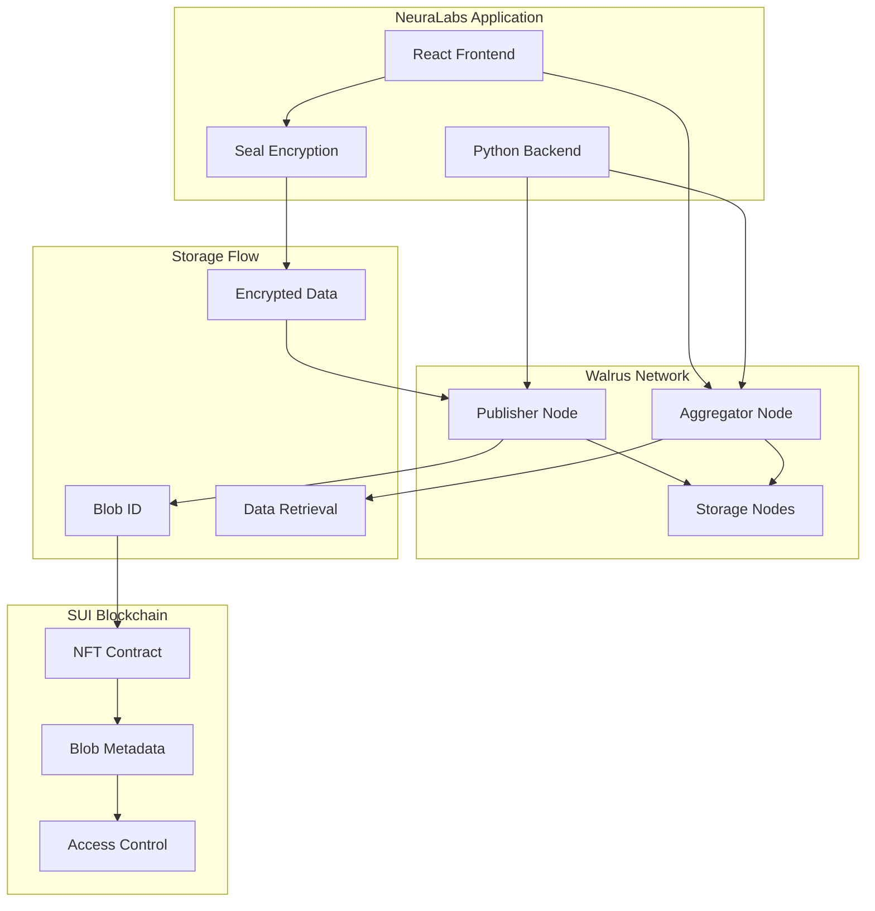

import { Card, CardHeader, CardTitle, CardDescription } from '@site/src/components/Card';

# Walrus Decentralized Storage

Integrate Walrus for decentralized blob storage of encrypted AI workflow data with content-addressed storage and built-in redundancy.

## Overview

Walrus is a decentralized storage network that provides secure, efficient, and cost-effective blob storage. In the NeuraLabs platform, Walrus stores encrypted AI workflow data while metadata and access control remain on the SUI blockchain, creating a hybrid architecture that combines security with performance.

<div className="card padding--md mt-4">
  <h3>Walrus Key Features</h3>
  <ul>
    <li><strong>Content-Addressed Storage:</strong> Immutable data references with integrity verification</li>
    <li><strong>Built-in Redundancy:</strong> Automatic data replication across storage nodes</li>
    <li><strong>Cost-Effective:</strong> Optimized for large blob storage at scale</li>
    <li><strong>SUI Integration:</strong> Seamless integration with SUI blockchain</li>
    <li><strong>HTTP API:</strong> Simple REST API for data operations</li>
  </ul>
</div>

## Architecture



## Walrus Testnet Configuration

### Network Endpoints

<div className="grid grid-cols-1 md:grid-cols-2 gap-4 mt-4">
  <Card>
    <CardHeader>
      <CardTitle>
        
        Publisher Endpoint
      </CardTitle>
      <CardDescription>
        For uploading data to Walrus<br/>
        URL: https://publisher.walrus-testnet.walrus.space
      </CardDescription>
    </CardHeader>
  </Card>

  <Card>
    <CardHeader>
      <CardTitle>
        
        Aggregator Endpoint
      </CardTitle>
      <CardDescription>
        For downloading data from Walrus<br/>
        URL: https://aggregator.walrus-testnet.walrus.space
      </CardDescription>
    </CardHeader>
  </Card>
</div>

### Environment Configuration

```bash
# .env configuration
REACT_APP_WALRUS_PUBLISHER_URL=https://publisher.walrus-testnet.walrus.space
REACT_APP_WALRUS_AGGREGATOR_URL=https://aggregator.walrus-testnet.walrus.space
REACT_APP_WALRUS_NETWORK=testnet

# Backend configuration
WALRUS_PUBLISHER_URL=https://publisher.walrus-testnet.walrus.space
WALRUS_AGGREGATOR_URL=https://aggregator.walrus-testnet.walrus.space
WALRUS_TIMEOUT=30
WALRUS_MAX_RETRIES=3
```

## Implementation

### 1. Walrus Client Setup

```typescript
// walrusClient.ts
export class WalrusClient {
  private publisherUrl: string;
  private aggregatorUrl: string;
  private timeout: number;
  
  constructor() {
    this.publisherUrl = process.env.REACT_APP_WALRUS_PUBLISHER_URL!;
    this.aggregatorUrl = process.env.REACT_APP_WALRUS_AGGREGATOR_URL!;
    this.timeout = 30000; // 30 seconds
  }
  
  async store(data: Uint8Array): Promise<{
    success: boolean;
    blobId?: string;
    error?: string;
  }> {
    try {
      const formData = new FormData();
      formData.append('file', new Blob([data]));
      
      const response = await fetch(`${this.publisherUrl}/v1/store`, {
        method: 'POST',
        body: formData,
        signal: AbortSignal.timeout(this.timeout),
      });
      
      if (!response.ok) {
        throw new Error(`Storage failed: ${response.statusText}`);
      }
      
      const result = await response.json();
      
      return {
        success: true,
        blobId: result.blob_id,
      };
    } catch (error) {
      console.error('Walrus storage error:', error);
      return {
        success: false,
        error: error instanceof Error ? error.message : 'Unknown error',
      };
    }
  }
  
  async retrieve(blobId: string): Promise<{
    success: boolean;
    data?: Uint8Array;
    error?: string;
  }> {
    try {
      const response = await fetch(
        `${this.aggregatorUrl}/v1/${blobId}`,
        {
          method: 'GET',
          signal: AbortSignal.timeout(this.timeout),
        }
      );
      
      if (!response.ok) {
        throw new Error(`Retrieval failed: ${response.statusText}`);
      }
      
      const arrayBuffer = await response.arrayBuffer();
      const data = new Uint8Array(arrayBuffer);
      
      return {
        success: true,
        data,
      };
    } catch (error) {
      console.error('Walrus retrieval error:', error);
      return {
        success: false,
        error: error instanceof Error ? error.message : 'Unknown error',
      };
    }
  }
  
  async checkAvailability(blobId: string): Promise<boolean> {
    try {
      const response = await fetch(
        `${this.aggregatorUrl}/v1/${blobId}`,
        {
          method: 'HEAD',
          signal: AbortSignal.timeout(5000),
        }
      );
      
      return response.ok;
    } catch {
      return false;
    }
  }
  
  // Get blob information without downloading
  async getBlobInfo(blobId: string): Promise<{
    success: boolean;
    size?: number;
    contentType?: string;
    error?: string;
  }> {
    try {
      const response = await fetch(
        `${this.aggregatorUrl}/v1/${blobId}`,
        {
          method: 'HEAD',
          signal: AbortSignal.timeout(5000),
        }
      );
      
      if (!response.ok) {
        throw new Error(`Info retrieval failed: ${response.statusText}`);
      }
      
      return {
        success: true,
        size: parseInt(response.headers.get('content-length') || '0'),
        contentType: response.headers.get('content-type') || undefined,
      };
    } catch (error) {
      return {
        success: false,
        error: error instanceof Error ? error.message : 'Unknown error',
      };
    }
  }
}
```

### 2. Integrated Storage Manager

```typescript
// storageManager.ts
import { WalrusClient } from './walrusClient';
import { NeuraLabsSealClient } from './sealClient';

export class StorageManager {
  private walrusClient: WalrusClient;
  private sealClient: NeuraLabsSealClient;
  
  constructor() {
    this.walrusClient = new WalrusClient();
    this.sealClient = new NeuraLabsSealClient();
  }
  
  async storeWorkflow(
    workflowId: string,
    workflowData: any,
    threshold: number = 1
  ): Promise<{
    success: boolean;
    blobId?: string;
    encryptionKey?: string;
    error?: string;
  }> {
    try {
      // 1. Serialize workflow data
      const serialized = JSON.stringify(workflowData);
      const data = new TextEncoder().encode(serialized);
      
      // 2. Encrypt with Seal
      const encryptionResult = await this.sealClient.encryptWorkflow(
        workflowId,
        data,
        threshold
      );
      
      if (!encryptionResult.success) {
        return {
          success: false,
          error: `Encryption failed: ${encryptionResult.error}`,
        };
      }
      
      // 3. Store encrypted data on Walrus
      const storageResult = await this.walrusClient.store(
        encryptionResult.encryptedData
      );
      
      if (!storageResult.success) {
        return {
          success: false,
          error: `Storage failed: ${storageResult.error}`,
        };
      }
      
      return {
        success: true,
        blobId: storageResult.blobId,
        encryptionKey: encryptionResult.backupKey,
      };
    } catch (error) {
      console.error('Workflow storage error:', error);
      return {
        success: false,
        error: error instanceof Error ? error.message : 'Unknown error',
      };
    }
  }
  
  async retrieveWorkflow(
    blobId: string,
    workflowId: string,
    sessionKey: any
  ): Promise<{
    success: boolean;
    workflow?: any;
    error?: string;
  }> {
    try {
      // 1. Retrieve encrypted data from Walrus
      const retrievalResult = await this.walrusClient.retrieve(blobId);
      
      if (!retrievalResult.success) {
        return {
          success: false,
          error: `Retrieval failed: ${retrievalResult.error}`,
        };
      }
      
      // 2. Decrypt with Seal
      const decryptionResult = await this.sealClient.decryptWorkflow(
        retrievalResult.data!,
        sessionKey,
        workflowId
      );
      
      if (!decryptionResult.success) {
        return {
          success: false,
          error: `Decryption failed: ${decryptionResult.error}`,
        };
      }
      
      // 3. Deserialize workflow data
      const serialized = new TextDecoder().decode(decryptionResult.decryptedData);
      const workflow = JSON.parse(serialized);
      
      return {
        success: true,
        workflow,
      };
    } catch (error) {
      console.error('Workflow retrieval error:', error);
      return {
        success: false,
        error: error instanceof Error ? error.message : 'Unknown error',
      };
    }
  }
  
  async verifyWorkflowIntegrity(
    blobId: string,
    expectedHash?: string
  ): Promise<boolean> {
    try {
      const available = await this.walrusClient.checkAvailability(blobId);
      
      if (!available) return false;
      
      if (expectedHash) {
        // If we have an expected hash, verify content integrity
        const data = await this.walrusClient.retrieve(blobId);
        if (!data.success || !data.data) return false;
        
        // Calculate hash and compare
        const hash = await this.calculateHash(data.data);
        return hash === expectedHash;
      }
      
      return true;
    } catch {
      return false;
    }
  }
  
  private async calculateHash(data: Uint8Array): Promise<string> {
    const hashBuffer = await crypto.subtle.digest('SHA-256', data);
    const hashArray = Array.from(new Uint8Array(hashBuffer));
    return hashArray.map(b => b.toString(16).padStart(2, '0')).join('');
  }
}
```

### 3. React Hook Integration

```typescript
// useWalrusStorage.ts
import { useState, useCallback } from 'react';
import { StorageManager } from './storageManager';
import { useSealEncryption } from './useSealEncryption';

export const useWalrusStorage = () => {
  const [storageManager] = useState(() => new StorageManager());
  const { createSession } = useSealEncryption();
  const [isLoading, setIsLoading] = useState(false);
  
  const storeWorkflow = useCallback(async (
    workflowId: string,
    workflowData: any,
    threshold: number = 1
  ) => {
    setIsLoading(true);
    try {
      const result = await storageManager.storeWorkflow(
        workflowId,
        workflowData,
        threshold
      );
      
      return result;
    } finally {
      setIsLoading(false);
    }
  }, [storageManager]);
  
  const retrieveWorkflow = useCallback(async (
    blobId: string,
    workflowId: string
  ) => {
    setIsLoading(true);
    try {
      // Ensure we have an active session
      const sessionResult = await createSession();
      if (!sessionResult.success) {
        return sessionResult;
      }
      
      const result = await storageManager.retrieveWorkflow(
        blobId,
        workflowId,
        sessionResult.sessionKey
      );
      
      return result;
    } finally {
      setIsLoading(false);
    }
  }, [storageManager, createSession]);
  
  const verifyIntegrity = useCallback(async (
    blobId: string,
    expectedHash?: string
  ) => {
    return await storageManager.verifyWorkflowIntegrity(blobId, expectedHash);
  }, [storageManager]);
  
  const getBlobInfo = useCallback(async (blobId: string) => {
    const walrusClient = new (await import('./walrusClient')).WalrusClient();
    return await walrusClient.getBlobInfo(blobId);
  }, []);
  
  return {
    storeWorkflow,
    retrieveWorkflow,
    verifyIntegrity,
    getBlobInfo,
    isLoading,
  };
};
```

### 4. Backend Integration (Python)

```python
# walrus_client.py
import aiohttp
import asyncio
from typing import Optional, Tuple, Union
import hashlib

class WalrusClient:
    def __init__(
        self,
        publisher_url: str,
        aggregator_url: str,
        timeout: int = 30
    ):
        self.publisher_url = publisher_url.rstrip('/')
        self.aggregator_url = aggregator_url.rstrip('/')
        self.timeout = timeout
    
    async def store(self, data: bytes) -> Tuple[bool, Optional[str], Optional[str]]:
        """Store data on Walrus network.
        
        Returns:
            (success, blob_id, error_message)
        """
        try:
            async with aiohttp.ClientSession(timeout=aiohttp.ClientTimeout(total=self.timeout)) as session:
                form_data = aiohttp.FormData()
                form_data.add_field('file', data, content_type='application/octet-stream')
                
                async with session.post(f"{self.publisher_url}/v1/store", data=form_data) as response:
                    if response.status == 200:
                        result = await response.json()
                        return True, result.get('blob_id'), None
                    else:
                        error_text = await response.text()
                        return False, None, f"Storage failed: {response.status} - {error_text}"
        
        except asyncio.TimeoutError:
            return False, None, "Storage timeout"
        except Exception as e:
            return False, None, f"Storage error: {str(e)}"
    
    async def retrieve(self, blob_id: str) -> Tuple[bool, Optional[bytes], Optional[str]]:
        """Retrieve data from Walrus network.
        
        Returns:
            (success, data, error_message)
        """
        try:
            async with aiohttp.ClientSession(timeout=aiohttp.ClientTimeout(total=self.timeout)) as session:
                async with session.get(f"{self.aggregator_url}/v1/{blob_id}") as response:
                    if response.status == 200:
                        data = await response.read()
                        return True, data, None
                    else:
                        error_text = await response.text()
                        return False, None, f"Retrieval failed: {response.status} - {error_text}"
        
        except asyncio.TimeoutError:
            return False, None, "Retrieval timeout"
        except Exception as e:
            return False, None, f"Retrieval error: {str(e)}"
    
    async def check_availability(self, blob_id: str) -> bool:
        """Check if blob is available without downloading."""
        try:
            async with aiohttp.ClientSession(timeout=aiohttp.ClientTimeout(total=5)) as session:
                async with session.head(f"{self.aggregator_url}/v1/{blob_id}") as response:
                    return response.status == 200
        except:
            return False
    
    async def get_blob_info(self, blob_id: str) -> Tuple[bool, dict]:
        """Get blob metadata without downloading."""
        try:
            async with aiohttp.ClientSession(timeout=aiohttp.ClientTimeout(total=5)) as session:
                async with session.head(f"{self.aggregator_url}/v1/{blob_id}") as response:
                    if response.status == 200:
                        return True, {
                            'size': int(response.headers.get('content-length', 0)),
                            'content_type': response.headers.get('content-type'),
                            'last_modified': response.headers.get('last-modified'),
                        }
                    else:
                        return False, {}
        except:
            return False, {}

# FastAPI integration
from fastapi import FastAPI, UploadFile, File, HTTPException
import os

app = FastAPI()

walrus_client = WalrusClient(
    publisher_url=os.getenv('WALRUS_PUBLISHER_URL'),
    aggregator_url=os.getenv('WALRUS_AGGREGATOR_URL'),
    timeout=int(os.getenv('WALRUS_TIMEOUT', '30'))
)

@app.post("/api/walrus/store")
async def store_data(file: UploadFile = File(...)):
    """Store file on Walrus network."""
    try:
        data = await file.read()
        success, blob_id, error = await walrus_client.store(data)
        
        if success:
            return {
                'success': True,
                'blob_id': blob_id,
                'size': len(data),
                'hash': hashlib.sha256(data).hexdigest()
            }
        else:
            raise HTTPException(status_code=400, detail=error)
    
    except Exception as e:
        raise HTTPException(status_code=500, detail=str(e))

@app.get("/api/walrus/retrieve/{blob_id}")
async def retrieve_data(blob_id: str):
    """Retrieve file from Walrus network."""
    try:
        success, data, error = await walrus_client.retrieve(blob_id)
        
        if success:
            return Response(
                content=data,
                media_type="application/octet-stream",
                headers={
                    "Content-Disposition": f"attachment; filename={blob_id}",
                    "Content-Length": str(len(data))
                }
            )
        else:
            raise HTTPException(status_code=404, detail=error)
    
    except Exception as e:
        raise HTTPException(status_code=500, detail=str(e))
```

## Complete Workflow Example

### 1. End-to-End Storage Flow

```typescript
// Complete workflow storage example
const storeAIWorkflow = async (workflow: AIWorkflow) => {
  const { storeWorkflow } = useWalrusStorage();
  const { currentWallet } = useWallet();
  
  try {
    // 1. Prepare workflow data
    const workflowData = {
      id: workflow.id,
      name: workflow.name,
      description: workflow.description,
      model: {
        type: workflow.model.type,
        parameters: workflow.model.parameters,
        weights: workflow.model.weights, // This could be large
      },
      config: workflow.config,
      dependencies: workflow.dependencies,
      metadata: {
        created_at: new Date().toISOString(),
        created_by: currentWallet?.address,
        version: '1.0',
      },
    };
    
    // 2. Store with encryption on Walrus
    const storageResult = await storeWorkflow(
      workflow.id,
      workflowData,
      1 // 1-of-2 threshold for testing
    );
    
    if (!storageResult.success) {
      throw new Error(storageResult.error);
    }
    
    // 3. Store metadata on SUI blockchain
    const metadataResult = await storeWorkflowMetadata({
      workflowId: workflow.id,
      blobId: storageResult.blobId!,
      encryptionInfo: {
        threshold: 1,
        keyServers: 2,
        backupKey: storageResult.encryptionKey, // Store securely!
      },
      size: workflowData.model.weights?.length || 0,
      hash: await calculateDataHash(workflowData),
    });
    
    return {
      success: true,
      blobId: storageResult.blobId,
      transactionId: metadataResult.transactionId,
    };
    
  } catch (error) {
    console.error('Workflow storage failed:', error);
    return {
      success: false,
      error: error instanceof Error ? error.message : 'Unknown error',
    };
  }
};
```

### 2. End-to-End Retrieval Flow

```typescript
// Complete workflow retrieval example
const loadAIWorkflow = async (workflowId: string) => {
  const { retrieveWorkflow, verifyIntegrity } = useWalrusStorage();
  
  try {
    // 1. Get metadata from blockchain
    const metadata = await getWorkflowMetadata(workflowId);
    if (!metadata) {
      throw new Error('Workflow not found');
    }
    
    // 2. Verify data integrity (optional)
    const isIntact = await verifyIntegrity(metadata.blobId, metadata.hash);
    if (!isIntact) {
      throw new Error('Data integrity check failed');
    }
    
    // 3. Retrieve and decrypt from Walrus
    const retrievalResult = await retrieveWorkflow(
      metadata.blobId,
      workflowId
    );
    
    if (!retrievalResult.success) {
      throw new Error(retrievalResult.error);
    }
    
    // 4. Validate workflow structure
    const workflow = retrievalResult.workflow;
    if (!workflow.id || workflow.id !== workflowId) {
      throw new Error('Invalid workflow data');
    }
    
    return {
      success: true,
      workflow,
      metadata,
    };
    
  } catch (error) {
    console.error('Workflow retrieval failed:', error);
    return {
      success: false,
      error: error instanceof Error ? error.message : 'Unknown error',
    };
  }
};
```

## Performance Optimization

### 1. Chunked Upload for Large Files

```typescript
// chunkedUpload.ts
export class ChunkedUploader {
  private static readonly CHUNK_SIZE = 5 * 1024 * 1024; // 5MB chunks
  
  async uploadLargeWorkflow(
    workflowId: string,
    data: Uint8Array,
    onProgress?: (progress: number) => void
  ) {
    const chunks = this.splitIntoChunks(data);
    const chunkIds: string[] = [];
    
    // Upload chunks in parallel (with concurrency limit)
    const concurrencyLimit = 3;
    for (let i = 0; i < chunks.length; i += concurrencyLimit) {
      const batch = chunks.slice(i, i + concurrencyLimit);
      const batchPromises = batch.map((chunk, index) => 
        this.uploadChunk(chunk, i + index)
      );
      
      const batchResults = await Promise.all(batchPromises);
      chunkIds.push(...batchResults);
      
      onProgress?.(Math.min((i + batch.length) / chunks.length, 1));
    }
    
    // Store chunk manifest
    const manifest = {
      workflowId,
      totalSize: data.length,
      chunkCount: chunks.length,
      chunkIds,
      checksum: await this.calculateChecksum(data),
    };
    
    const manifestId = await this.uploadManifest(manifest);
    return manifestId;
  }
  
  private splitIntoChunks(data: Uint8Array): Uint8Array[] {
    const chunks: Uint8Array[] = [];
    for (let i = 0; i < data.length; i += ChunkedUploader.CHUNK_SIZE) {
      chunks.push(data.slice(i, i + ChunkedUploader.CHUNK_SIZE));
    }
    return chunks;
  }
  
  private async uploadChunk(chunk: Uint8Array, index: number): Promise<string> {
    const walrusClient = new WalrusClient();
    const result = await walrusClient.store(chunk);
    if (!result.success) {
      throw new Error(`Chunk ${index} upload failed: ${result.error}`);
    }
    return result.blobId!;
  }
}
```

### 2. Caching and Prefetching

```typescript
// storageCache.ts
export class StorageCache {
  private cache = new Map<string, { data: any; timestamp: number; ttl: number }>();
  private prefetchQueue = new Set<string>();
  
  async get(key: string, fetchFn: () => Promise<any>, ttl: number = 300000) {
    const cached = this.cache.get(key);
    if (cached && Date.now() - cached.timestamp < cached.ttl) {
      return cached.data;
    }
    
    const data = await fetchFn();
    this.cache.set(key, { data, timestamp: Date.now(), ttl });
    return data;
  }
  
  async prefetch(workflowIds: string[]) {
    const toPrefetch = workflowIds.filter(id => 
      !this.cache.has(id) && !this.prefetchQueue.has(id)
    );
    
    toPrefetch.forEach(id => this.prefetchQueue.add(id));
    
    // Prefetch in background
    Promise.all(
      toPrefetch.map(async (id) => {
        try {
          await this.get(id, () => loadAIWorkflow(id));
        } finally {
          this.prefetchQueue.delete(id);
        }
      })
    );
  }
  
  clear() {
    this.cache.clear();
  }
}
```

## Monitoring and Analytics

### 1. Storage Metrics

```typescript
// storageMetrics.ts
export class StorageMetrics {
  private metrics = {
    uploads: 0,
    downloads: 0,
    totalBytesStored: 0,
    totalBytesRetrieved: 0,
    errors: 0,
    averageUploadTime: 0,
    averageDownloadTime: 0,
  };
  
  recordUpload(size: number, duration: number) {
    this.metrics.uploads++;
    this.metrics.totalBytesStored += size;
    this.updateAverageTime('upload', duration);
  }
  
  recordDownload(size: number, duration: number) {
    this.metrics.downloads++;
    this.metrics.totalBytesRetrieved += size;
    this.updateAverageTime('download', duration);
  }
  
  recordError() {
    this.metrics.errors++;
  }
  
  getMetrics() {
    return { ...this.metrics };
  }
  
  private updateAverageTime(type: 'upload' | 'download', newTime: number) {
    const countKey = type === 'upload' ? 'uploads' : 'downloads';
    const avgKey = type === 'upload' ? 'averageUploadTime' : 'averageDownloadTime';
    
    const count = this.metrics[countKey];
    const currentAvg = this.metrics[avgKey];
    
    this.metrics[avgKey] = (currentAvg * (count - 1) + newTime) / count;
  }
}
```

### 2. Health Monitoring

```typescript
// healthMonitor.ts
export class WalrusHealthMonitor {
  private walrusClient: WalrusClient;
  private healthStatus = {
    publisher: false,
    aggregator: false,
    lastCheck: 0,
  };
  
  constructor() {
    this.walrusClient = new WalrusClient();
    this.startHealthCheck();
  }
  
  private startHealthCheck() {
    setInterval(() => {
      this.checkHealth();
    }, 60000); // Check every minute
  }
  
  private async checkHealth() {
    const testBlobId = 'test-blob-id'; // Known test blob
    
    // Check publisher health
    try {
      const testData = new TextEncoder().encode('health-check');
      const result = await this.walrusClient.store(testData);
      this.healthStatus.publisher = result.success;
    } catch {
      this.healthStatus.publisher = false;
    }
    
    // Check aggregator health
    try {
      const available = await this.walrusClient.checkAvailability(testBlobId);
      this.healthStatus.aggregator = available;
    } catch {
      this.healthStatus.aggregator = false;
    }
    
    this.healthStatus.lastCheck = Date.now();
    
    // Emit health status if needed
    if (!this.healthStatus.publisher || !this.healthStatus.aggregator) {
      console.warn('Walrus health check failed:', this.healthStatus);
    }
  }
  
  getHealthStatus() {
    return { ...this.healthStatus };
  }
}
```

## Error Handling and Retry Logic

### 1. Robust Error Handling

```typescript
// errorHandler.ts
export class WalrusErrorHandler {
  private maxRetries = 3;
  private baseDelay = 1000; // 1 second
  
  async withRetry<T>(
    operation: () => Promise<T>,
    context: string
  ): Promise<T> {
    let lastError: Error;
    
    for (let attempt = 0; attempt < this.maxRetries; attempt++) {
      try {
        return await operation();
      } catch (error) {
        lastError = error instanceof Error ? error : new Error(String(error));
        
        if (attempt < this.maxRetries - 1) {
          const delay = this.baseDelay * Math.pow(2, attempt);
          console.warn(`${context} failed (attempt ${attempt + 1}), retrying in ${delay}ms:`, error);
          await this.delay(delay);
        }
      }
    }
    
    throw new Error(`${context} failed after ${this.maxRetries} attempts: ${lastError.message}`);
  }
  
  private delay(ms: number): Promise<void> {
    return new Promise(resolve => setTimeout(resolve, ms));
  }
  
  isRetriableError(error: any): boolean {
    // Network errors, timeouts, and 5xx responses are retriable
    return (
      error.name === 'TimeoutError' ||
      error.message.includes('timeout') ||
      error.message.includes('network') ||
      (error.status >= 500 && error.status < 600)
    );
  }
}
```

## Testing

### 1. Unit Tests

```typescript
// walrus.test.ts
import { describe, it, expect, vi } from 'vitest';
import { WalrusClient } from './walrusClient';

describe('Walrus Integration', () => {
  it('should store and retrieve data successfully', async () => {
    const client = new WalrusClient();
    const testData = new TextEncoder().encode('test data');
    
    // Mock fetch for testing
    global.fetch = vi.fn()
      .mockResolvedValueOnce({
        ok: true,
        json: () => Promise.resolve({ blob_id: 'test-blob-id' }),
      })
      .mockResolvedValueOnce({
        ok: true,
        arrayBuffer: () => Promise.resolve(testData.buffer),
      });
    
    // Test storage
    const storeResult = await client.store(testData);
    expect(storeResult.success).toBe(true);
    expect(storeResult.blobId).toBe('test-blob-id');
    
    // Test retrieval
    const retrieveResult = await client.retrieve('test-blob-id');
    expect(retrieveResult.success).toBe(true);
    expect(retrieveResult.data).toEqual(testData);
  });
  
  it('should handle storage errors gracefully', async () => {
    const client = new WalrusClient();
    
    global.fetch = vi.fn().mockResolvedValueOnce({
      ok: false,
      status: 500,
      text: () => Promise.resolve('Internal Server Error'),
    });
    
    const result = await client.store(new Uint8Array());
    expect(result.success).toBe(false);
    expect(result.error).toContain('Storage failed');
  });
});
```

### 2. Integration Tests

```bash
# Run Walrus integration tests
npm test walrus-integration

# Test with real Walrus testnet
npm run test:walrus-live

# Performance testing
npm run test:walrus-performance
```

## Security Considerations

<div className="card padding--md mt-4" style={{ borderLeft: '4px solid #ff6b6b' }}>
  <h3>Security Best Practices</h3>
  <ul>
    <li><strong>Data Encryption:</strong> Always encrypt data before storing on Walrus</li>
    <li><strong>Access Control:</strong> Verify permissions before allowing data access</li>
    <li><strong>Content Validation:</strong> Validate retrieved data integrity</li>
    <li><strong>Backup Keys:</strong> Store Seal backup keys securely for disaster recovery</li>
    <li><strong>Rate Limiting:</strong> Implement rate limiting for API endpoints</li>
  </ul>
</div>

## Troubleshooting

### Common Issues

<div className="card padding--md mt-4">
  <h3>Common Walrus Issues</h3>
  
  **Upload Timeout**
  ```typescript
  // Increase timeout for large files
  const client = new WalrusClient();
  client.timeout = 60000; // 60 seconds
  ```
  
  **Network Connectivity**
  ```bash
  # Test connectivity
  curl -X GET https://aggregator.walrus-testnet.walrus.space/v1/health
  ```
  
  **Large File Handling**
  ```typescript
  // Use chunked upload for files > 10MB
  if (fileSize > 10 * 1024 * 1024) {
    return await chunkedUploader.uploadLargeWorkflow(id, data);
  }
  ```
</div>

## Next Steps

1. **Test complete integration** with Seal encryption
2. **Implement monitoring** and alerting
3. **Optimize for production** with caching and CDN
4. **Plan backup and recovery** procedures
5. **Configure load balancing** for high availability

## References

- [Walrus Documentation](https://docs.walrus.space/)
- [Walrus Testnet Guide](https://docs.walrus.space/usage/setup)
- [SUI Blob Storage](https://docs.sui.io/concepts/object-model/blob)
- [NeuraLabs Walrus Integration](https://github.com/neuralabs/neuralabs-sui)

