- [Flow Executor Documentation](#flow-executor-documentation)
  - [Overview](#overview)
  - [Common componets of a flow element](#common-componets-of-a-flow-element)
  - [Component Categories and Element Reference Tables](#component-categories-and-element-reference-tables)
    - [Flow Control Elements](#flow-control-elements)
    - [Input Elements](#input-elements)
    - [Utility Elements](#utility-elements)
    - [AI Elements](#ai-elements)
    - [Blockchain Elements](#blockchain-elements)
    - [Custom Element](#custom-element)
    - [Start](#start)
    - [End](#end)
    - [Case](#case)
    - [FlowSelect](#flowselect)
  - [Input Elements](#input-elements-1)
    - [ChatInput](#chatinput)
    - [ContextHistory](#contexthistory)
    - [Datablocks](#datablocks)
    - [RestAPI](#restapi)
    - [Metadata](#metadata)
    - [Constants](#constants)
  - [Utility Elements](#utility-elements-1)
    - [Selector](#selector)
    - [Merger](#merger)
    - [RandomGenerator](#randomgenerator)
    - [TimeBlock](#timeblock)
  - [AI Elements](#ai-elements-1)
    - [LLMText](#llmtext)
    - [LLMStructured](#llmstructured)
  - [Blockchain Elements](#blockchain-elements-1)
    - [ReadBlockchainData](#readblockchaindata)
    - [BuildTransactionJSON](#buildtransactionjson)
  - [Custom Element](#custom-element-1)
    - [Custom](#custom)
  - [Flow Control and Execution](#flow-control-and-execution)
    - [Connection Example](#connection-example)
    - [Full Flow Example](#full-flow-example)
  - [Summary](#summary)


# Flow Executor Documentation

## Overview

The Flow Executor is a powerful backend system designed to execute workflow definitions composed of interconnected elements. Each element performs a specific function, and together they form a complete flow that can process data, make API calls, interact with blockchain services, generate AI responses, and more.

The system is built around the concept of elements that have inputs and outputs. These elements can be connected together, where the output from one element becomes the input to another, creating a directed flow of data and execution. The executor handles the execution order, data passing between elements, and streaming of events during execution.

## Common componets of a flow element

  llm_text_345678901234:
    type: llm_text
    element_id: llm_text_345678901234
    name: AI Text Generator
    description: Generates a response using the LLM

  | Name | Description | type |
  |------|-------------|--------|
  | type | The type of the element (e.g., llm_text, selector, etc.) | string |
  | element_id | A unique identifier for the element  generally also the key of element in a flow| string |
  | name | A human-readable name for the element | string | 
  | description | A brief description of what the element does | string |
  | input_schema | A schema defining the expected inputs for the element | dict |
  | output_schema | A schema defining the outputs produced by the element | dict |
  | parameters | Additional parameters specific to the element type | dict |
  | processing_message | A message shown in the chat when the element is processing | string | 
  |Tags| A list of tags associated with the element - user can create new similar to notion select and multiselect | list |
  |Layer| The layer in which the element is placed - user can create new similar to notion select | string |

## Component Categories and Element Reference Tables

The Flow Executor organizes elements into the following categories:

1. **Flow Control Elements** - Control the execution path of the flow
2. **Input Elements** - Provide data input to the flow
3. **Utility Elements** - Perform data manipulation and utility functions
4. **AI Elements** - Generate text or structured data using language models
5. **Blockchain Elements** - Interact with blockchain networks (Note: Using SUI instead of Aptos)
6. **Custom Element** - Execute custom Python code with security restrictions

### Flow Control Elements

| Name | Description | Parameters | Inputs | Outputs |
|------|-------------|------------|--------|---------|
| Start | Entry point of a flow | None | Any (passed from initial inputs) | Same as inputs |
| End | Exit point of a flow | None | `text_input`, `proposed_transaction` (optional) | `text_output`, `proposed_transaction` (optional) |
| Case | Conditional branching | `cases` (list of condition configurations) | `variables` (dict of values to compare) | `result` (dict of case IDs to boolean results) |
| FlowSelect | Choose between multiple flow paths | `flows_to_switch` (list of flow IDs) | Any | Same as inputs + `chosen_flow` |

### Input Elements

| Name | Description | Parameters | Inputs | Outputs |
|------|-------------|------------|--------|---------|
| ChatInput | User input text | None | `chat_input` (string) | `chat_input` (string) |
| ContextHistory | Conversation history | None | `context_history` (list) | `context_history` (list) |
| Datablocks | Constant data (JSON/CSV) | `data_type`, `data` | None | `data` (depends on type) |
| RestAPI | External API calls | `url`, `method`, `headers`, `api_key` | `params` (dict) | `data` (API response) |
| Metadata | User and environment metadata | `data` (dict) | Any | Same as inputs + metadata from schema |
| Constants | Fixed values | `data_type`, `data` | None | `data` (depends on type) |

### Utility Elements

| Name | Description | Parameters | Inputs | Outputs |
|------|-------------|------------|--------|---------|
| Selector | Extract values from data | `key` (string or list) | `data` (any) | `value` (extracted data) |
| Merger | Combine multiple data inputs | None | `data1` (any), `data2` (any) | `merged_data` (combined data) |
| RandomGenerator | Generate random values | `type`, `min`, `max`, `length`, etc. | None | `random_data` (depends on type) |
| TimeBlock | Provide time/date information | `type`, `format`, `timezone` | None | `time_data` (depends on type) |

### AI Elements

| Name | Description | Parameters | Inputs | Outputs |
|------|-------------|------------|--------|---------|
| LLMText | Generate free-form text | `model`, `temperature`, `max_tokens`, `wrapper_prompt` | `prompt`, `context` (optional), `additional_data` (optional) | `llm_output` (string) |
| LLMStructured | Generate structured data | `model`, `temperature`, `max_tokens`, `wrapper_prompt`, `llm_hidden_prompt` | `prompt`, `context` (optional), `additional_data` (optional) | Varies based on output_schema |

### Blockchain Elements

| Name | Description | Parameters | Inputs | Outputs |
|------|-------------|------------|--------|---------|
| ReadBlockchainData | Read data from blockchain | `node_url`, `contract_address`, `function_name`, `function_args` | Varies based on function_args | `data` (blockchain response) |
| BuildTransactionJSON | Create transaction payload | `node_url`, `contract_address`, `function_name`, `function_args` | Varies based on function_args | `transaction_json` (transaction payload) |

### Custom Element

| Name | Description | Parameters | Inputs | Outputs |
|------|-------------|------------|--------|---------|
| Custom | Execute Python code | `code`, `hyperparameters`, `constants` | Varies based on input_schema | Varies based on code implementation |

### Start

The Start element is the entry point for any flow. It receives the initial inputs provided to the flow executor and passes them forward.

**Parameters**: None

**Inputs**: Any inputs provided to the flow executor

**Outputs**: Mirrors its inputs

**Example Usage**:

```yaml
start_node:
  type: start
  element_id: start_node
  name: Start Block
  description: Entry point of the flow
  input_schema: {}
  output_schema: {}
```

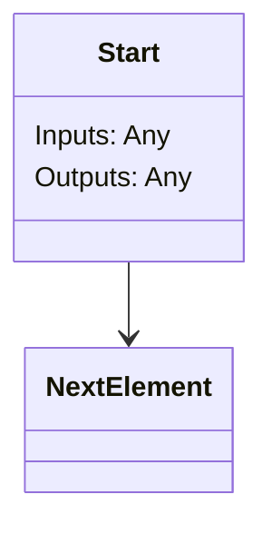
```mermaid
classDiagram
    class Start {
        Inputs: Any
        Outputs: Any
    }
    class NextElement {
    }
    Start --> NextElement
```

### End

The End element marks the conclusion of a flow. It collects final outputs and can include the response message and any proposed blockchain transactions.

**Parameters**: None

**Inputs**:
- `text_input` (string, required): Final text output of the flow
- `proposed_transaction` (JSON, optional): Transaction data for blockchain interaction

**Outputs**:
- `text_output` (string): Same as the text_input
- `proposed_transaction` (JSON): Same as the proposed_transaction input

**Example Usage**:

```yaml
# Partial flow with End element
elements:
  llm_text_345678901234:
    type: llm_text
    element_id: llm_text_345678901234
    name: AI Text Generator
    description: Generates a response using the LLM
    input_schema:
      prompt:
        type: string
        description: The prompt for the LLM
        required: true
      # Additional inputs omitted for brevity
    output_schema:
      llm_output:
        type: string
        description: Generated text from the LLM
        required: true
    model: "DeepSeek R1 AWS"
    temperature: 0.7
    max_tokens: 1000
  
  selector_456789012345:
    type: selector
    element_id: selector_456789012345
    name: Transaction Selector
    description: Extract transaction data if present
    input_schema:
      data:
        type: json
        description: Data to extract from
        required: true
    output_schema:
      value:
        type: json
        description: Extracted transaction data
        required: true
    key: "transaction"
  
  end_567890123456:
    type: end
    element_id: end_567890123456
    name: End Block
    description: Exit point of the flow
    input_schema:
      text_input:
        type: string
        description: Text output to return to the user
        required: true
      proposed_transaction:
        type: json
        description: Transaction to be sent to the blockchain
        required: false
    output_schema:
      text_output:
        type: string
        description: Final text output
        required: true
      proposed_transaction:
        type: json
        description: Final transaction payload
        required: false

connections:
  - from_id: llm_text_345678901234
    to_id: end_567890123456
    from_output: llm_output
    to_input: text_input
  - from_id: llm_text_345678901234
    to_id: selector_456789012345
    from_output: llm_output
    to_input: data
  - from_id: selector_456789012345
    to_id: end_567890123456
    from_output: value
    to_input: proposed_transaction
```

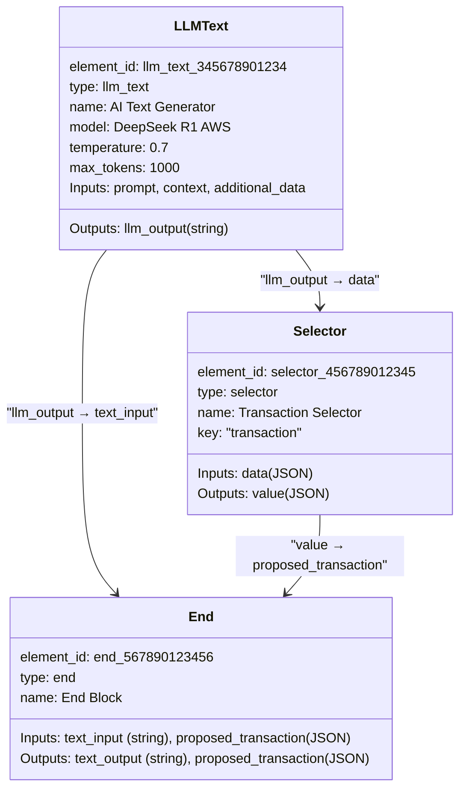
```mermaid
classDiagram
    class LLMText {
        element_id: llm_text_345678901234
        type: llm_text
        name: AI Text Generator
        model: DeepSeek R1 AWS
        temperature: 0.7
        max_tokens: 1000
        Inputs: prompt, context, additional_data
        Outputs: llm_output (string)
    }
    class Selector {
        element_id: selector_456789012345
        type: selector
        name: Transaction Selector
        key: "transaction"
        Inputs: data (JSON)
        Outputs: value (JSON)
    }
    class End {
        element_id: end_567890123456
        type: end
        name: End Block
        Inputs: text_input (string), proposed_transaction (JSON)
        Outputs: text_output (string), proposed_transaction (JSON)
    }
    
    LLMText --> End : "llm_output → text_input"
    LLMText --> Selector : "llm_output → data"
    Selector --> End : "value → proposed_transaction"
```

### Case

The Case element provides conditional branching based on variable comparisons. It evaluates a set of conditions and enables/disables downstream connections accordingly.

**Parameters**:
- `cases`: List of case configurations, each containing a case ID, variable names to compare, and the comparison operator

**Inputs**:
- `variables` (dict): Dictionary of variables to use in comparisons

**Outputs**:
- `result` (dict): Dictionary mapping case IDs to boolean results

**Example Usage**:

```yaml
# Partial flow showing Case element for user routing
elements:
  metadata_678901234567:
    type: metadata
    element_id: metadata_678901234567
    name: User Metadata
    description: Provides user-related metadata
    input_schema:
      user_id:
        type: string
        description: User ID
        required: true
    output_schema:
      user_id:
        type: string
        description: User ID
        required: true
      user_type:
        type: string
        description: Type of user
        required: true
      session_count:
        type: int
        description: Number of user sessions
        required: true
    data:
      user_type: "standard"
      session_count: 1

  case_789012345678:
    type: case
    element_id: case_789012345678
    name: Route By User Type
    description: Routes flow based on user type and session count
    input_schema:
      variables:
        type: json
        description: Variables to evaluate
        required: true
    output_schema:
      result:
        type: json
        description: Results of condition evaluations
        required: true
    cases:
      - premium_user:
          variable1: user_type
          variable2: premium
          compare: ==
      - new_user:
          variable1: session_count
          variable2: 3
          compare: <
      - returning_user:
          variable1: session_count
          variable2: 3
          compare: >=

  premium_llm_890123456789:
    type: llm_text
    element_id: premium_llm_890123456789
    name: Premium AI Response
    description: Enhanced response for premium users
    input_schema:
      prompt:
        type: string
        description: The prompt for the LLM
        required: true
    output_schema:
      llm_output:
        type: string
        description: Generated text from the LLM
        required: true
    model: "DeepSeek R1 AWS"
    temperature: 0.8
    max_tokens: 2000

  standard_llm_901234567890:
    type: llm_text
    element_id: standard_llm_901234567890
    name: Standard AI Response
    description: Standard response for regular users
    input_schema:
      prompt:
        type: string
        description: The prompt for the LLM
        required: true
    output_schema:
      llm_output:
        type: string
        description: Generated text from the LLM
        required: true
    model: "DeepSeek R1 AWS"
    temperature: 0.7
    max_tokens: 1000

connections:
  - from_id: metadata_678901234567
    to_id: case_789012345678
    from_output: user_type
    to_input: variables.user_type
  - from_id: metadata_678901234567
    to_id: case_789012345678
    from_output: session_count
    to_input: variables.session_count
  - from_id: case_789012345678
    to_id: premium_llm_890123456789
  # This connection is disabled if premium_user case is false
  - from_id: case_789012345678
    to_id: standard_llm_901234567890
  # This connection is disabled if premium_user case is true
```

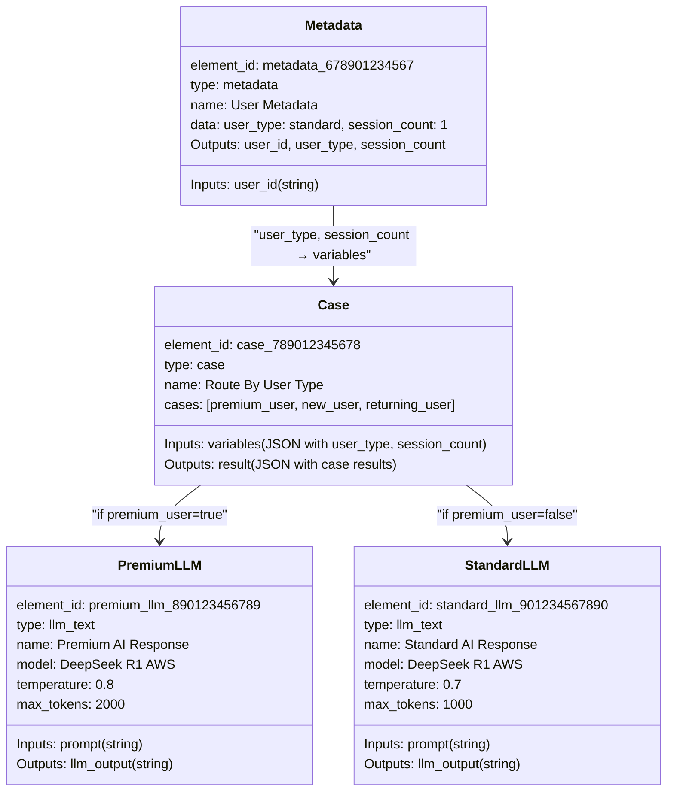
```mermaid
classDiagram
    class Metadata {
        element_id: metadata_678901234567
        type: metadata
        name: User Metadata
        data: user_type: standard, session_count: 1
        Inputs: user_id (string)
        Outputs: user_id, user_type, session_count
    }
    class Case {
        element_id: case_789012345678
        type: case
        name: Route By User Type
        cases: [premium_user, new_user, returning_user]
        Inputs: variables (JSON with user_type, session_count)
        Outputs: result (JSON with case results)
    }
    class PremiumLLM {
        element_id: premium_llm_890123456789
        type: llm_text
        name: Premium AI Response
        model: DeepSeek R1 AWS
        temperature: 0.8
        max_tokens: 2000
        Inputs: prompt (string)
        Outputs: llm_output (string)
    }
    class StandardLLM {
        element_id: standard_llm_901234567890
        type: llm_text
        name: Standard AI Response
        model: DeepSeek R1 AWS
        temperature: 0.7
        max_tokens: 1000
        Inputs: prompt (string)
        Outputs: llm_output (string)
    }
    
    Metadata --> Case : "user_type, session_count → variables"
    Case --> PremiumLLM : "if premium_user=true"
    Case --> StandardLLM : "if premium_user=false"
```

### FlowSelect

The FlowSelect element enables choosing between multiple execution paths. It's simpler than Case as it doesn't evaluate conditions but rather selects paths based on pre-determined flow IDs.

**Parameters**:
- `flows_to_switch` (list): List of flow IDs representing possible paths

**Inputs**: Any

**Outputs**: Same as inputs + `chosen_flow` (ID of the selected flow)

**Example Usage**:

```yaml
# Partial flow showing FlowSelect for processing path selection
elements:
  chat_input_234567890123:
    type: chat_input
    element_id: chat_input_234567890123
    name: User Input
    description: Captures the user's message
    input_schema:
      chat_input:
        type: string
        description: The input provided by the user
        required: true
    output_schema:
      chat_input:
        type: string
        description: The input provided by the user
        required: true

  flow_select_012345678901:
    type: flow_select
    element_id: flow_select_012345678901
    name: Process Type Selector
    description: Select between different processing paths
    input_schema:
      data:
        type: string
        description: Input to process
        required: true
    output_schema:
      data:
        type: string
        description: Passed-through input
        required: true
      chosen_flow:
        type: string
        description: ID of the chosen flow
        required: true
    flows_to_switch:
      - text_generation
      - transaction_builder

  llm_text_345678901234:
    type: llm_text
    element_id: llm_text_345678901234
    name: AI Text Generator
    description: Generates a response using the LLM
    input_schema:
      prompt:
        type: string
        description: The prompt for the LLM
        required: true
    output_schema:
      llm_output:
        type: string
        description: Generated text from the LLM
        required: true
    model: "DeepSeek R1 AWS"
    temperature: 0.7
    max_tokens: 1000

  transaction_builder_123456789012:
    type: build_transaction_json
    element_id: transaction_builder_123456789012
    name: Transaction Builder
    description: Builds a SUI transaction
    input_schema:
      recipient:
        type: string
        description: Recipient address
        required: true
      amount:
        type: string
        description: Amount to transfer
        required: true
    output_schema:
      transaction_json:
        type: json
        description: Transaction payload
        required: true
    node_url: "https://fullnode.mainnet.sui.io"
    contract_address: "0x2::coin::transfer"
    function_name: "transfer"
    function_args:
      - recipient
      - amount

connections:
  - from_id: chat_input_234567890123
    to_id: flow_select_012345678901
    from_output: chat_input
    to_input: data
  - from_id: flow_select_012345678901
    to_id: llm_text_345678901234
    from_output: data
    to_input: prompt
  - from_id: flow_select_012345678901
    to_id: transaction_builder_123456789012
    from_output: data
    to_input: recipient
```

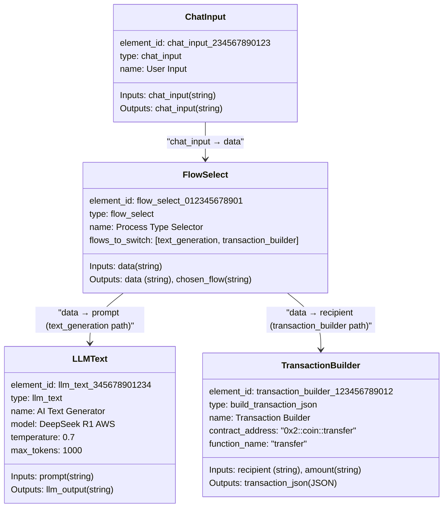
```mermaid
classDiagram
    class ChatInput {
        element_id: chat_input_234567890123
        type: chat_input
        name: User Input
        Inputs: chat_input (string)
        Outputs: chat_input (string)
    }
    class FlowSelect {
        element_id: flow_select_012345678901
        type: flow_select
        name: Process Type Selector
        flows_to_switch: [text_generation, transaction_builder]
        Inputs: data (string)
        Outputs: data (string), chosen_flow (string)
    }
    class LLMText {
        element_id: llm_text_345678901234
        type: llm_text
        name: AI Text Generator
        model: DeepSeek R1 AWS
        temperature: 0.7
        max_tokens: 1000
        Inputs: prompt (string)
        Outputs: llm_output (string)
    }
    class TransactionBuilder {
        element_id: transaction_builder_123456789012
        type: build_transaction_json
        name: Transaction Builder
        contract_address: "0x2::coin::transfer"
        function_name: "transfer"
        Inputs: recipient (string), amount (string)
        Outputs: transaction_json (JSON)
    }
    
    ChatInput --> FlowSelect : "chat_input → data"
    FlowSelect --> LLMText : "data → prompt (text_generation path)"
    FlowSelect --> TransactionBuilder : "data → recipient (transaction_builder path)"
```

## Input Elements

Input elements provide data to the flow from various sources.

| Name | Description | Parameters | Inputs | Outputs |
|------|-------------|------------|--------|---------|
| ChatInput | User input text | None | `chat_input` (string) | `chat_input` (string) |
| ContextHistory | Conversation history | None | `context_history` (list) | `context_history` (list) |
| Datablocks | Constant data (JSON/CSV) | `data_type`, `data` | None | `data` (depends on type) |
| RestAPI | External API calls | `url`, `method`, `headers`, `api_key` | `params` (dict) | `data` (API response) |
| Metadata | User and environment metadata | `data` (dict) | Any | Same as inputs + metadata from schema |
| Constants | Fixed values | `data_type`, `data` | None | `data` (depends on type) |

### ChatInput

The ChatInput element captures user input and makes it available to the flow.

**Parameters**: None

**Inputs**:
- `chat_input` (string): The user's text input

**Outputs**:
- `chat_input` (string): Same as the input

**Example Usage**:

```yaml
chat_input:
  type: chat_input
  element_id: chat_input
  name: User Input
  description: Captures the user's message
  input_schema:
    chat_input:
      type: string
      description: The input provided by the user
      required: true
  output_schema:
    chat_input:
      type: string
      description: The input provided by the user
      required: true
```

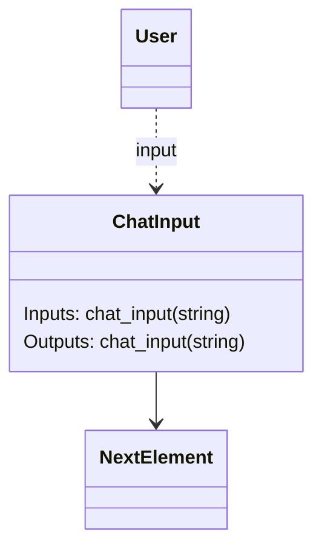
```mermaid
classDiagram
    class User {
    }
    class ChatInput {
        Inputs: chat_input (string)
        Outputs: chat_input (string)
    }
    class NextElement {
    }
    User ..> ChatInput : input
    ChatInput --> NextElement
```

### ContextHistory

The ContextHistory element provides conversation history for context in AI conversations.

**Parameters**: None

**Inputs**:
- `context_history` (list): List of previous messages or context items

**Outputs**:
- `context_history` (list): Same as the input

**Example Usage**: See the ChatInput example above, which includes ContextHistory in a partial flow.

### Datablocks

The Datablocks element provides constant data in JSON or CSV format to the flow.

**Parameters**:
- `data_type` (string): "json" or "csv"
- `data` (any): The actual data to provide

**Inputs**: None

**Outputs**:
- `data` (depends on type): The processed data

**Example Usage**:

```yaml
# Partial flow showing Datablocks providing product data
elements:
  products_data_567890123456:
    type: datablock
    element_id: products_data_567890123456
    name: Product Catalog
    description: Contains product information
    input_schema: {}
    output_schema:
      data:
        type: json
        description: Product catalog data
        required: true
    data_type: json
    data:
      products:
        - id: 1
          name: "SUI Token"
          price: 19.99
        - id: 2
          name: "NFT Collection"
          price: 29.99

  selector_678901234567:
    type: selector
    element_id: selector_678901234567
    name: Product Selector
    description: Extracts specific product info
    input_schema:
      data:
        type: json
        description: Data to select from
        required: true
    output_schema:
      value:
        type: json
        description: Selected product data
        required: true
    key: "products"

  llm_structured_789012345678:
    type: llm_structured
    element_id: llm_structured_789012345678
    name: Product Summarizer
    description: Creates structured product summaries
    input_schema:
      prompt:
        type: string
        description: Instruction prompt
        required: true
      additional_data:
        type: json
        description: Product data to summarize
        required: true
    output_schema:
      summary:
        type: string
        description: Product summary
        required: true
      pricing:
        type: json
        description: Pricing analysis
        required: true
    model: "DeepSeek R1 AWS"
    temperature: 0.3
    max_tokens: 500

connections:
  - from_id: products_data_567890123456
    to_id: selector_678901234567
    from_output: data
    to_input: data
  - from_id: selector_678901234567
    to_id: llm_structured_789012345678
    from_output: value
    to_input: additional_data
```

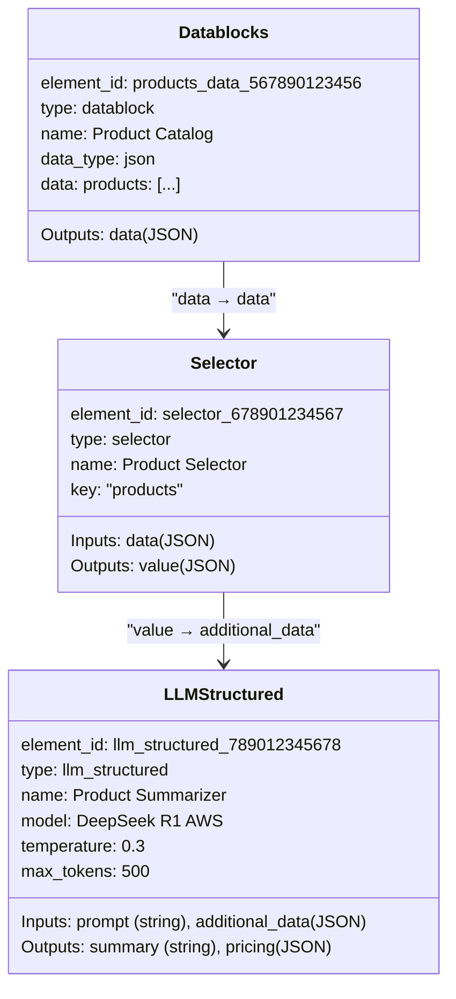
```mermaid
classDiagram
    class Datablocks {
        element_id: products_data_567890123456
        type: datablock
        name: Product Catalog
        data_type: json
        data: products: [...]
        Outputs: data (JSON)
    }
    class Selector {
        element_id: selector_678901234567
        type: selector
        name: Product Selector
        key: "products"
        Inputs: data (JSON)
        Outputs: value (JSON)
    }
    class LLMStructured {
        element_id: llm_structured_789012345678
        type: llm_structured
        name: Product Summarizer
        model: DeepSeek R1 AWS
        temperature: 0.3
        max_tokens: 500
        Inputs: prompt (string), additional_data (JSON)
        Outputs: summary (string), pricing (JSON)
    }
    
    Datablocks --> Selector : "data → data"
    Selector --> LLMStructured : "value → additional_data"
```

### RestAPI

The RestAPI element makes HTTP requests to external APIs and returns the response.

**Parameters**:
- `url` (string): The API endpoint URL
- `method` (string): HTTP method (GET, POST, PUT, DELETE)
- `headers` (dict): HTTP headers
- `api_key` (string, optional): API key for authentication

**Inputs**:
- `params` (dict): Parameters or body for the request

**Outputs**:
- `data` (dict): The API response

**Example Usage**:

```yaml
# Partial flow showing RestAPI getting blockchain data
elements:
  constants_890123456789:
    type: constants
    element_id: constants_890123456789
    name: API Constants
    description: Provides API configuration
    input_schema: {}
    output_schema:
      data:
        type: json
        description: API configuration
        required: true
    data_type: json
    data:
      api_key: "your_api_key_here"
      network: "mainnet"

  metadata_901234567890:
    type: metadata
    element_id: metadata_901234567890
    name: User Wallet
    description: User wallet information
    input_schema:
      wallet_address:
        type: string
        description: User's wallet address
        required: true
    output_schema:
      wallet_address:
        type: string
        description: User's wallet address
        required: true
    
  rest_api_012345678901:
    type: rest_api
    element_id: rest_api_012345678901
    name: SUI Balance API
    description: Fetches user's SUI balance
    input_schema:
      params:
        type: json
        description: Query parameters
        required: true
    output_schema:
      data:
        type: json
        description: Balance API response
        required: true
    url: https://api.sui.io/balances
    method: GET
    headers:
      Content-Type: application/json
      Accept: application/json

  selector_123456789012:
    type: selector
    element_id: selector_123456789012
    name: Balance Extractor
    description: Extracts balance information
    input_schema:
      data:
        type: json
        description: API response data
        required: true
    output_schema:
      value:
        type: json
        description: Extracted balance info
        required: true
    key: "balance"

connections:
  - from_id: constants_890123456789
    to_id: rest_api_012345678901
    from_output: data
    to_input: params.api_key
  - from_id: metadata_901234567890
    to_id: rest_api_012345678901
    from_output: wallet_address
    to_input: params.address
  - from_id: rest_api_012345678901
    to_id: selector_123456789012
    from_output: data
    to_input: data
```

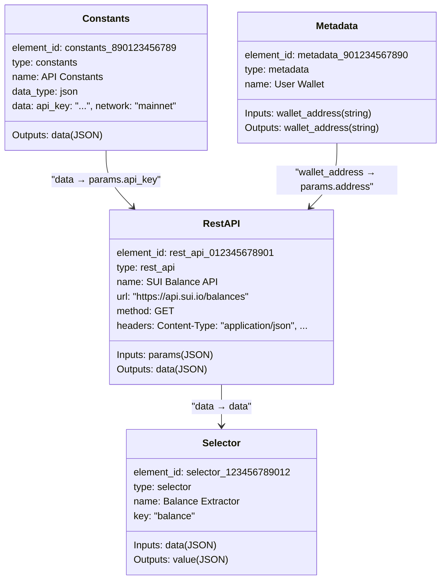
```mermaid
classDiagram
    class Constants {
        element_id: constants_890123456789
        type: constants
        name: API Constants
        data_type: json
        data: api_key: "...", network: "mainnet"
        Outputs: data (JSON)
    }
    class Metadata {
        element_id: metadata_901234567890
        type: metadata
        name: User Wallet
        Inputs: wallet_address (string)
        Outputs: wallet_address (string)
    }
    class RestAPI {
        element_id: rest_api_012345678901
        type: rest_api
        name: SUI Balance API
        url: "https://api.sui.io/balances"
        method: GET
        headers: Content-Type: "application/json", ...
        Inputs: params (JSON)
        Outputs: data (JSON)
    }
    class Selector {
        element_id: selector_123456789012
        type: selector
        name: Balance Extractor
        key: "balance"
        Inputs: data (JSON)
        Outputs: value (JSON)
    }
    
    Constants --> RestAPI : "data → params.api_key"
    Metadata --> RestAPI : "wallet_address → params.address"
    RestAPI --> Selector : "data → data"
```

### Metadata

The Metadata element provides user and environment metadata to the flow.

**Parameters**:
- `data` (dict, optional): Default metadata values

**Inputs**: Any (overrides defaults)

**Outputs**: Combined metadata from inputs and defaults

**Example Usage**:

```yaml
user_metadata:
  type: metadata
  element_id: user_metadata
  name: User Metadata
  description: Provides user-related metadata
  input_schema:
    user_id:
      type: string
      description: User ID
      required: false
  output_schema:
    user_id:
      type: string
      description: User ID
      required: true
    timestamp:
      type: string
      description: Current timestamp
      required: true
  data:
    timestamp: "2025-05-19T12:00:00Z"
```

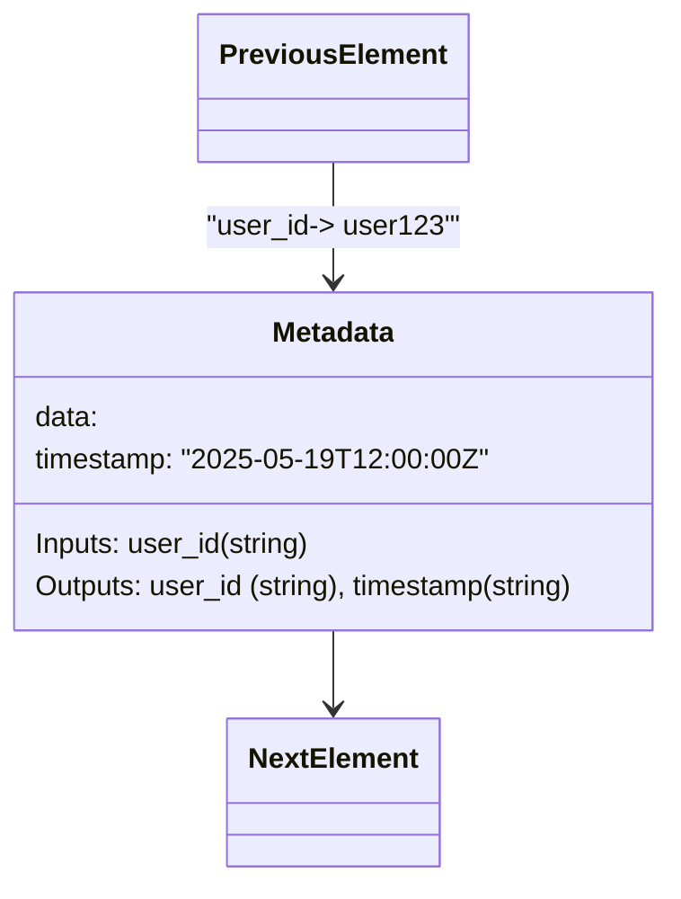
```mermaid
classDiagram
    class PreviousElement 

    class Metadata {
        data: 
        timestamp: "2025-05-19T12:00:00Z"
        Inputs: user_id (string)
        Outputs: user_id (string), timestamp (string)
        }
    
    class NextElement 
    
    PreviousElement --> Metadata : "user_id-> user123'"
    Metadata --> NextElement
```

### Constants

The Constants element provides fixed values to the flow.

**Parameters**:
- `data_type` (string): Type of the constant (string, int, float, bool, json, list)
- `data` (any): The value of the constant

**Inputs**: None

**Outputs**:
- `data` (depends on type): The constant value

**Example Usage**:

```yaml
config_constants:
  type: constants
  element_id: config_constants
  name: Configuration Constants
  description: Provides configuration values
  input_schema: {}
  output_schema:
    data:
      type: json
      description: Configuration data
      required: true
  data_type: json
  data:
    max_retries: 3
    timeout_seconds: 30
    base_url: "https://api.example.com"
```

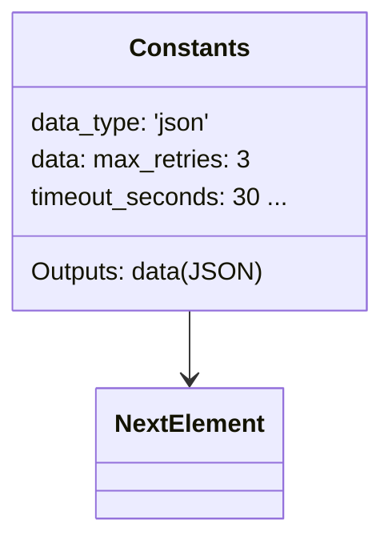
```mermaid
classDiagram
    class Constants {
        data_type: 'json'
        data: max_retries: 3
        timeout_seconds: 30 ...
        Outputs: data (JSON)
    }
    class NextElement {
    }
    Constants --> NextElement
```

## Utility Elements

Utility elements manipulate or process data within the flow.

| Name | Description | Parameters | Inputs | Outputs |
|------|-------------|------------|--------|---------|
| Selector | Extract values from data | `key` (string or list) | `data` (any) | `value` (extracted data) |
| Merger | Combine multiple data inputs | None | `data1` (any), `data2` (any) | `merged_data` (combined data) |
| RandomGenerator | Generate random values | `type`, `min`, `max`, `length`, etc. | None | `random_data` (depends on type) |
| TimeBlock | Provide time/date information | `type`, `format`, `timezone` | None | `time_data` (depends on type) |

### Selector

The Selector element extracts specific values from data structures based on keys.

**Parameters**:
- `key` (string or list): Key(s) to select from the data

**Inputs**:
- `data` (any): The data to extract from

**Outputs**:
- `value` (any): The extracted data

**Example Usage**:

```yaml
user_selector:
  type: selector
  element_id: user_selector
  name: Extract User Details
  description: Get specific user information
  input_schema:
    data:
      type: json
      description: User data object
      required: true
  output_schema:
    value:
      type: json
      description: Selected user details
      required: true
  key:
    - name
    - email
    - subscription_type
```

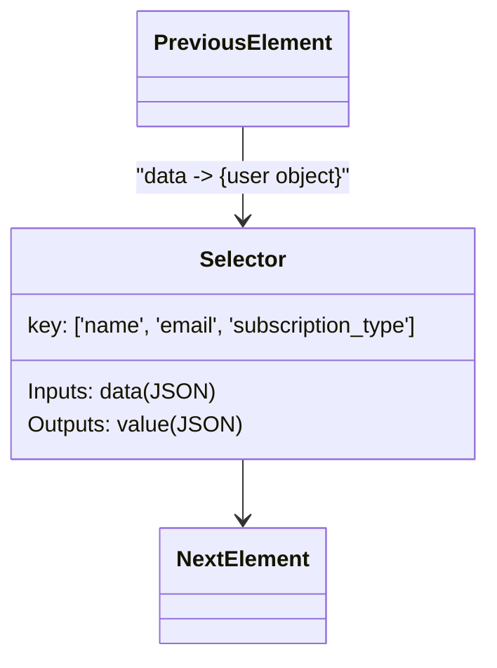
```mermaid
classDiagram
    class PreviousElement {
    }
    class Selector {
        key: ['name', 'email', 'subscription_type']
        Inputs: data (JSON)
        Outputs: value (JSON)
    }
    class NextElement {
    }
    PreviousElement --> Selector : "data -> {user object}"
    Selector --> NextElement
```

### Merger

The Merger element combines multiple data inputs into a single output.

**Parameters**: None

**Inputs**:
- `data1` (any): First data input
- `data2` (any): Second data input

**Outputs**:
- `merged_data` (any): Combined data result

**Example Usage**:

```yaml
profile_merger:
  type: merger
  element_id: profile_merger
  name: Combine Profile Data
  description: Merges user profile with preferences
  input_schema:
    data1:
      type: json
      description: User profile
      required: true
    data2:
      type: json
      description: User preferences
      required: true
  output_schema:
    merged_data:
      type: json
      description: Complete user data
      required: true
```

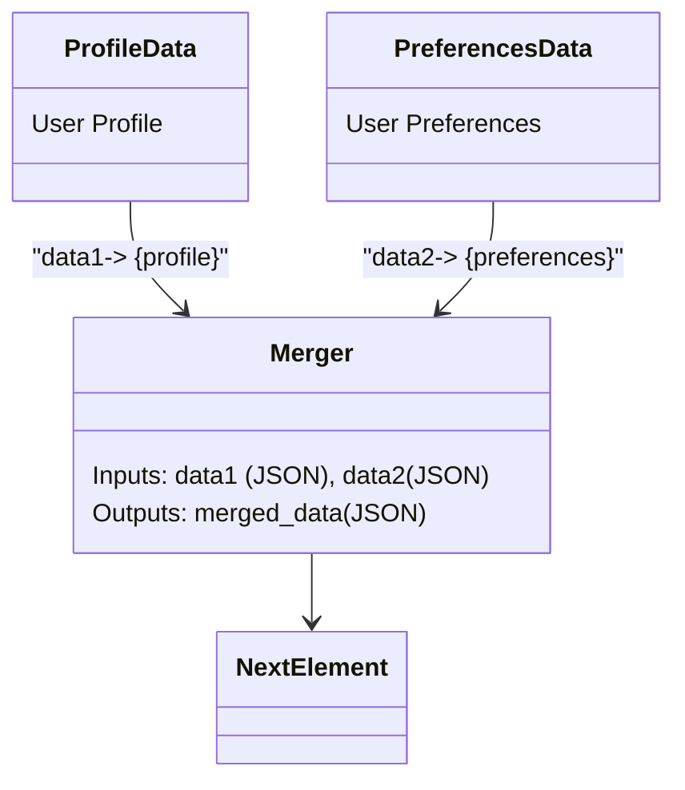
```mermaid
classDiagram
    class ProfileData {
        User Profile
    }
    class PreferencesData {
        User Preferences
    }
    class Merger {
        Inputs: data1 (JSON), data2 (JSON)
        Outputs: merged_data (JSON)
    }
    class NextElement {
    }
    ProfileData --> Merger : "data1-> {profile}"
    PreferencesData --> Merger : "data2-> {preferences}"
    Merger --> NextElement
```

### RandomGenerator

The RandomGenerator element generates random values of different types.

**Parameters**:
- `type` (string): Type of random data (string, int, float)
- `floating_point` (bool): Generate floating point numbers
- `min` (int): Minimum value for numbers
- `max` (int): Maximum value for numbers
- `decimal` (int): Decimal places for floats
- `length` (int): Length for strings

**Inputs**: None

**Outputs**:
- `random_data` (depends on type): The generated random value

**Example Usage**:

```yaml
id_generator:
  type: random_generator
  element_id: id_generator
  name: Transaction ID Generator
  description: Generates random transaction IDs
  input_schema: {}
  output_schema:
    random_data:
      type: string
      description: Random transaction ID
      required: true
  type: string
  length: 16
```

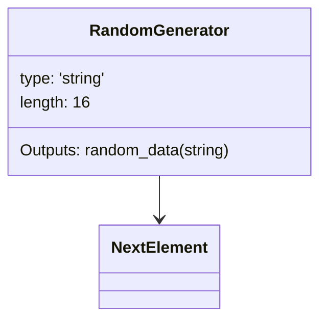
```mermaid
classDiagram
    class RandomGenerator {
        type: 'string'
        length: 16
        Outputs: random_data (string)
    }
    class NextElement {
    }
    RandomGenerator --> NextElement
```

### TimeBlock

The TimeBlock element provides current time and date information.

**Parameters**:
- `type` (string): Output type (string, int, float)
- `format` (string): Time format for string output
- `timezone` (string): Timezone to use

**Inputs**: None

**Outputs**:
- `time_data` (depends on type): The current time/date

**Example Usage**:

```yaml
timestamp:
  type: time
  element_id: timestamp
  name: Transaction Timestamp
  description: Provides current timestamp
  input_schema: {}
  output_schema:
    time_data:
      type: string
      description: Current timestamp
      required: true
  type: string
  format: "YYYY-MM-DD HH:MM:SS"
  timezone: "UTC+0"
```

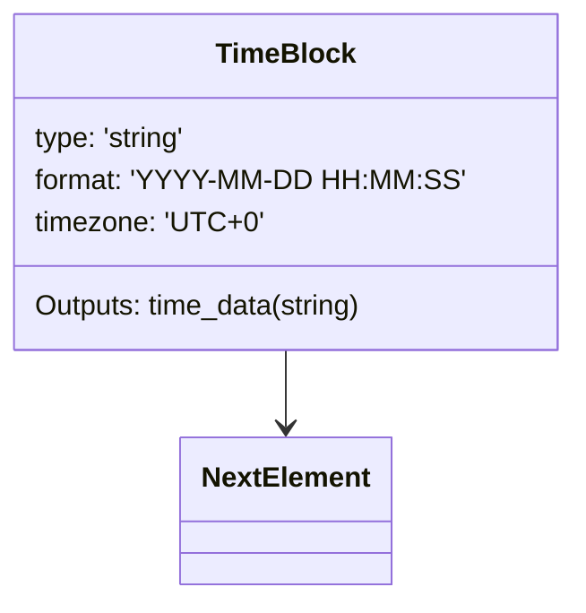
```mermaid
classDiagram
    class TimeBlock {
        type: 'string'
        format: 'YYYY-MM-DD HH:MM:SS'
        timezone: 'UTC+0'
        Outputs: time_data (string)
    }
    class NextElement {
    }
    TimeBlock --> NextElement
```

## AI Elements

AI elements generate text or structured data using language models.

| Name | Description | Parameters | Inputs | Outputs |
|------|-------------|------------|--------|---------|
| LLMText | Generate free-form text | `model`, `temperature`, `max_tokens`, `wrapper_prompt` | `prompt`, `context` (optional), `additional_data` (optional) | `llm_output` (string) |
| LLMStructured | Generate structured data | `model`, `temperature`, `max_tokens`, `wrapper_prompt`, `llm_hidden_prompt` | `prompt`, `context` (optional), `additional_data` (optional) | Varies based on output_schema |

### LLMText

The LLMText element generates free-form text using a language model.

**Parameters**:
- `model` (string): Language model ID (e.g., "DeepSeek R1 AWS")
- `temperature` (float): Creativity parameter (0.0-1.0)
- `max_tokens` (int): Maximum tokens to generate
- `wrapper_prompt` (string): Template for constructing the prompt

**Inputs**:
- `prompt` (string): Main user prompt
- `context` (list, optional): Additional context information
- `additional_data` (JSON, optional): Extra data for the prompt

**Outputs**:
- `llm_output` (string): Generated text from the model

**Example Usage**:

```yaml
llm_text:
  type: llm_text
  element_id: llm_text
  name: AI Text Generator
  description: Generates a response using the LLM
  input_schema:
    prompt:
      type: string
      description: The prompt for the LLM
      required: true
    context:
      type: list
      description: Context for the LLM
      required: false
    additional_data:
      type: json
      description: Additional data for the LLM
      required: false
  output_schema:
    llm_output:
      type: string
      description: Generated text from the LLM
      required: true
  model: "DeepSeek R1 AWS"
  temperature: 0.7
  max_tokens: 1000
  wrapper_prompt: "You are a helpful AI assistant. Please respond to the following: {prompt}\n\nContext: {context}"
```

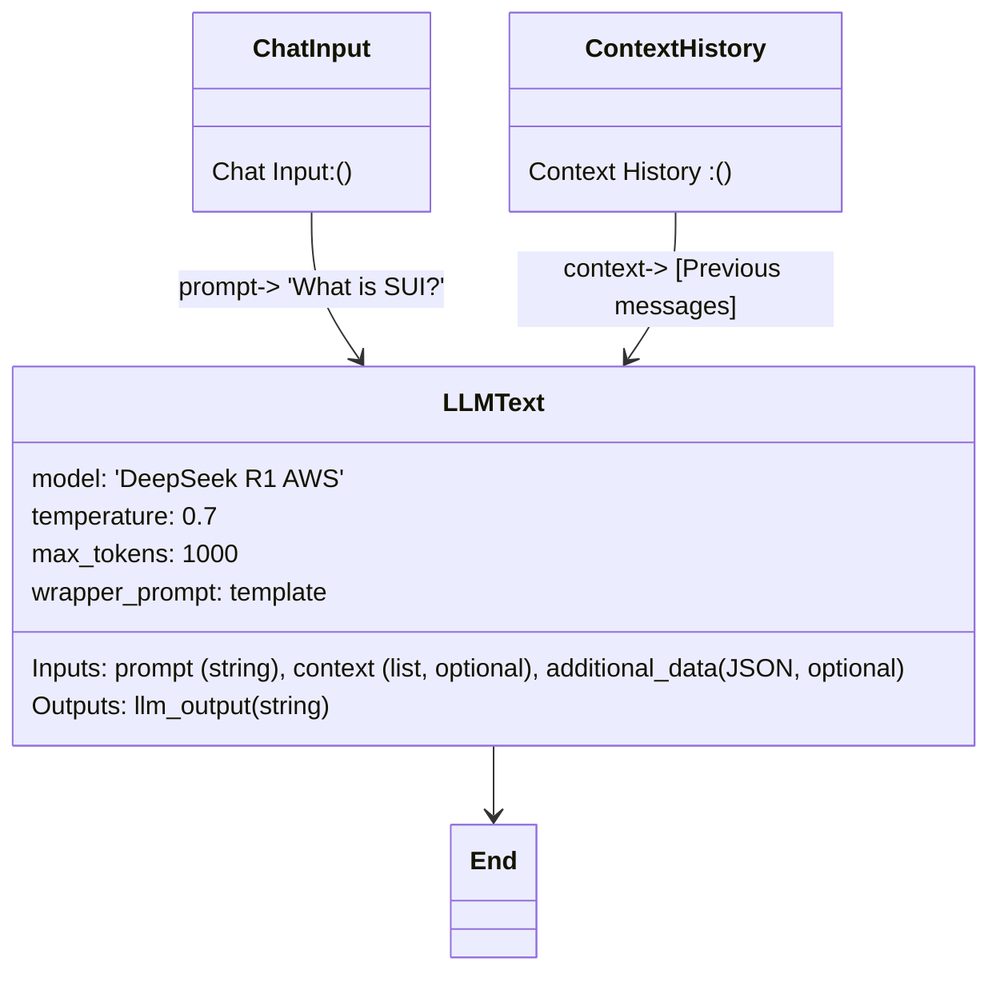
```mermaid
classDiagram
    class ChatInput {
        Chat Input: ()
    }
    class ContextHistory {
        Context History : ()
    }
    class LLMText {
        model: 'DeepSeek R1 AWS' 
        temperature: 0.7 
        max_tokens: 1000 
        wrapper_prompt: template
        Inputs: prompt (string), context (list, optional), additional_data (JSON, optional)
        Outputs: llm_output (string)
    }
    class End {
    }
    ChatInput --> LLMText : prompt-> 'What is SUI?'
    ContextHistory --> LLMText : context-> [Previous messages]
    LLMText --> End
```

### LLMStructured

The LLMStructured element generates structured data according to a schema using a language model.

**Parameters**:
- `model` (string): Language model ID (e.g., "DeepSeek R1 AWS")
- `temperature` (float): Creativity parameter (0.0-1.0)
- `max_tokens` (int): Maximum tokens to generate
- `wrapper_prompt` (string): Template for constructing the prompt
- `llm_hidden_prompt` (string): Additional internal prompt instructions

**Inputs**:
- `prompt` (string): Main user prompt
- `context` (list, optional): Additional context information
- `additional_data` (JSON, optional): Extra data for the prompt

**Outputs**: Varies based on the defined output_schema

**Example Usage**:

```yaml
product_classifier:
  type: llm_structured
  element_id: product_classifier
  name: Product Category Classifier
  description: Classifies products into categories
  input_schema:
    prompt:
      type: string
      description: Product description
      required: true
    additional_data:
      type: json
      description: Available categories
      required: false
  output_schema:
    category:
      type: string
      description: Primary product category
      required: true
    subcategory:
      type: string
      description: Product subcategory
      required: true
    confidence:
      type: float
      description: Confidence score
      required: true
  model: "DeepSeek R1 AWS"
  temperature: 0.3
  max_tokens: 500
```

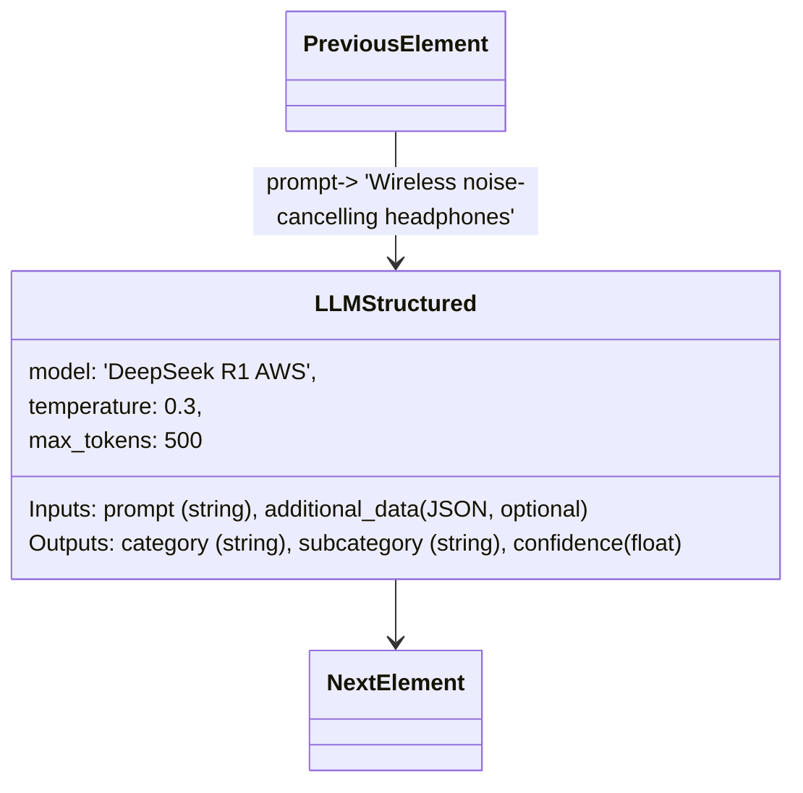
```mermaid
classDiagram
    class PreviousElement {
    }
    class LLMStructured {
        model: 'DeepSeek R1 AWS',  
        temperature: 0.3, 
        max_tokens: 500
        Inputs: prompt (string), additional_data (JSON, optional)
        Outputs: category (string), subcategory (string), confidence (float)
    }
    class NextElement {
    }
    PreviousElement --> LLMStructured : prompt-> 'Wireless noise-cancelling headphones'
    LLMStructured --> NextElement
```

## Blockchain Elements

Blockchain elements interact with blockchain networks (Note: Using SUI instead of Aptos as specified).

| Name | Description | Parameters | Inputs | Outputs |
|------|-------------|------------|--------|---------|
| ReadBlockchainData | Read data from blockchain | `node_url`, `contract_address`, `function_name`, `function_args` | Varies based on function_args | `data` (blockchain response) |
| BuildTransactionJSON | Create transaction payload | `node_url`, `contract_address`, `function_name`, `function_args` | Varies based on function_args | `transaction_json` (transaction payload) |

### ReadBlockchainData

The ReadBlockchainData element reads data from the SUI blockchain.

**Parameters**:
- `node_url` (string): URL of the SUI node
- `contract_address` (string): Address of the smart contract
- `function_name` (string): Name of the function to call
- `function_args` (list): List of argument names to use from inputs

**Inputs**: Varies based on function_args

**Outputs**:
- `data` (any): The response from the blockchain function call

**Example Usage**:

```yaml
token_balance:
  type: read_blockchain_data
  element_id: token_balance
  name: Token Balance Checker
  description: Reads token balance from SUI
  input_schema:
    wallet_address:
      type: string
      description: User wallet address
      required: true
    token_id:
      type: string
      description: Token ID to check
      required: true
  output_schema:
    data:
      type: json
      description: Token balance data
      required: true
  node_url: "https://fullnode.mainnet.sui.io"
  contract_address: "0x2::coin::CoinStore"
  function_name: "balance"
  function_args:
    - wallet_address
    - token_id
```

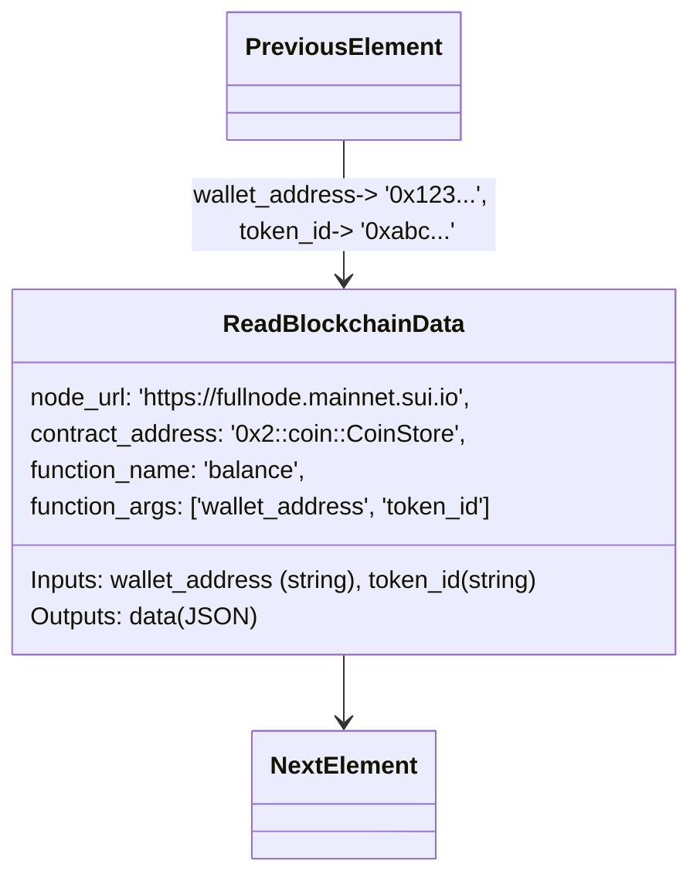
```mermaid
classDiagram
    class PreviousElement {
    }
    class ReadBlockchainData {
        node_url: 'https://fullnode.mainnet.sui.io', 
        contract_address: '0x2::coin::CoinStore', 
        function_name: 'balance', 
        function_args: ['wallet_address', 'token_id']
        Inputs: wallet_address (string), token_id (string)
        Outputs: data (JSON)
    }
    class NextElement {
    }
    PreviousElement --> ReadBlockchainData : wallet_address-> '0x123...',  token_id-> '0xabc...'
    ReadBlockchainData --> NextElement
```

### BuildTransactionJSON

The BuildTransactionJSON element creates a transaction payload for the SUI blockchain.

**Parameters**:
- `node_url` (string): URL of the SUI node
- `contract_address` (string): Address of the smart contract
- `function_name` (string): Name of the function to call
- `function_args` (list): List of argument names to use from inputs

**Inputs**: Varies based on function_args

**Outputs**:
- `transaction_json` (JSON): The transaction payload

**Example Usage**:

```yaml
token_transfer:
  type: build_transaction_json
  element_id: token_transfer
  name: Token Transfer Builder
  description: Builds a token transfer transaction
  input_schema:
    recipient:
      type: string
      description: Recipient address
      required: true
    amount:
      type: string
      description: Amount to transfer
      required: true
    token_id:
      type: string
      description: Token ID
      required: true
  output_schema:
    transaction_json:
      type: json
      description: Transaction payload
      required: true
  node_url: "https://fullnode.mainnet.sui.io"
  contract_address: "0x2::coin::transfer"
  function_name: "transfer"
  function_args:
    - recipient
    - amount
    - token_id
```

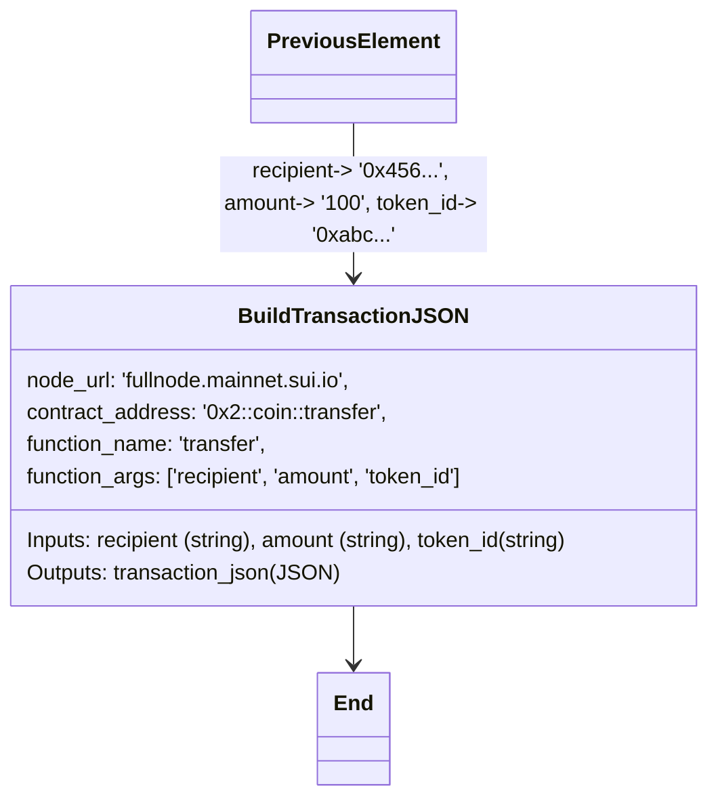
```mermaid
classDiagram
    class PreviousElement {
    }
    class BuildTransactionJSON {
         node_url: 'fullnode.mainnet.sui.io', 
         contract_address: '0x2::coin::transfer', 
         function_name: 'transfer', 
         function_args: ['recipient', 'amount', 'token_id']
        Inputs: recipient (string), amount (string), token_id (string)
        Outputs: transaction_json (JSON)
    }
    class End {
    }
    PreviousElement --> BuildTransactionJSON : recipient-> '0x456...', amount-> '100', token_id-> '0xabc...'
    BuildTransactionJSON --> End
```

## Custom Element

The Custom element provides the ability to execute custom Python code with security restrictions.

| Name | Description | Parameters | Inputs | Outputs |
|------|-------------|------------|--------|---------|
| Custom | Execute Python code | `code`, `hyperparameters`, `constants` | Varies based on input_schema | Varies based on code implementation |

### Custom

The Custom element allows for executing restricted Python code within the flow.

**Parameters**:
- `code` (string): Python code to execute
- `hyperparameters` (dict, optional): Hyperparameters for the code
- `constants` (dict, optional): Constants for the code

**Inputs**: Varies based on input_schema

**Outputs**: Varies based on the code implementation and output_schema

**Example Usage**:

```yaml
data_processor:
  type: custom
  element_id: data_processor
  name: Custom Data Processor
  description: Processes data with custom logic
  input_schema:
    input_data:
      type: json
      description: Input data to process
      required: true
  output_schema:
    output:
      type: json
      description: Processed output data
      required: true
  code: |
    # Process the input data
    input_data = inputs.get('input_data', {})
    
    # Apply custom transformations
    result = {}
    for key, value in input_data.items():
        if isinstance(value, (int, float)):
            result[key] = value * 2
        elif isinstance(value, str):
            result[key] = value.upper()
        else:
            result[key] = value
    
    # Set the output
    output = result
  hyperparameters:
    multiply_factor: 2
```

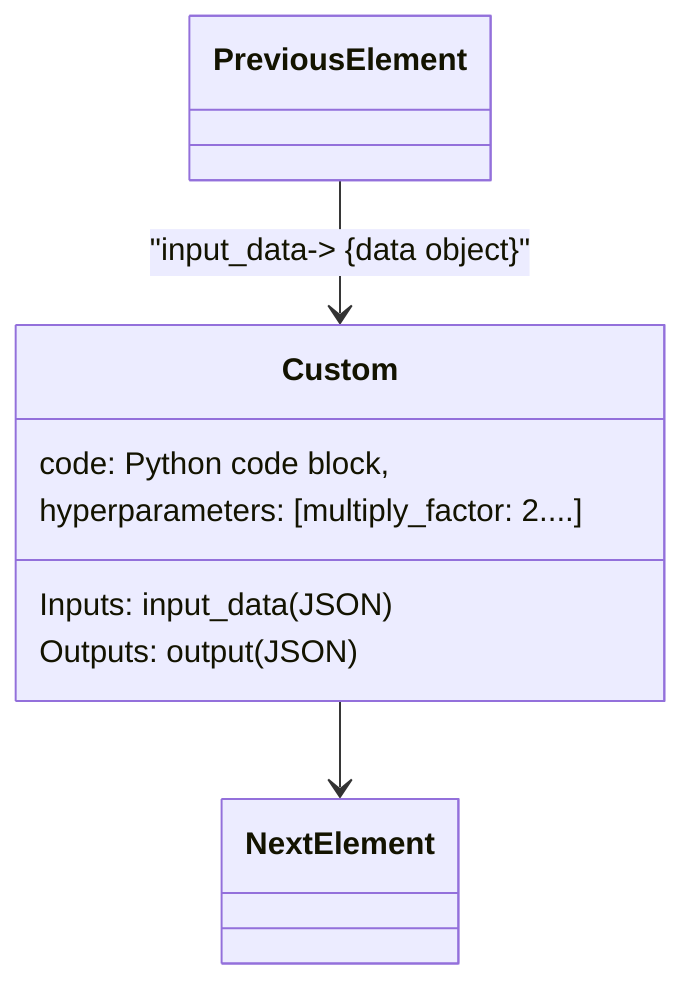
```mermaid
classDiagram
    class PreviousElement {
    }
    class Custom {
        code: Python code block, 
        hyperparameters: [multiply_factor: 2....]
        Inputs: input_data (JSON)
        Outputs: output (JSON)
    }
    class NextElement {
    }
    PreviousElement --> Custom : "input_data-> {data object}"
    Custom --> NextElement
```

## Flow Control and Execution

The Flow Executor manages the execution of elements in the flow by following these rules:

1. **Execution Order**: Elements are executed in dependency order, where an element must wait for all of its dependencies (upstream elements) to execute first.

2. **Downward Execution**: Each element has a `downwards_execute` flag that determines whether its downstream connections should be executed after it completes. Flow control elements like Case can modify this flag for connections based on conditions.

3. **Data Passing**: Data is passed between elements through their inputs and outputs. Each connection can map specific output fields from the source element to specific input fields of the target element.

4. **Backtracking**: If an element is requested to execute but its dependencies haven't been executed yet, the system will "backtrack" to execute those dependencies first.

5. **Event Streaming**: As elements execute, events are streamed to provide visibility into the flow's progress and results.

### Connection Example

Here's an example of how connections are defined:

```yaml
connections:
  - from_id: chat_input_234567890123
    to_id: llm_text_345678901234
    from_output: chat_input
    to_input: prompt
  - from_id: context_history_456789012345
    to_id: llm_text_345678901234
    from_output: context_history
    to_input: context
  - from_id: llm_text_345678901234
    to_id: end_567890123456
    from_output: llm_output
    to_input: text_input
```

This creates the following flow:
1. The `chat_input_234567890123` element's `chat_input` output is connected to the `llm_text_345678901234` element's `prompt` input
2. The `context_history_456789012345` element's `context_history` output is connected to the `llm_text_345678901234` element's `context` input
3. The `llm_text_345678901234` element's `llm_output` output is connected to the `end_567890123456` element's `text_input` input

### Full Flow Example

Here's a simple example of a complete flow definition:

```yaml
flow_id: simple_ai_flow
flow_definition:
  flow_id: simple_ai_flow
  elements:
    start_123456789012:
      type: start
      element_id: start_123456789012
      name: Start Block
      description: Entry point of the flow
      input_schema: {}
      output_schema: {}
    chat_input_234567890123:
      type: chat_input
      element_id: chat_input_234567890123
      name: User Input
      description: Captures the user's message
      input_schema:
        chat_input:
          type: string
          description: The input provided by the user
          required: true
      output_schema:
        chat_input:
          type: string
          description: The input provided by the user
          required: true
    context_history_345678901234:
      type: context_history
      element_id: context_history_345678901234
      name: Conversation Context
      description: Provides conversation history for context
      input_schema:
        context_history:
          type: list
          description: List of previous messages
          required: false
      output_schema:
        context_history:
          type: list
          description: List of previous messages
          required: false
    llm_text_456789012345:
      type: llm_text
      element_id: llm_text_456789012345
      name: AI Text Generator
      description: Generates a response using the LLM
      input_schema:
        prompt:
          type: string
          description: The prompt for the LLM
          required: true
        context:
          type: list
          description: Context for the LLM
          required: false
        additional_data:
          type: json
          description: Additional data for the LLM
          required: false
      output_schema:
        llm_output:
          type: string
          description: Generated text from the LLM
          required: true
      model: "DeepSeek R1 AWS"
      temperature: 0.7
      max_tokens: 1000
      wrapper_prompt: "You are a helpful AI assistant. Please respond to the following: {prompt}\n\nContext: {context}"
    end_567890123456:
      type: end
      element_id: end_567890123456
      name: End Block
      description: Exit point of the flow
      input_schema:
        text_input:
          type: string
          description: Text output to return to the user
          required: true
        proposed_transaction:
          type: json
          description: Transaction to be sent to the blockchain
          required: false
      output_schema:
        text_output:
          type: string
          description: Final text output
          required: true
        proposed_transaction:
          type: json
          description: Final transaction payload
          required: false
  connections:
    - from_id: start_123456789012
      to_id: llm_text_456789012345
    - from_id: chat_input_234567890123
      to_id: llm_text_456789012345
      from_output: chat_input
      to_input: prompt
    - from_id: context_history_345678901234
      to_id: llm_text_456789012345
      from_output: context_history
      to_input: context
    - from_id: llm_text_456789012345
      to_id: end_567890123456
      from_output: llm_output
      to_input: text_input
  start_element_id: start_123456789012
  metadata:
    name: Simple AI Flow
    description: A simple flow that takes user input and generates a response using an LLM
```

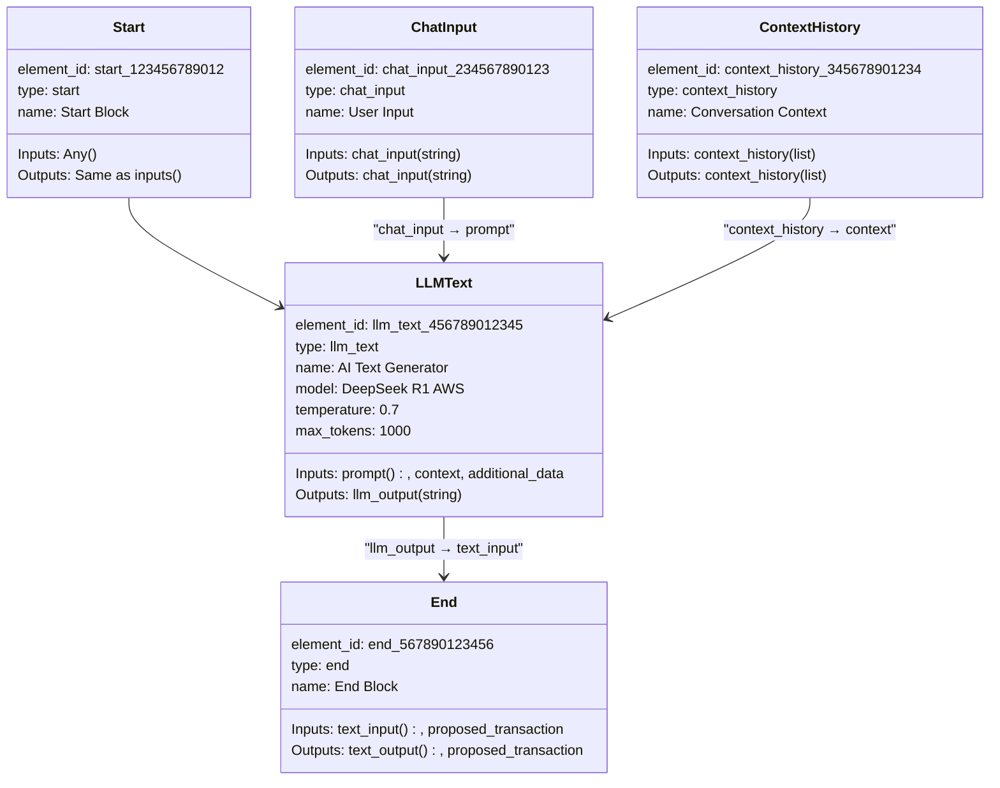
```mermaid
classDiagram
    class Start {
        element_id: start_123456789012
        type: start
        name: Start Block
        Inputs: Any()
        Outputs: Same as inputs()
    }
    class ChatInput {
        element_id: chat_input_234567890123
        type: chat_input
        name: User Input
        Inputs: chat_input (string)
        Outputs: chat_input (string)
    }
    class ContextHistory {
        element_id: context_history_345678901234
        type: context_history
        name: Conversation Context
        Inputs: context_history (list)
        Outputs: context_history (list)
    }
    class LLMText {
        element_id: llm_text_456789012345
        type: llm_text
        name: AI Text Generator
        model: DeepSeek R1 AWS
        temperature: 0.7
        max_tokens: 1000
        Inputs: prompt(), context, additional_data
        Outputs: llm_output (string)
    }
    class End {
        element_id: end_567890123456
        type: end
        name: End Block
        Inputs: text_input(), proposed_transaction
        Outputs: text_output(), proposed_transaction
    }
    
    Start --> LLMText
    ChatInput --> LLMText : "chat_input → prompt"
    ContextHistory --> LLMText : "context_history → context"
    LLMText --> End : "llm_output → text_input"
```

## Summary

The Flow Executor provides a flexible, component-based system for building complex workflows. Elements can be combined in various ways to create flows for different purposes:

1. **Conversational AI**: Using ChatInput, ContextHistory, and LLMText to build conversational agents
2. **Data Processing**: Using RestAPI, Datablocks, and Custom elements to process and transform data
3. **Blockchain Interaction**: Using ReadBlockchainData and BuildTransactionJSON to interact with the SUI blockchain
4. **Decision Flows**: Using Case and FlowSelect to create branching logic based on conditions

By understanding the different element types and how they connect, you can build powerful, reusable flows for a wide variety of applications.