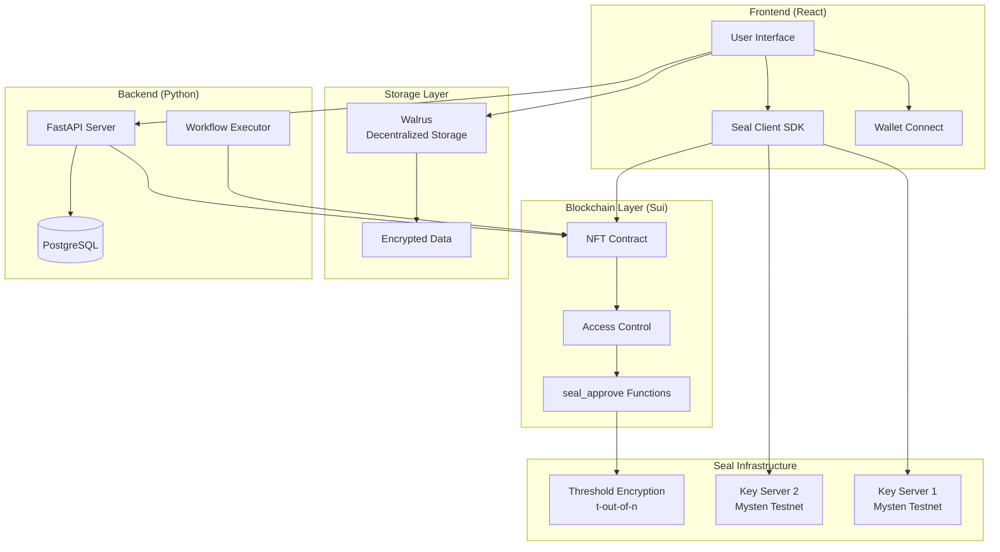
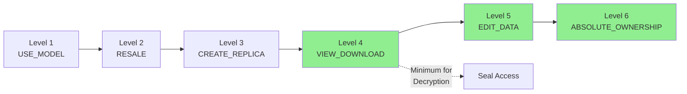
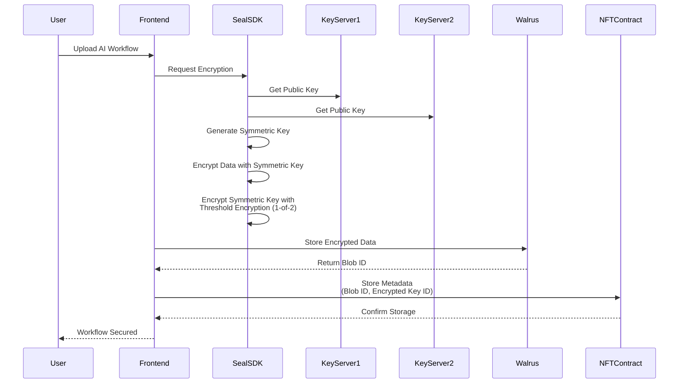
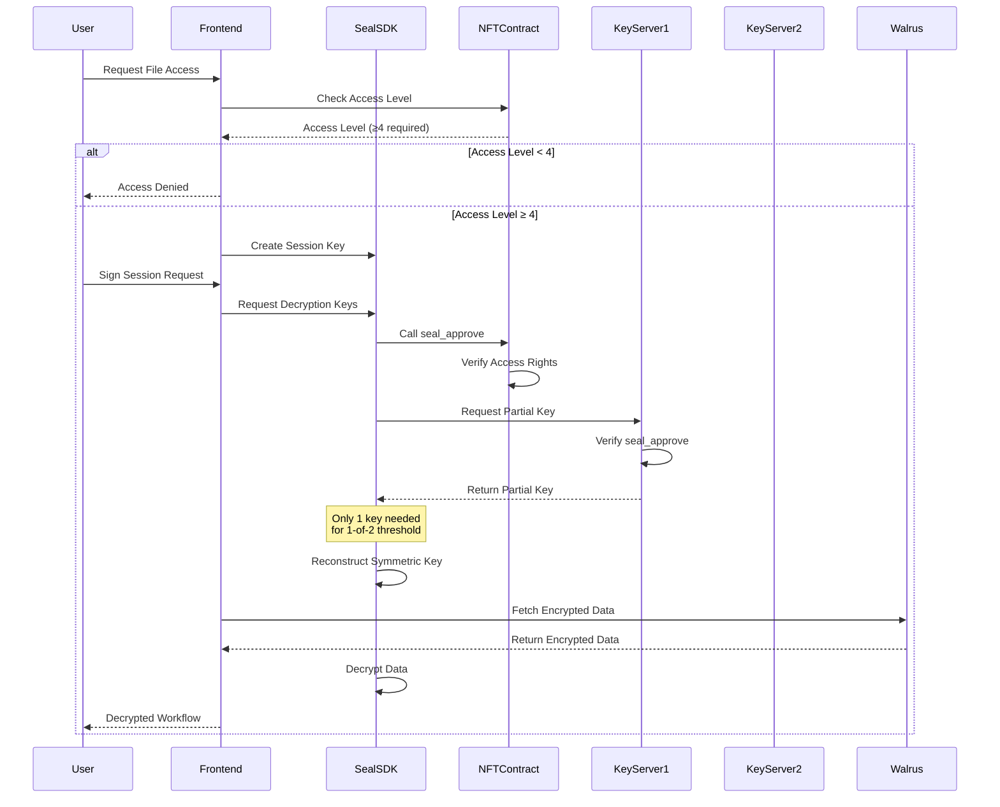
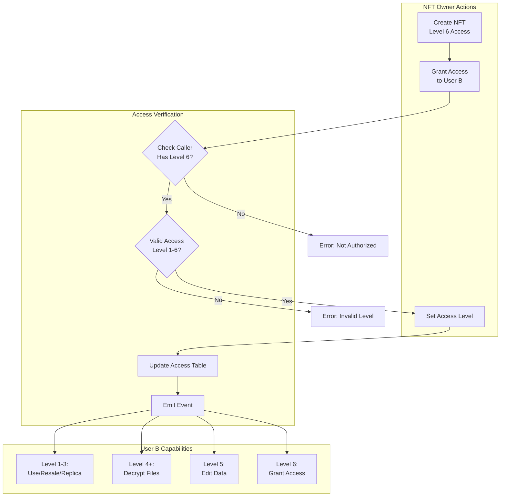
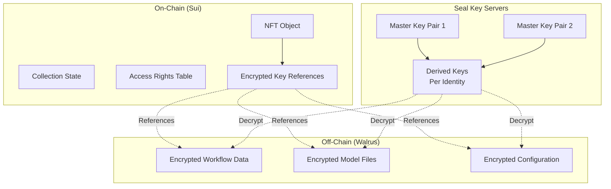
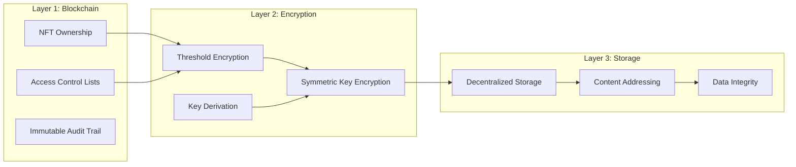
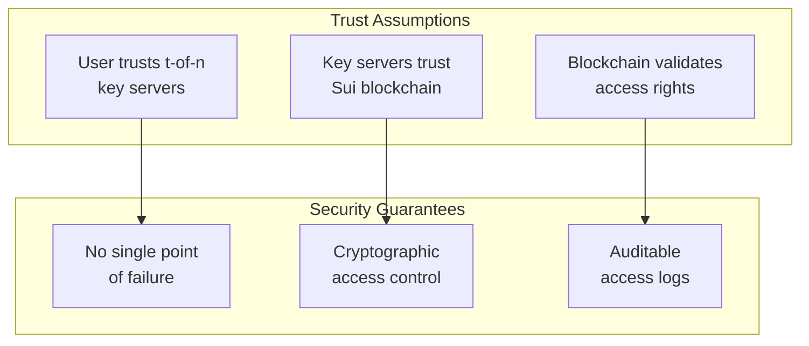
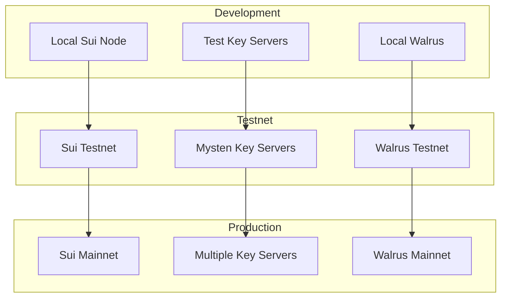

# NeuraLabs Architecture Guide: Seal Integration for Encrypted AI Workflows

## Overview

This guide explains the architecture of the NeuraLabs system, focusing on how Seal threshold encryption integrates with NFT-based access control to secure AI workflows stored on Walrus.

## System Architecture



## Core Components

### 1. NFT-Based Access Control

The system uses NFTs to represent AI workflows with 6 levels of access:



### 2. Seal Threshold Encryption Flow

#### Encryption Process



#### Decryption Process



### 3. Access Grant Workflow



### 4. Data Storage Architecture



## Security Model

### 1. Multi-Layer Security



### 2. Trust Model



## Integration Points

### 1. Frontend Integration

```javascript
// Key integration points in React app
const integrationFlow = {
  wallet: "Sui Wallet / zkLogin",
  encryption: "@mysten/seal SDK",
  storage: "Walrus SDK",
  blockchain: "@mysten/sui.js"
};
```

### 2. Backend Integration

```python
# Key integration points in Python backend
integration_points = {
    "blockchain": "sui-py SDK",
    "database": "PostgreSQL + Redis",
    "ai_execution": "Custom Workflow Engine",
    "authentication": "JWT + zkLogin"
}
```

### 3. Smart Contract Hooks

```move
// Key functions for integration
module neuralnft::nft {
    // Seal integration point
    entry fun seal_approve(id: vector<u8>, collection: &NFTCollection, ctx: &TxContext)
    
    // Access control integration
    public fun grant_access(...)
    public fun can_decrypt_files(...)
    
    // Data storage integration
    public fun add_encrypted_data(...)
}
```

## Deployment Architecture



## Best Practices

### 1. Key Management
- Use 1-of-2 threshold for low latency testing
- Consider 2-of-3 or higher for production
- Rotate session keys regularly

### 2. Access Control
- Start with minimal access (Level 1)
- Grant higher access only when needed
- Audit access changes regularly

### 3. Data Storage
- Encrypt all sensitive data before storage
- Use content addressing for integrity
- Implement data retention policies

### 4. Performance Optimization
- Cache decryption keys in frontend
- Batch access requests when possible
- Use appropriate gas budgets

## Conclusion

The NeuraLabs architecture leverages Sui's programmability, Seal's threshold encryption, and Walrus's decentralized storage to create a secure, scalable platform for AI workflow management. The 6-level access control system ensures fine-grained permissions while maintaining the ability to share and monetize AI workflows securely.