# NeuraLabs - Autonomous AI Agent Orchestration Platform

- [NeuraLabs - Autonomous AI Agent Orchestration Platform](#neuralabs---autonomous-ai-agent-orchestration-platform)
  - [Overview](#overview)
    - [Core Vision: Democratizing AI Ownership](#core-vision-democratizing-ai-ownership)
    - [Technical Architecture](#technical-architecture)
      - [🧠 Autonomous Agent Protocol](#-autonomous-agent-protocol)
      - [🔐 Cryptographic Infrastructure](#-cryptographic-infrastructure)
      - [🔄 Execution Infrastructure](#-execution-infrastructure)
      - [📄 Smart Contract Layer](#-smart-contract-layer)
    - [Current Technical Implementations](#current-technical-implementations)
      - [Smart Contract Implementation](#smart-contract-implementation)
      - [Backend Infrastructure](#backend-infrastructure)
      - [Cryptographic Components](#cryptographic-components)
    - [The Path to Full Autonomy](#the-path-to-full-autonomy)
      - [Phase 1: Foundation (Current)](#phase-1-foundation-current)
      - [Phase 2: Semi-Autonomous (Q2 2025)](#phase-2-semi-autonomous-q2-2025)
      - [Phase 3: Full Autonomy (Q4 2025)](#phase-3-full-autonomy-q4-2025)
      - [Phase 4: The Singularity (2026+)](#phase-4-the-singularity-2026)
    - [Use Case Example: Autonomous Medical Research](#use-case-example-autonomous-medical-research)
    - [Technical Challenges We're Solving](#technical-challenges-were-solving)
    - [Our Philosophy](#our-philosophy)
- [How to get started](#how-to-get-started)
- [Smart Contract Architecture](#smart-contract-architecture)
  - [Contract Modules](#contract-modules)
  - [Access Control System](#access-control-system)
  - [Seal Integration](#seal-integration)
  - [Deployment Information](#deployment-information)
- [HPC Neura Execution Engine](#hpc-neura-execution-engine)
  - [Core Architecture](#core-architecture)
  - [Elements and Nodes](#elements-and-nodes)
  - [Flow Design and Execution](#flow-design-and-execution)
  - [Connection Types and Data Flow](#connection-types-and-data-flow)
  - [Execution Model](#execution-model)
- [Storage Infrastructure](#storage-infrastructure)
  - [Walrus Decentralized Storage](#walrus-decentralized-storage)
  - [Storage Architecture](#storage-architecture)
  - [Data Flow and Security](#data-flow-and-security)
  - [Performance and Scalability](#performance-and-scalability)
- [Authentication System](#authentication-system)
  - [zkLogin Architecture](#zklogin-architecture)
  - [OAuth Integration](#oauth-integration)
  - [Prover Service Infrastructure](#prover-service-infrastructure)
- [Encryption Infrastructure](#encryption-infrastructure)
  - [Seal Threshold Encryption](#seal-threshold-encryption)
  - [Concrete Implementation Patterns](#concrete-implementation-patterns)
  - [Security Features](#security-features)
- [AWS Bedrock Integration](#aws-bedrock-integration)
  - [Model Support and Selection](#model-support-and-selection)
  - [Setup and Configuration](#setup-and-configuration)
  - [Performance and Cost Optimization](#performance-and-cost-optimization)
- [Components that we have used for cryptography](#components-that-we-have-used-for-cryptography)
  - [Setting up Salt serve](#setting-up-salt-serve)
  - [Setting up Prover service](#setting-up-prover-service)

## Overview

NeuraLabs is building the future of autonomous AI - a decentralized platform where AI agents can self-organize, discover capabilities, and collaboratively solve complex problems without human intervention. By leveraging SUI blockchain's infrastructure, we enable users to create, own, and monetize AI agents that can autonomously compose workflows, negotiate payments, and execute tasks in a trustless, privacy-preserving environment. Our deep integration with SUI's cryptographic primitives - including Seal for threshold encryption, Walrus for decentralized storage, and zkLogin for seamless authentication - ensures that every interaction remains secure and truly decentralized.

### Core Vision: Democratizing AI Ownership

Our mission is to empower anyone to create, own, and monetize AI agents in a truly decentralized manner, free from central control. We envision:

- **Universal AI Creation**: Anyone, regardless of technical expertise, can create and deploy AI agents
- **True Ownership**: Creators maintain complete sovereignty over their AI agents, models, and data
- **Fair Compensation**: When AI agents use sub-agents created by others, creators are automatically and fairly compensated according to their pricing
- **Autonomous Workflow Composition**: AI agents can discover and integrate capabilities from other agents to solve complex problems
- **Privacy-Preserving Collaboration**: Enable federated learning and data sharing without revealing underlying data through zero-knowledge techniques

### Technical Architecture

#### 🧠 Autonomous Agent Protocol
- **Capability Discovery Protocol**: AI agents advertise their capabilities on-chain through structured metadata
- **Workflow Composition Engine**: Uses graph-based algorithms to automatically compose optimal workflows from available sub-agents
- **Cost Optimization**: AI agents negotiate and select sub-workflows based on performance metrics and cost
- **Recursive Composition**: Agents can create hierarchical workflows of arbitrary complexity

#### 🔐 Cryptographic Infrastructure
- **SUI Seal Integration**: 
  - Threshold encryption for multi-party computation
  - Distributed key generation (DKG) for trustless key management
  - Encrypted state sharing between agents
- **Walrus Decentralized Storage**:
  - Content-addressed storage for workflow definitions
  - Encrypted data blobs with capability-based access control
  - Merkle proofs for data integrity verification
- **Zero-Knowledge Proofs**:
  - Custom prover service running Groth16 proving system
  - zkLogin for Web2-friendly authentication
  - Private workflow execution verification
- **Verifiable Random Function (VRF)**:
  - On-chain randomness for gaming and prediction markets
  - Provably fair agent selection for load balancing
  - Verifiable shuffling for privacy-preserving data aggregation

#### 🔄 Execution Infrastructure
- **Distributed Execution Nodes**: 
  - Docker-containerized workers for isolated execution
  - Resource metering and billing per computation unit
  - Automatic scaling based on workflow demands
- **Streaming Protocol**:
  - Server-Sent Events (SSE) for real-time responses
  - Chunked processing for large language models
  - Backpressure handling for network optimization

#### 📄 Smart Contract Layer
- **SUI Move Contracts**: Native smart contracts deployed on SUI testnet
- **NFT-Based Access Control**: 6-level hierarchical permission system for AI workflows
- **Modular Architecture**: 4 separate modules for maintainability and upgradability
- **Seal Integration**: Built-in `seal_approve` functions for threshold encryption
- **Gas Optimized**: Efficient operations with O(1) complexity for access checks

#### 🔧 HPC Neura Execution Engine
- **Multi-Level Architecture**: 4-level stakeholder separation (L1-L4)
- **Typed Connections**: Control, data, and both connection types for precise flow control
- **Two-Phase Execution**: Downward execution and automatic backtracking for dependency resolution
- **Element System**: Reusable templates with hyperparameter-controlled customization
- **Real-Time Streaming**: Complete execution visibility with event streaming

### Current Technical Implementations

#### Smart Contract Implementation
- **Package ID**: `0x926de4be791b165822a8a213540c0606bb0d52450e5f8b6531097d9cd2c4dc64`
- **NFT Module**: Core NFT functionality with access control integration
- **Access Module**: 6-level permission system (USE_MODEL → ABSOLUTE_OWNERSHIP)
- **Storage Module**: Walrus integration for encrypted data management
- **Utils Module**: Helper functions for signature verification and access validation
- **Comprehensive Testing**: Unit tests, integration tests, and security validation
- **Deployment Automation**: Scripts for testnet deployment with monitoring

#### Backend Infrastructure
- **FastAPI-based Orchestration Service**: 
  - JWT authentication with Redis session management
  - PostgreSQL for workflow metadata and execution history
  - Async execution with Celery for long-running tasks
- **Execution Engine**:
  - Sandboxed Python/JavaScript execution environments
  - Multi-provider AI model support (Anthropic, DeepSeek, Bedrock)
  - Custom DSL for workflow definition (YAML-based)

#### Cryptographic Components
- **zkLogin Implementation**:
  - OAuth integration with major providers
  - Ephemeral key generation with deterministic derivation
  - Proof generation with custom prover service
- **VRF Integration**:
  - Commit-reveal scheme for unbiasable randomness
  - Integration with SUI's native VRF when available
  - Fallback to threshold signatures for randomness
- **Threshold Cryptography using Seal**:
  - Distributed key generation for trustless operations
  - Multi-party computation without revealing individual inputs
  - Secure secret sharing among network participants
- **Decentralized Storage using Walrus**:
  - Content-addressed storage with built-in redundancy
  - Encrypted blob storage with access control
  - Immutable data references for workflow definitions
- **Data Encryption**:
  - AES (Advanced Encryption Standard) for data at rest
  - End-to-end encryption for workflow execution
  - Homomorphic encryption for privacy-preserving computations (planned)

### The Path to Full Autonomy

#### Phase 1: Foundation (Current)
- ✅ Basic workflow composition and execution
- ✅ NFT-based access control with smart contracts
- ✅ Cryptographic primitives (zkLogin, Seal, Walrus)
- ✅ Manual workflow creation and sharing
- ✅ VRF for verifiable randomness
- ✅ Smart contract deployment and testing

#### Phase 2: Semi-Autonomous (Q2 2025)
- 🔄 Agent capability advertisement protocol
- 🔄 Automatic sub-workflow discovery
- 🔄 Cost-based workflow optimization
- 🔄 Basic federated learning support
- 🔄 Smart contract-based automated payments

#### Phase 3: Full Autonomy (Q4 2025)
- 🎯 Self-improving agents through reinforcement learning
- 🎯 Emergent workflow composition for novel problems
- 🎯 Cross-chain agent communication
- 🎯 Fully decentralized execution network

#### Phase 4: The Singularity (2026+)
- 🚀 Agents creating new agents autonomously
- 🚀 Self-organizing agent swarms for massive parallelization
- 🚀 Human-AI collaborative problem solving at scale
- 🚀 AGI-level task decomposition and execution

### Use Case Example: Autonomous Medical Research

Imagine a researcher asks: "What are the latest treatments for rare genetic disorders in children?"

1. **Master Agent** receives the query and decomposes it into sub-tasks
2. **Discovery Phase**: Master agent searches the workflow registry for:
   - Medical literature analysis agents
   - Clinical trial data aggregators
   - Genetic sequence analyzers
   - Pediatric specialty agents
3. **Negotiation**: Agents bid for subtasks based on their capabilities and costs
4. **Execution**: Selected agents work in parallel:
   - Literature agent scans recent publications
   - Clinical agent queries trial databases
   - Genetic agent analyzes relevant mutations
5. **Payment**: Master agent automatically pays sub-agents via smart contract micropayments
6. **Synthesis**: Results are aggregated and presented to the user
7. **Learning**: Performance metrics update agent rankings for future queries

All of this happens without human intervention beyond the initial query, secured by our smart contract infrastructure.

### Technical Challenges We're Solving

1. **Semantic Capability Matching**: Using embedding models to match agent capabilities with task requirements
2. **Byzantine Fault Tolerance**: Ensuring reliable execution even with malicious agents
3. **Economic Incentive Alignment**: Designing tokenomics that encourage quality over quantity
4. **Privacy-Preserving Computation**: Enabling agents to work with sensitive data without exposure
5. **Scalable Consensus**: Efficient agreement protocols for multi-agent workflows
6. **Smart Contract Gas Optimization**: Minimizing transaction costs for frequent micro-interactions

### Our Philosophy

> **"We are not enabling blockchain, but blockchain is enabling us"**

Blockchain provides the trustless infrastructure necessary for autonomous AI agents to transact, collaborate, and evolve without centralized control. It's not about putting AI on blockchain - it's about using blockchain to unleash AI's full potential.

---

# Components that we have used for cryptography

Our cryptographic infrastructure consists of three main components working together to provide secure, decentralized authentication and encryption:

## zkLogin Authentication System
- **OAuth Integration**: Support for Google, Facebook, Apple, and custom OAuth2 providers
- **Zero-Knowledge Proofs**: Privacy-preserving authentication without exposing Web2 credentials
- **Salt Servers**: Deterministic address generation with rainbow table attack prevention
- **Custom Prover Service**: Testnet-ready proof generation infrastructure at `https://prover.neuralabs.io`

## Seal Threshold Encryption
- **Distributed Key Generation (DKG)**: Trustless key management across multiple servers
- **Threshold Cryptography**: t-out-of-n encryption for fault tolerance
- **Smart Contract Integration**: `seal_approve` functions for access control
- **Multiple Access Patterns**: Allowlist, subscription, and NFT-based access control

## Walrus Decentralized Storage
- **Content-Addressed Storage**: Immutable references for AI workflow definitions
- **Encrypted Data Blobs**: Client-side encryption before storage with Seal integration
- **Built-in Redundancy**: Distributed storage across multiple nodes with erasure coding
- **Capability-Based Access**: Integration with Seal for encrypted blob access control
- **Multi-Pattern Storage**: Support for AI models, workflows, datasets, and execution results

---

# How to get started 

- Docker Compose Codes
- Backend 1
- Backend 2
- Frontend
- Prover Service
- Database
- Smart Contracts
- Walrus
- Seal

# HPC Neura Execution Engine

The HPC Neura Execution Engine is the sophisticated workflow orchestration system that powers autonomous AI agent composition and execution. Built on a multi-level architecture, it enables secure, scalable, and flexible AI workflow creation and management.

## Core Architecture

The execution engine implements a four-level stakeholder hierarchy that separates concerns while maintaining security and flexibility:

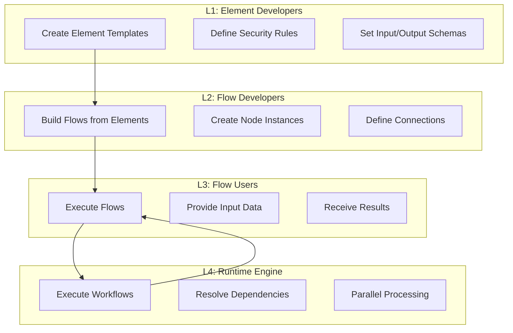

### Stakeholder Responsibilities

| Level | Role | Access | Responsibilities |
|-------|------|--------|-----------------|
| **L1** | Element Developer | Full template control | Create reusable elements, define schemas, set hyperparameters |
| **L2** | Flow Developer | Customizable properties | Build flows from elements, configure allowed parameters |
| **L3** | Flow User | Input/execution interface | Execute flows, provide inputs, receive outputs |
| **L4** | Runtime | All flow data | Execute nodes, manage data flow, handle errors |

## Elements and Nodes

### Elements: The Building Blocks

Elements are predefined templates created by L1 developers that encapsulate specific functionality:

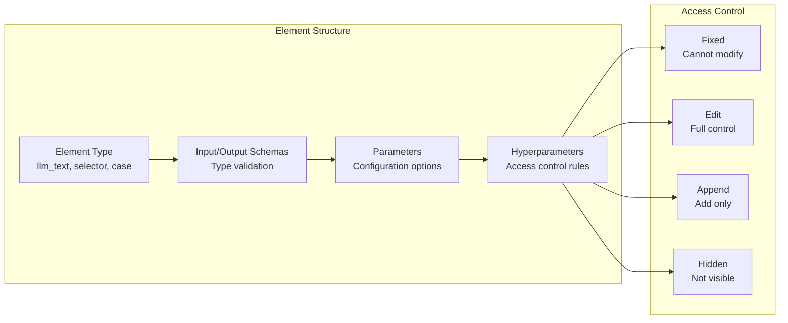

### Hyperparameter System

The hyperparameter system provides granular control over what L2 developers can customize:

- **`fixed`**: Cannot be modified (e.g., core functionality, API endpoints)
- **`edit`**: Full control within constraints (e.g., prompts, temperature settings)
- **`append`**: Can add but not remove (e.g., tags, optional parameters)
- **`hidden`**: Present but not visible (e.g., API keys, sensitive configuration)

### Node Creation

When L2 developers create nodes from elements:

1. **Template Selection**: Choose from available element catalog
2. **Customization**: Configure parameters according to hyperparameter rules
3. **Validation**: System validates all configurations against schemas
4. **Instance Creation**: Node becomes available for flow composition

## Flow Design and Execution

### Flow Structure

Flows are complete workflow definitions consisting of seven core components:

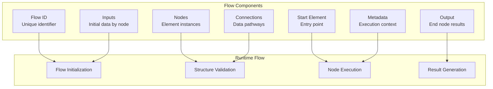

### Flow Patterns

The engine supports multiple workflow patterns:

1. **Sequential Processing**: Linear step-by-step execution
2. **Parallel Processing**: Concurrent execution of independent branches
3. **Conditional Routing**: Dynamic path selection based on conditions
4. **Cross-Path Dependencies**: Complex data sharing between conditional paths

## Connection Types and Data Flow

### Typed Connections

The engine implements three types of connections for precise flow control:

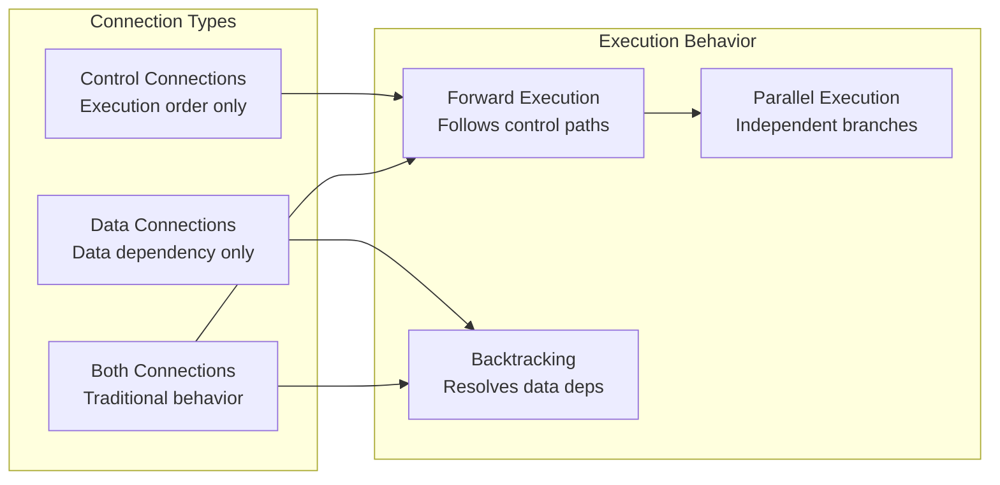

### Data Flow Patterns

Data follows a structured flow through the system:

1. **Input Stage**: L3 users provide data mapped to specific nodes
2. **Processing Stage**: Nodes transform data according to their logic
3. **Transfer Stage**: Connections route data between nodes using `node_id:variable_name` format
4. **Output Stage**: End nodes produce final results

### Variable Naming Convention

All data references use the format: `node_id:variable_name`

Examples:
- `chat_input_001:message` - User message from chat input node
- `llm_processor:response` - AI response from LLM node
- `analyzer:sentiment.score` - Nested sentiment score from analyzer

## Execution Model

### Two-Phase Execution

The engine operates using a sophisticated two-phase execution model:

```mermaid
graph TB
    subgraph "Downward Execution (Forward)"
        DOWN_START[Node Completes]
        DOWN_CHECK[Check downwards_execute flag]
        DOWN_FOLLOW[Follow control/both connections]
        DOWN_EXEC[Execute downstream nodes]
    end
    
    subgraph "Backtracking (Dependency Resolution)"
        BACK_START[Node needs missing data]
        BACK_FIND[Find dependency source]
        BACK_EXEC[Execute upstream node]
        BACK_DATA[Provide required data]
        BACK_NO_DOWN[No downstream triggering]
    end
    
    DOWN_START --> DOWN_CHECK
    DOWN_CHECK --> DOWN_FOLLOW
    DOWN_FOLLOW --> DOWN_EXEC
    
    BACK_START --> BACK_FIND
    BACK_FIND --> BACK_EXEC
    BACK_EXEC --> BACK_DATA
    BACK_DATA --> BACK_NO_DOWN
```

### Key Execution Features

- **Dependency Resolution**: Automatic handling of complex dependencies
- **Parallel Processing**: Independent nodes execute concurrently
- **Smart Caching**: Results cached to avoid re-execution
- **Flow Control**: Precise control over execution paths
- **Error Handling**: Graceful failure management with recovery options

### Execution Optimizations

1. **Lazy Evaluation**: Nodes execute only when outputs are needed
2. **Parallel Opportunities**: Engine identifies and leverages parallel execution
3. **Memory Management**: Automatic cleanup and resource management
4. **Event Streaming**: Real-time visibility into execution progress

### Real-Time Monitoring

The engine provides comprehensive event streaming for execution visibility:

| Event Type | When Emitted | Data Included |
|------------|--------------|---------------|
| `flow_started` | Flow execution begins | Flow ID, start time, initial inputs |
| `element_started` | Node begins execution | Node ID, type, inputs |
| `element_completed` | Node finishes successfully | Node ID, outputs, duration |
| `llm_chunk` | LLM streams response | Node ID, chunk content |
| `element_error` | Node encounters error | Node ID, error details |
| `flow_completed` | Flow execution completes | Final outputs, total duration |

### Advanced Execution Example

Consider a complex customer service flow with cross-path dependencies:

```yaml
# Master AI routes to premium or standard path
# Standard path needs auth token from premium path's auth service
# Backtracking automatically resolves this dependency

execution_flow:
  1. start → customer_data, auth_service (parallel)
  2. customer_data → router (evaluates tier="standard")
  3. router enables standard path, disables premium path
  4. router → standard_queue → standard_ai
  5. standard_ai needs auth token (data dependency)
  6. BACKTRACKING: auth_service executes if not already done
  7. auth_service provides token to standard_ai
  8. standard_ai executes with auth token
  9. Results flow to merger and final output
```

This demonstrates how the engine handles complex dependency resolution automatically while maintaining efficient execution.

This demonstrates how the engine handles complex dependency resolution automatically while maintaining efficient execution.

# AWS Bedrock Integration

The HPC Neura Execution Engine seamlessly integrates with AWS Bedrock to provide access to state-of-the-art language models from leading AI companies through a unified interface. Our integration supports multiple providers and advanced features like streaming responses and dynamic model selection.

## Model Support and Selection

We provide comprehensive support for multiple AI model providers through AWS Bedrock:

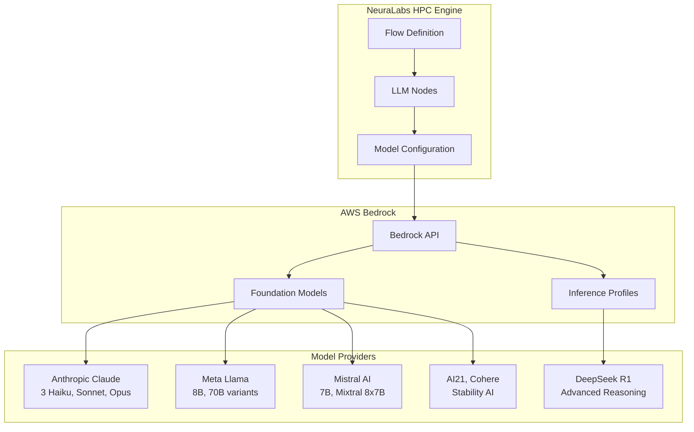

### Supported Model Categories

| Provider | Models | Best For | Special Features |
|----------|--------|----------|-----------------|
| **Anthropic Claude** | Haiku, Sonnet, Opus | General AI tasks, analysis | 200K context, balanced performance |
| **DeepSeek** | R1 (Reasoning) | Complex reasoning, math | Chain-of-thought, inference profiles |
| **Meta Llama** | 8B, 70B Instruct | Cost-effective, open-source | Good general performance |
| **Mistral AI** | 7B, Mixtral 8x7B | Multilingual, coding | Mixture of experts architecture |
| **Others** | AI21, Cohere, Stability | Specialized use cases | Domain-specific capabilities |

### Dynamic Model Selection

Our system supports multiple levels of model configuration:

1. **Environment Defaults**: Global model settings in `.env`
2. **Flow Definition**: Per-node model specification
3. **Runtime Overrides**: Dynamic model selection via API
4. **Cost Optimization**: Automatic model selection based on complexity

```yaml
# Flow definition with multiple models
nodes:
  fast_processor:
    type: llm_text
    model: anthropic.claude-3-haiku-20240307-v1:0  # Fast, cost-effective
    temperature: 0.7
    
  complex_analyzer:
    type: llm_structured
    model: anthropic.claude-3-opus-20240229-v1:0   # High capability
    temperature: 0.3
    
  reasoning_engine:
    type: llm_text
    # DeepSeek requires full inference profile ARN
    model: arn:aws:bedrock:us-east-2:559050205657:inference-profile/us.deepseek.r1-v1:0
    max_tokens: 8000
```

## Setup and Configuration

### Prerequisites and IAM Setup

AWS Bedrock integration requires proper IAM configuration and model access requests:

```json
{
  "Version": "2012-10-17",
  "Statement": [
    {
      "Effect": "Allow",
      "Action": [
        "bedrock:InvokeModel",
        "bedrock:InvokeModelWithResponseStream",
        "bedrock:ListFoundationModels",
        "bedrock:GetFoundationModel"
      ],
      "Resource": "*"
    },
    {
      "Effect": "Allow",
      "Action": [
        "bedrock:GetModelInferenceProfile",
        "bedrock:ListModelInferenceProfiles"
      ],
      "Resource": "arn:aws:bedrock:*:*:inference-profile/*"
    }
  ]
}
```

### Environment Configuration

Complete configuration setup for production deployment:

```bash
# Core AWS Configuration
AWS_REGION=us-east-2
AWS_ACCESS_KEY_ID=your_access_key_id
AWS_SECRET_ACCESS_KEY=your_secret_access_key

# Default Model Settings
DEFAULT_MODEL_ID=anthropic.claude-3-haiku-20240307-v1:0
DEFAULT_TEMPERATURE=0.7
DEFAULT_MAX_TOKENS=1000

# Streaming Configuration
BEDROCK_STREAMING_ENABLED=true
BEDROCK_STREAM_CHUNK_SIZE=256

# Performance Optimization
BEDROCK_MAX_RETRIES=3
BEDROCK_CONNECTION_TIMEOUT=30
BEDROCK_READ_TIMEOUT=300
BEDROCK_MAX_POOL_CONNECTIONS=50

# Cost Control
BEDROCK_DAILY_TOKEN_LIMIT=1000000
BEDROCK_ALERT_THRESHOLD_USD=100
```

### Model Access Management

Before using any model, you must request access through AWS Console:

1. **Navigate to Amazon Bedrock Console**
2. **Model Access** → **Manage model access**
3. **Select desired models**:
   - Anthropic Claude (Haiku, Sonnet, Opus)
   - DeepSeek R1 (if available)
   - Meta Llama variants
   - Mistral AI models
4. **Submit request** (usually instant approval)

### Regional Considerations

| Region | Code | Model Coverage | Best For |
|--------|------|----------------|----------|
| US East (N. Virginia) | `us-east-1` | Most comprehensive | General use, widest selection |
| US East (Ohio) | `us-east-2` | Most models | Lower cost, good coverage |
| US West (Oregon) | `us-west-2` | Most models | West coast users |
| Europe (Frankfurt) | `eu-central-1` | Limited selection | EU compliance |

## Performance and Cost Optimization

### Performance Characteristics

Our integration provides optimized performance across different model types:

| Model | Response Time | Context Window | Cost/1K tokens | Best Use Case |
|-------|--------------|----------------|----------------|---------------|
| Claude 3 Haiku | ~1-2s | 200K | $ | High-volume, fast responses |
| Claude 3 Sonnet | ~2-4s | 200K | $ | Balanced workloads |
| Claude 3 Opus | ~4-8s | 200K | $$ | Complex analysis |
| DeepSeek R1 | ~3-6s | 64K | $ | Advanced reasoning |
| Llama 3 8B | ~1-2s | 8K | $ | Cost-sensitive applications |

### Streaming Implementation

Advanced streaming support with special handling for reasoning models:

```python
# Standard streaming for most models
async def stream_response(model_id, prompt):
    response = bedrock_runtime.invoke_model_with_response_stream(
        modelId=model_id,
        body=json.dumps({
            "messages": [{"role": "user", "content": prompt}],
            "max_tokens": 1000,
            "temperature": 0.7
        })
    )
    
    for event in response['body']:
        chunk = json.loads(event['chunk']['bytes'].decode())
        if 'delta' in chunk:
            yield chunk['delta']['text']

# Special handling for DeepSeek reasoning
async def stream_deepseek_reasoning(prompt):
    # DeepSeek provides reasoning traces in <think></think> tags
    # and final answers in <answer></answer> tags
    reasoning_buffer = []
    answer_buffer = []
    
    async for chunk in stream_response(deepseek_model_id, prompt):
        if '<think>' in chunk:
            # Process reasoning section
            reasoning_buffer.append(chunk)
        elif '<answer>' in chunk:
            # Stream final answer to user
            answer_buffer.append(chunk)
            yield chunk
```

### Cost Optimization Strategies

1. **Model Selection by Complexity**
   - Simple tasks: Claude 3 Haiku or Llama 3 8B
   - Balanced needs: Claude 3 Sonnet
   - Complex analysis: Claude 3 Opus or DeepSeek R1

2. **Smart Caching**
   - Cache responses for repeated queries
   - Implement response deduplication
   - Use Redis for session-based caching

3. **Token Management**
   - Set appropriate `max_tokens` limits
   - Optimize prompts for conciseness
   - Use structured outputs for efficiency

4. **Batch Processing**
   - Group similar requests when possible
   - Implement request queuing for non-urgent tasks
   - Use parallel processing for independent requests

### Runtime Configuration

Dynamic configuration support for different execution contexts:

```python
# Runtime model overrides
execution_config = {
    "model_overrides": {
        "classifier_node": "anthropic.claude-3-haiku-20240307-v1:0",  # Fast classification
        "analyzer_node": "anthropic.claude-3-opus-20240229-v1:0",    # Deep analysis
        "reasoner_node": "arn:aws:bedrock:us-east-2:559050205657:inference-profile/us.deepseek.r1-v1:0"
    },
    "parameter_overrides": {
        "analyzer_node": {
            "temperature": 0.2,  # More deterministic for analysis
            "max_tokens": 4000
        }
    },
    "cost_limits": {
        "max_tokens_per_request": 2000,
        "max_total_cost_usd": 10.0
    }
}
```

### Integration with HPC Engine

The Bedrock integration seamlessly works with our HPC execution engine:

- **Automatic Model Detection**: System detects model type and applies appropriate formatting
- **Error Handling**: Comprehensive retry logic with exponential backoff
- **Performance Monitoring**: Real-time metrics for token usage and response times
- **Cost Tracking**: Automatic cost calculation and budget alerts
- **Streaming Support**: Full SSE integration for real-time responses

# Storage Infrastructure

Our storage infrastructure leverages Walrus decentralized storage network to provide secure, scalable, and cost-effective data management for AI workflows, models, and datasets.

## Walrus Decentralized Storage

Walrus is a decentralized storage network built on Byzantine fault-tolerant protocols, designed specifically for large blob storage with verifiable integrity and built-in redundancy.

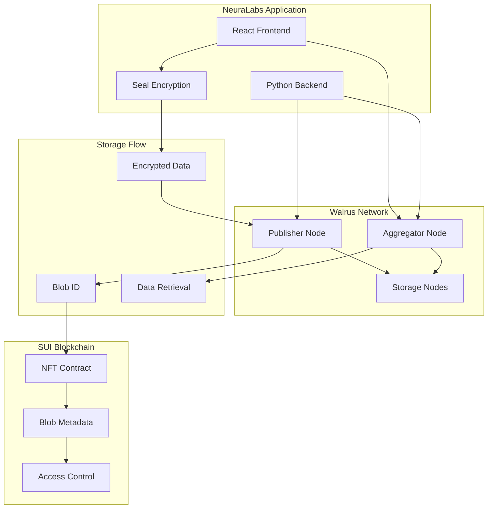

### Key Features

- **Content-Addressed Storage**: Immutable data references with integrity verification
- **Built-in Redundancy**: Automatic data replication across storage nodes using erasure coding
- **Cost-Effective**: Optimized for large blob storage at scale (10-100x cheaper than traditional cloud)
- **SUI Integration**: Seamless integration with SUI blockchain for metadata and payments
- **HTTP API**: Simple REST API for data operations across any programming language

### Network Endpoints (Testnet)

- **Publisher Endpoint**: `https://publisher.walrus-testnet.walrus.space`
  - For uploading data to Walrus
  - Alternative: `https://wal-publisher-testnet.staketab.org`

- **Aggregator Endpoint**: `https://aggregator.walrus-testnet.walrus.space`
  - For downloading data from Walrus
  - Alternative: `https://wal-aggregator-testnet.staketab.org`

## Storage Architecture

### Data Storage Patterns

We implement multiple storage patterns optimized for different AI use cases:

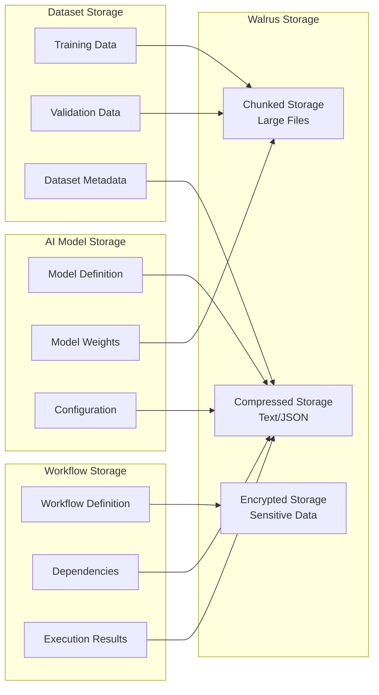

### Storage Layers

1. **Application Layer**
   - React frontend with file upload/download
   - Python backend with async processing
   - Real-time progress tracking via Server-Sent Events (SSE)

2. **Encryption Layer**
   - Client-side encryption using Seal before upload
   - Access control through NFT ownership verification
   - Automatic key management with session handling

3. **Storage Layer**
   - Walrus network for blob storage
   - Erasure coding with Reed-Solomon for fault tolerance
   - Content addressing for deduplication and integrity

4. **Metadata Layer**
   - SUI blockchain for blob references and access control
   - Smart contract validation for all storage operations
   - On-chain audit trail for data access and modifications

## Data Flow and Security

### Upload Flow

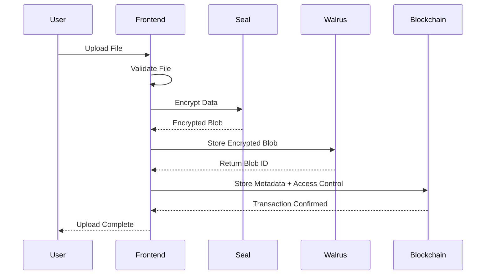

### Download Flow

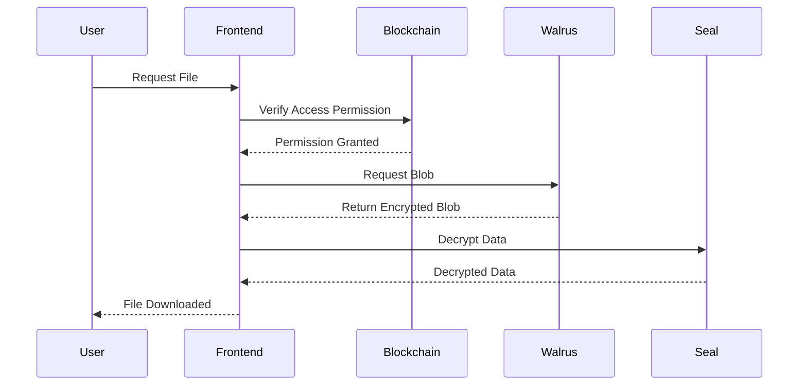

### Security Features

- **End-to-End Encryption**: Data encrypted before leaving the client
- **Access Control**: NFT-based permissions with 6-level hierarchy
- **Integrity Verification**: Cryptographic proofs of data integrity
- **Audit Trail**: Complete on-chain record of all data operations
- **Byzantine Fault Tolerance**: Resilient to up to 1/3 malicious nodes

## Performance and Scalability

### Performance Characteristics

| Operation | Small Files (<1MB) | Medium Files (1-10MB) | Large Files (10-100MB) |
|-----------|-------------------|----------------------|------------------------|
| Upload Time | 500ms - 1s | 1-3s | 3-10s (chunked) |
| Download Time | 200-500ms | 500ms - 2s | 2-8s (parallel) |
| Storage Cost | ~0.01 WAL/MB | ~0.1 WAL/MB | ~1 WAL/MB |

### Scalability Features

- **Horizontal Scaling**: Linear scaling with additional storage nodes
- **Parallel Processing**: Concurrent upload/download of file chunks
- **Caching Layer**: Client-side and CDN caching for frequently accessed data
- **Load Balancing**: Multiple aggregator nodes for download optimization

### Storage Optimization

1. **Compression**
   - Automatic compression for text/JSON data (60-90% savings)
   - Skip compression for already compressed formats (images, videos)
   - Adaptive compression based on file type detection

2. **Chunking Strategy**
   - Files > 10MB automatically chunked into 5MB segments
   - Parallel upload/download for improved performance
   - Chunk reassembly with integrity verification

3. **Deduplication**
   - Content-addressed storage prevents duplicate uploads
   - Automatic cost savings for repeated data
   - Cross-user deduplication while maintaining privacy

### Integration Examples

#### AI Model Storage
```python
# Store large AI model with automatic chunking
model_storage = NeuraLabsStorageService(sui_client, signer)

result = await model_storage.storeAIWorkflow(
    workflow={
        "id": "gpt-2-small",
        "name": "GPT-2 Small Model",
        "model": {
            "architecture": "transformer",
            "weights": model_weights_data  # Large binary data
        }
    },
    options={
        "threshold": 1,  # Seal encryption threshold
        "epochs": 100,   # Walrus storage duration
        "compress": True # Enable compression
    }
)
```

#### Dataset Management
```python
# Batch upload training dataset
dataset_manager = DatasetStorage(walrus_client)

result = await dataset_manager.uploadDataset(
    dataset_path="./training_data/",
    metadata={
        "name": "Medical Images Dataset",
        "type": "image",
        "samples": 10000
    },
    options={
        "epochs": 50,
        "onProgress": lambda p: print(f"Progress: {p*100:.1f}%")
    }
)
```

#### Workflow Execution Results
```python
# Store execution results with automatic compression
results_storage = ResultStorage(walrus_client)

await results_storage.storeResult(
    result={
        "jobId": "job_123",
        "outputs": execution_results,
        "logs": execution_logs,
        "metrics": performance_metrics
    },
    options={
        "compress": True,
        "epochs": 7  # Short-term storage for results
    }
)
```

### Cost Analysis

| Storage Duration | Cost per MB | Use Case |
|------------------|-------------|----------|
| 1-5 epochs (days) | ~0.001 WAL | Temporary data, caches |
| 10-30 epochs (weeks) | ~0.01 WAL | User uploads, results |
| 50-100 epochs (months) | ~0.1 WAL | AI models, datasets |
| 200+ epochs (long-term) | ~1+ WAL | Permanent archives |

*Note: Costs are estimates based on testnet pricing and may vary*

# Authentication System

Our authentication system leverages SUI's zkLogin technology to provide passwordless, privacy-preserving authentication using familiar OAuth providers while maintaining true blockchain sovereignty.

## zkLogin Architecture

zkLogin enables users to authenticate using Web2 OAuth providers (Google, Facebook, Apple) without exposing credentials to the blockchain. The system uses zero-knowledge proofs to verify authentication while maintaining complete privacy.

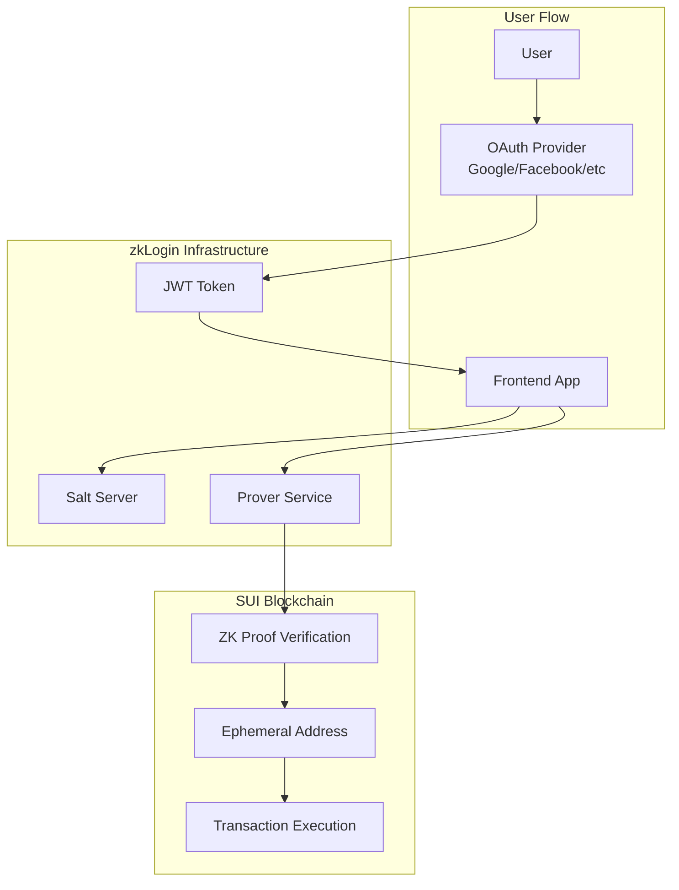

### Key Components

1. **Salt Server**: Provides deterministic randomness for address generation while preventing rainbow table attacks
2. **Prover Service**: Generates zero-knowledge proofs for authentication verification
3. **OAuth Integration**: Seamless Web2 authentication experience
4. **Ephemeral Keys**: Temporary keys for transaction signing with zero-knowledge proof verification

## OAuth Integration

We support multiple OAuth providers for maximum user convenience:

- **Google OAuth**: Primary authentication method
- **Facebook OAuth**: Alternative social authentication
- **Apple OAuth**: iOS-optimized authentication
- **Custom Providers**: Extensible to additional OAuth2-compliant providers

### Authentication Flow

1. **OAuth Initiation**: User clicks login and selects provider
2. **JWT Generation**: OAuth provider returns signed JWT token
3. **Salt Retrieval**: Frontend requests deterministic salt from salt server
4. **Ephemeral Key Creation**: Generate temporary key pair for transaction signing
5. **Proof Generation**: Create zero-knowledge proof linking JWT to ephemeral key
6. **SUI Address Derivation**: Deterministic address generation from proof
7. **Transaction Signing**: Use combined signature for blockchain interactions

## Prover Service Infrastructure

Since no public testnet prover service exists, we operate our own infrastructure:

- **Service URL**: `https://prover.neuralabs.io`
- **Infrastructure**: Docker-based deployment with RapidSNARK backend
- **Performance**: 16+ cores recommended for sub-15 second proof generation
- **Reliability**: Redundant instances with failover capabilities

# Encryption Infrastructure

Our encryption infrastructure is built on SUI's Seal protocol, providing decentralized threshold encryption for secure AI workflow management and data protection.

## Seal Threshold Encryption

Seal enables distributed secrets management through threshold cryptography, ensuring no single point of failure in our encryption system.

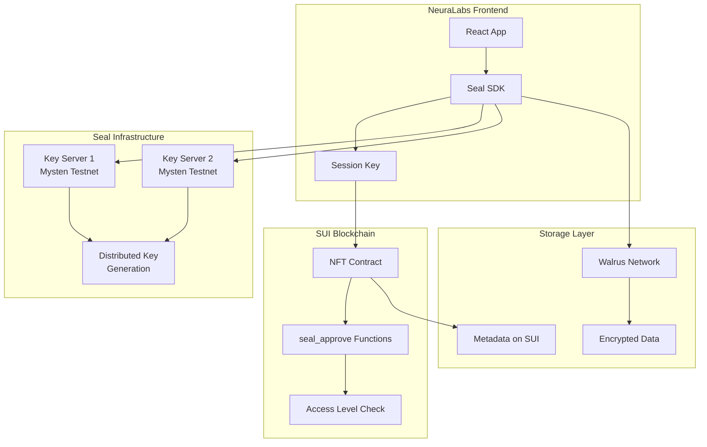

### Key Features

- **Threshold Encryption**: t-out-of-n key servers for fault tolerance
- **Distributed Key Generation (DKG)**: No single point of failure
- **SUI-based Access Control**: Leverages NFT ownership for permissions
- **Client-side Encryption**: Data never exposed in plaintext to servers
- **Identity-based Keys**: Automatic key derivation per workflow/user

### Mysten Labs Key Servers

For testnet development, we use Mysten Labs managed key servers:

- **Testnet Key Server 1**: 
  - URL: `https://seal-key-server-testnet-1.mystenlabs.com`
  - Object ID: `0x1ee708e0d09c31593a60bee444f8f36a5a3ce66f1409a9dfb12eb11ab254b06b`

- **Testnet Key Server 2**:
  - URL: `https://seal-key-server-testnet-2.mystenlabs.com`
  - Object ID: `0x2ff809f1e1ad42604a71cff555f9f47b6b4df77g5109b0efc23fc22bc365c17c`

### Threshold Configuration

- **Development**: 1-of-2 threshold for low latency testing
- **Staging**: 2-of-2 threshold for reliability testing
- **Production**: 2-of-3 or higher for maximum security

## Concrete Implementation Patterns

We implement multiple access control patterns for different use cases:

### 1. Allowlist Pattern
Simple access control where a predefined list of addresses can access encrypted data:
- **Use Case**: Private research collaborations
- **Access Method**: On-chain allowlist maintained by admin
- **Smart Contract**: Validates user presence in allowlist before decryption

### 2. Subscription Pattern
Time-limited access with payment requirements:
- **Use Case**: Paid AI model access
- **Access Method**: SUI payment creates time-limited subscription
- **Smart Contract**: Validates payment and checks subscription expiry

### 3. NFT-Based Pattern
Hierarchical access control through NFT ownership:
- **Use Case**: Granular workflow permissions
- **Access Method**: 6-level NFT access system
- **Smart Contract**: Validates access level meets minimum requirement (Level 4+ for decryption)

## Security Features

- **Session Management**: Secure session key generation with configurable TTL
- **Key Caching**: Performance optimization with secure key storage
- **Access Validation**: Smart contract integration ensures proper authorization
- **Backup Keys**: Disaster recovery through secure backup key storage
- **Audit Trail**: Complete on-chain record of all access grants and modifications

Our smart contract system implements a sophisticated NFT-based access control mechanism integrated with Seal threshold encryption for secure AI workflow management.

## Contract Modules

The NeuraLabs smart contract architecture consists of 4 modular components:

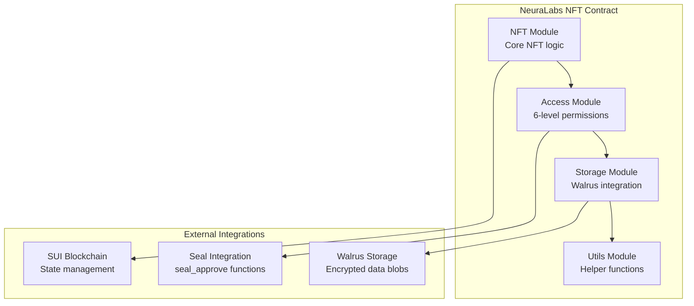

### Core Modules

1. **NFT Module (`nft.move`)**
   - Mint new NFTs with specific access levels
   - Transfer ownership with access level preservation
   - Burn NFTs and clean up access permissions

2. **Access Module (`access.move`)**
   - 6-level hierarchical access control system
   - Grant/revoke access permissions
   - Verify user access levels for operations

3. **Storage Module (`storage.move`)**
   - Manage encrypted data storage with Walrus
   - Store/retrieve data metadata
   - Update storage references

4. **Utils Module (`utils.move`)**
   - Signature verification
   - Access key generation
   - Access level validation

## Access Control System

Our smart contracts implement a 6-level hierarchical access control system:

| Level | Name | Capabilities |
|-------|------|-------------|
| 1 | USE_MODEL | Basic usage rights |
| 2 | RESALE | Can resell the NFT |
| 3 | CREATE_REPLICA | Can create copies |
| 4 | VIEW_DOWNLOAD | Can decrypt files (Seal minimum) |
| 5 | EDIT_DATA | Can modify encrypted data |
| 6 | ABSOLUTE_OWNERSHIP | Full control and admin rights |

Higher levels include all permissions of lower levels, and level 4 is the minimum required for Seal decryption operations.

## Seal Integration

The contracts include `seal_approve` functions that follow Seal's conventions for threshold encryption:

```move
entry fun seal_approve(
    id: vector<u8>,
    nft: &NFT,
    ctx: &TxContext
) {
    // Verify caller has sufficient access level
    let caller = tx_context::sender(ctx);
    let access_level = get_user_access_level(caller, object::id(nft));
    
    // Require level 4 or above for file decryption
    assert!(access_level >= 4, EInsufficientAccess);
    
    // Additional access control logic...
}
```

## Deployment Information

- **Network**: SUI Testnet
- **Package ID**: `0x926de4be791b165822a8a213540c0606bb0d52450e5f8b6531097d9cd2c4dc64`
- **Deployment Status**: ✅ Successfully deployed and tested
- **Gas Optimization**: All operations designed for O(1) complexity
- **Security Features**: 
  - Input validation and sanitization
  - Ownership verification for all modifications
  - Hierarchical permission checks
  - Integration with Seal for threshold encryption

### Performance Characteristics

| Operation | Gas Cost | Time Complexity | Notes |
|-----------|----------|-----------------|-------|
| NFT Creation | ~0.001 SUI | O(1) | Fixed cost per NFT |
| Access Grant | ~0.0005 SUI | O(1) | Single permission update |
| Access Check | ~0.0001 SUI | O(1) | Read-only operation |
| Seal Approve | ~0.0003 SUI | O(1) | Verification + approval |


## Setting up Salt Server

The salt server provides deterministic randomness for zkLogin address generation while preventing rainbow table attacks.

### Purpose
- **Deterministic Mapping**: Same OAuth identity always maps to same SUI address
- **Security**: Prevents pre-computation of address mappings for known identities
- **Privacy**: No exposure of Web2 credentials to blockchain

### Configuration
```python
# Salt server configuration
SALT_SECRET = os.getenv('SALT_SECRET', 'your-secret-key')

# Generate deterministic salt
identity = f"{decoded['iss']}:{decoded['sub']}"
salt = hashlib.sha256(f"{identity}:{SALT_SECRET}".encode()).hexdigest()
```

## Setting up Prover Service

We run our own prover service for testnet functionality since no public testnet prover service is available.

**Prover Service URL**: `https://prover.neuralabs.io`

### Requirements
- **Hardware**: Minimum 16 cores, 16GB RAM (compute-heavy operations)
- **Software**: Docker, Git LFS for zkey files
- **Network**: Stable internet connection

### Key Components
- **Backend**: `mysten/zklogin:prover-stable` (RapidSNARK service)
- **Frontend**: `mysten/zklogin:prover-fe-stable` (HTTP interface)
- **Proving Key**: zkLogin-main.zkey file for Groth16 proofs

### Performance Characteristics
| Hardware | Proof Generation Time | Throughput |
|----------|----------------------|------------|
| 16 cores, 16GB RAM | 5-10 seconds | 6-12 proofs/min |
| 32 cores, 32GB RAM | 2-5 seconds | 12-30 proofs/min |
| 64 cores, 64GB RAM | 1-3 seconds | 20-60 proofs/min |

### Docker Configuration
```yaml
services:
  backend:
    image: mysten/zklogin:prover-stable
    volumes:
      - ${ZKEY}:/app/binaries/zkLogin.zkey
    environment:
      - ZKEY=/app/binaries/zkLogin.zkey
      - PROVER_TIMEOUT=30

  frontend:
    image: mysten/zklogin:prover-fe-stable
    ports:
      - '${PROVER_PORT}:8080'
    environment:
      - PROVER_URI=http://backend:8080/input
    depends_on:
      - backend
```

See the [prover-service documentation](docs/05-sui-integration/03-authentication/02-prover-service.mdx) for detailed setup instructions.