# NeuraLabs: Decentralized AI Infrastructure Platform

<div align="center">
  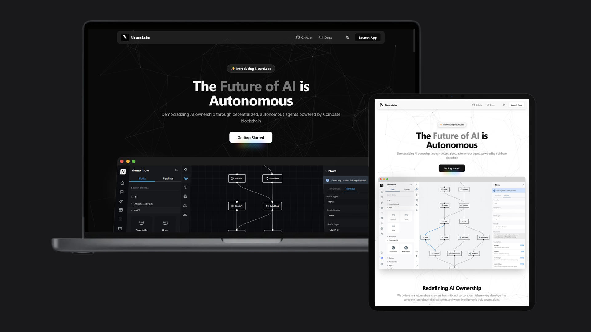
  
  ### Tokenizing Intelligence. Democratizing AI.
  
  [](https://aws.amazon.com/bedrock/)
  [](https://www.coinbase.com/cloud/products/wallet-api)
  [](https://x402.org/)
  [](https://akash.network/)
  [](https://base.org/)
</div>

---

## 🚀 Overview

NeuraLabs revolutionizes AI deployment by creating **autonomous AI agents** that own crypto wallets, pay for their own operations, and generate revenue independently. Built on **Coinbase CDP** for secure wallet infrastructure, **X402 Protocol** for frictionless micropayments, and **AWS Bedrock** for enterprise-grade AI models, we're creating the world's first truly decentralized AI ecosystem.

### 🌟 Key Innovation: AI Agents as Economic Entities

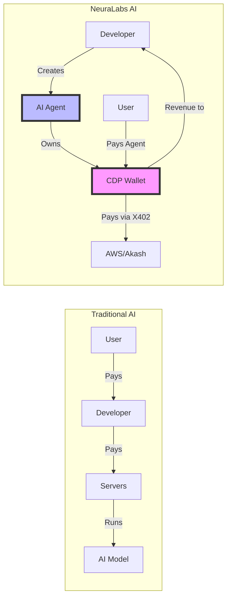

---

## 📋 Table of Contents

1. [Problem & Solution](#-the-problem-neuralabs-solves)
2. [Core Technologies](#-core-technologies)
3. [Architecture Overview](#-architecture-overview)
4. [Smart Contract System](#-smart-contract-system)
5. [Payment Infrastructure](#-payment-infrastructure-x402)
6. [Wallet Management](#-wallet-management-coinbase-cdp)
7. [AI Model Integration](#-ai-model-integration-aws-bedrock)
8. [Getting Started](#-getting-started)
9. [Use Cases](#-use-cases)
10. [Roadmap](#-roadmap)

---

## 🎯 The Problem NeuraLabs Solves

### Current AI Ecosystem Challenges

| Problem | Impact | NeuraLabs Solution |
|---------|--------|-------------------|
| **High Infrastructure Costs** | $5-10K initial, $1-3K monthly | Zero upfront costs - agents pay for themselves |
| **Platform Lock-in** | 20-30% fees, no flexibility | Direct monetization, minimal fees |
| **Limited Deployment Options** | Centralized only | Hybrid AWS + Akash infrastructure |
| **Complex Monetization** | Subscriptions only | 5 flexible monetization models |
| **No True Ownership** | Platform controls everything | NFT-based ownership with smart contracts |

### Our Solution: Autonomous AI Economy

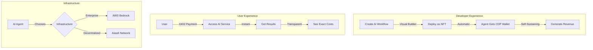

---

## 🔧 Core Technologies

### 1. **Coinbase CDP** - Autonomous Wallet Infrastructure

```javascript
// Every AI agent gets its own wallet
const agentWallet = await coinbase.wallets.create({
    blockchain: "base-sepolia",
    type: "agent"
});

// Transfer control to smart contract
await agentWallet.transferOwnership({
    newOwner: AGENT_REGISTRY_CONTRACT,
    restrictions: {
        dailyLimit: "100 USDC",
        allowedContracts: [MONETIZATION_CONTRACT]
    }
});
```

**Key Features:**
- 🔐 Self-custodial AI wallets
- 💰 Autonomous payment capabilities
- 🛡️ Smart contract controlled
- 📊 Transparent spending limits

### 2. **X402 Protocol** - Micropayment Infrastructure

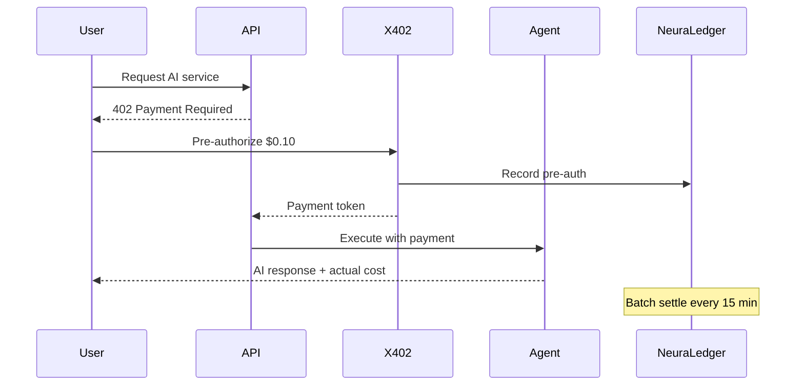

**Benefits:**
- ⚡ Instant micropayments
- 💸 95% lower transaction costs
- 🔄 Automatic reconciliation
- 📈 Usage-based pricing

### 3. **AWS Bedrock** - Enterprise AI Models

```yaml
# Seamless integration with top AI models
supported_models:
  - name: "AWS Nova"
    variants: ["Micro", "Lite", "Pro"]
    context: "300K tokens"
    best_for: "Complex reasoning"
    
  - name: "AWS Titan"
    variants: ["Text", "Embeddings"]
    context: "32K tokens"
    best_for: "General tasks"
    
  - name: "Claude 3.5"
    variants: ["Haiku", "Sonnet", "Opus"]
    context: "200K tokens"
    best_for: "Balanced performance"
```

### 4. **Akash Network** - Decentralized Compute

```yaml
# Deploy open-source models without restrictions
deployment:
  provider: "akash"
  model: "llama-3.1-70b"
  resources:
    gpu: "nvidia-a100"
    count: 1
  cost_savings: "85% vs AWS"
```

---

## 🏗️ Architecture Overview

### High-Level System Architecture

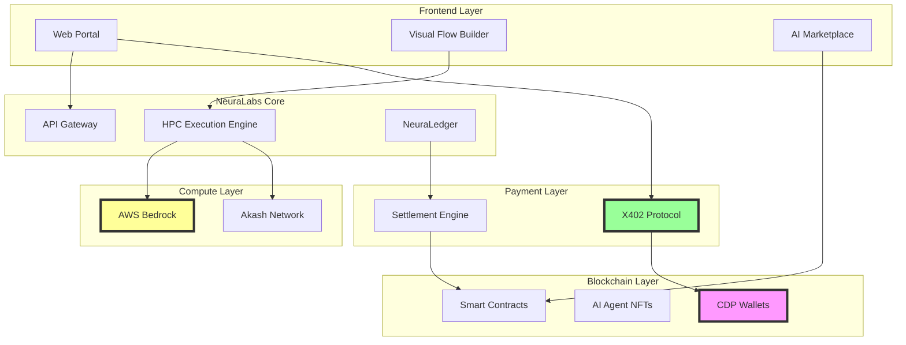

---

## 📄 Smart Contract System

### Contract Architecture

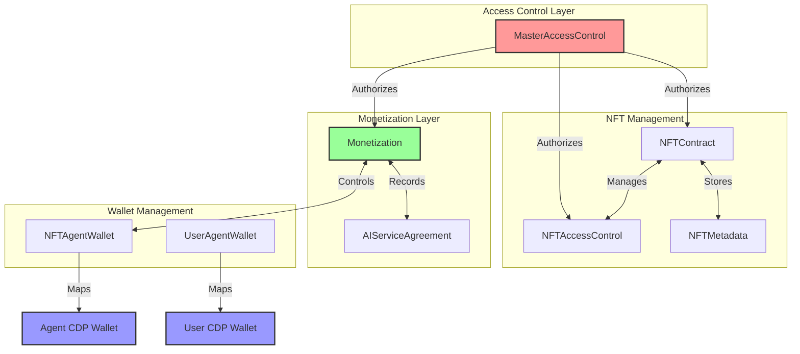

### 1. **NFT-Based AI Agents**

Each AI agent is represented as an NFT with:

```solidity
struct NFTInfo {
    uint8 levelOfOwnership;     // 1-6 access level
    string name;                // Agent name
    address creator;            // Original creator
    uint256 creationDate;       // Timestamp
    address owner;              // Current owner
}

// Create an AI agent
uint256 agentId = nftContract.createNFT("Customer Support AI", 6);
```

### 2. **6-Level Access Control System**

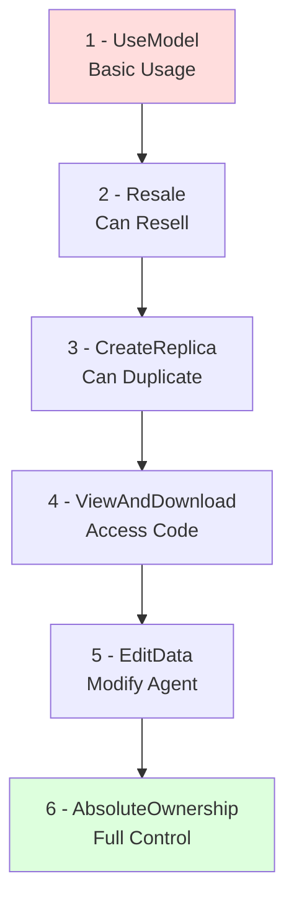

### 3. **5 Monetization Models**

```solidity
// 1. Pay-Per-Use (via X402)
enablePayPerUse(agentId, 0.01 USDC, platformPayer);

// 2. Subscription
enableSubscription(agentId, 50 USDC, 30 days, 1000 calls);

// 3. Buy Access (Temporary)
enableBuyAccess(agentId, AccessLevel.UseModel, 7 days, 10 USDC);

// 4. Buy Ownership (Transfer NFT)
enableBuyOwnership(agentId, 1000 USDC, ownershipLevel);

// 5. Buy Replica (Create Copy)
enableBuyReplica(agentId, 100 USDC, replicaLevel);
```

### 4. **Lock & Commitment System**

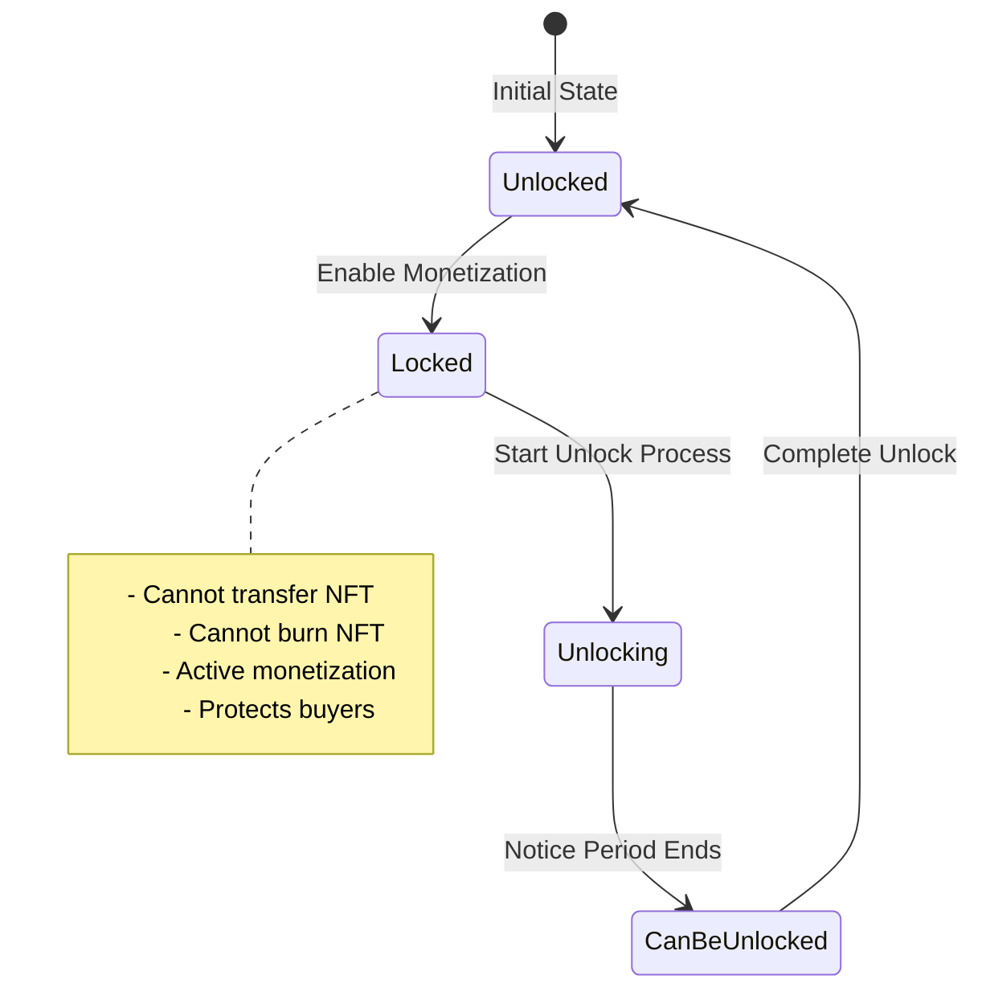

### 5. **Agent Wallet Management**

```solidity
// NFT Agent Wallet Registration
contract NFTAgentWallet {
    // Each NFT can have an autonomous CDP wallet
    function registerAgentWallet(
        uint256 nftId,
        bytes signature,
        address agentWallet
    ) external {
        // Verify signature from CDP wallet
        // Create bidirectional mapping
        // Agent can now transact autonomously
    }
}

// User Agent Wallet Registration  
contract UserAgentWallet {
    // Users get dedicated agent interaction wallets
    function registerAgentWallet(
        bytes signature,
        address agentWallet
    ) external {
        // Verify ownership
        // Enable X402 micropayments
        // Separate from main wallet for security
    }
}
```

---

## 💳 Payment Infrastructure (X402)

### How X402 Enables the AI Economy

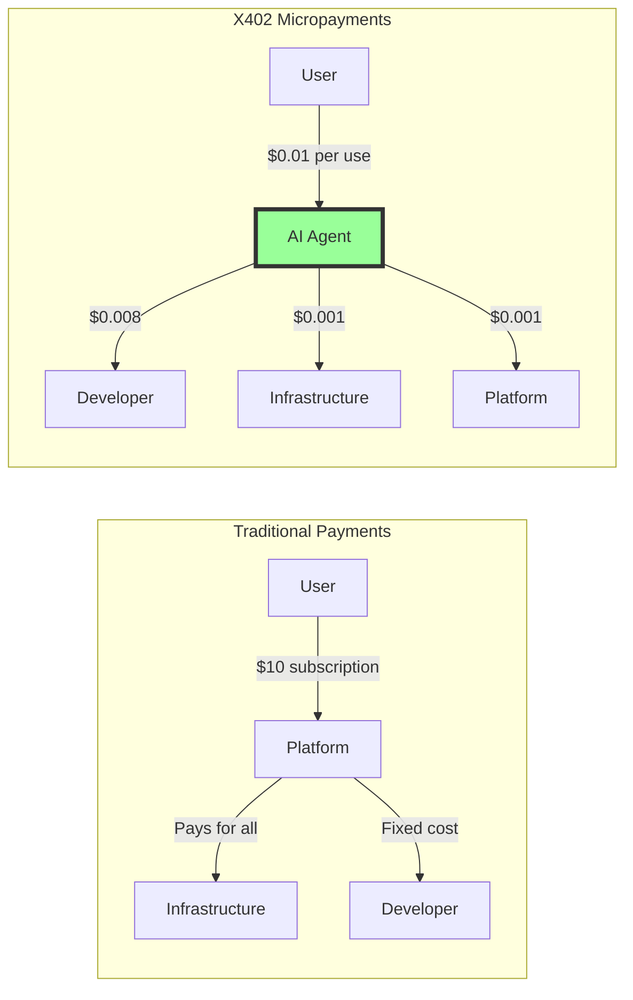

### NeuraLedger: L2 Settlement Layer

```javascript
// Single X402 transaction, multiple settlements
class NeuraLedger {
    async processAICall(request) {
        // 1. Pre-authorize maximum cost
        const maxCost = calculateMaxCost(request);
        await x402.preAuthorize(user, maxCost);
        
        // 2. Execute AI call
        const result = await executeAI(request);
        const actualCost = result.tokensUsed * PRICE_PER_TOKEN;
        
        // 3. Record in graph database
        await recordTransaction({
            user_to_agent: actualCost * 0.85,
            agent_to_infra: actualCost * 0.10,
            platform_fee: actualCost * 0.05
        });
        
        // 4. Batch settle every 15 minutes
        // Reduces 6 transactions to 1
    }
}
```

### Cost Efficiency

| Traditional Blockchain | With NeuraLedger + X402 |
|------------------------|-------------------------|
| 6 transactions per AI call | 1 transaction per batch |
| ~$0.30 gas fees | ~$0.01 gas fees |
| Immediate settlement | 15-minute batches |
| Complex reconciliation | Automatic balancing |

---

## 👛 Wallet Management (Coinbase CDP)

### Dual Wallet Architecture

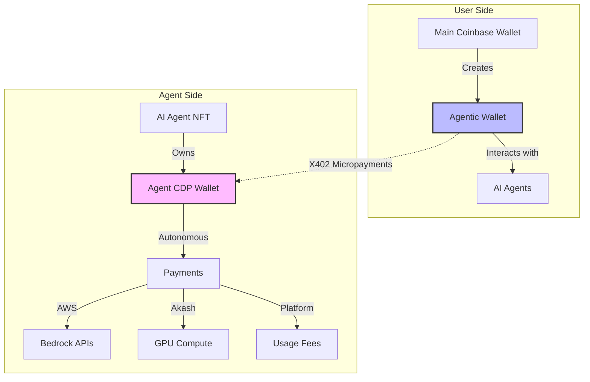

### Agent Wallet Lifecycle

```javascript
// 1. Agent Creation
const agent = await createAIAgent({
    name: "Market Analyst AI",
    model: "aws-bedrock-nova-pro"
});

// 2. Automatic CDP Wallet Creation
const agentWallet = await CDP.createWallet({
    type: "agent",
    parentNFT: agent.id
});

// 3. Transfer Control to Smart Contract
await agentWallet.transferControl({
    controller: AGENT_REGISTRY_CONTRACT,
    limits: {
        daily: "100 USDC",
        perTransaction: "10 USDC"
    }
});

// 4. Fund Agent Wallet
await fundAgentWallet(agentWallet.address, "50 USDC");

// 5. Agent Operates Autonomously
// - Pays for AWS Bedrock API calls
// - Pays for Akash GPU compute
// - Receives payments from users
// - Sends revenue to creator
```

---

## 🤖 AI Model Integration (AWS Bedrock)

### Seamless Multi-Model Support

```yaml
# Agent configuration example
agent:
  name: "Multi-Model Research Assistant"
  
  components:
    - id: "quick_classifier"
      model: "aws-nova-micro"  # Fast, cheap
      purpose: "Route queries"
      
    - id: "main_processor"
      model: "aws-nova-pro"    # Powerful
      purpose: "Complex analysis"
      max_tokens: 8000
      
    - id: "safety_check"
      model: "aws-titan-guardrails"
      purpose: "Content filtering"
```

### Dynamic Model Selection

```javascript
class IntelligentRouter {
    async selectModel(query, requirements) {
        // Cost-optimized selection
        if (query.complexity === 'low') {
            return 'aws-nova-micro';  // $0.001 per query
        }
        
        // Performance-optimized selection
        if (requirements.speed === 'critical') {
            return 'anthropic-claude-haiku';  // <1s response
        }
        
        // Capability-optimized selection
        if (requirements.reasoning === 'advanced') {
            return 'aws-nova-pro';  // Best reasoning
        }
        
        // Decentralized fallback
        if (requirements.privacy === 'maximum') {
            return 'akash:llama-3.1-70b';  // Self-hosted
        }
    }
}
```

---

## 🚀 Getting Started

### Quick Start Guide

```bash
# 1. Clone the repository
git clone https://github.com/neuralabs/neuralabs-platform
cd neuralabs-platform

# 2. Install dependencies
npm install

# 3. Configure environment
cp .env.example .env
# Add your API keys:
# - COINBASE_CDP_API_KEY
# - AWS_ACCESS_KEY_ID
# - X402_API_KEY

# 4. Deploy smart contracts
cd smart-contracts
npx hardhat deploy --network base-sepolia

# 5. Start the platform
npm run dev
```

### Create Your First AI Agent

```javascript
// 1. Connect wallet
const wallet = await connectCoinbaseWallet();

// 2. Create agent using visual builder or code
const agent = await neuralabs.createAgent({
    name: "Customer Support AI",
    description: "24/7 customer support assistant",
    workflow: {
        input: { type: "text", schema: { question: "string" } },
        process: [
            { 
                step: "classify",
                model: "aws-nova-lite",
                prompt: "Classify customer query: {{question}}"
            },
            {
                step: "respond",
                model: "aws-nova-pro",
                prompt: "Provide helpful response: {{question}}"
            }
        ],
        output: { type: "text", schema: { response: "string" } }
    }
});

// 3. Set monetization
await agent.enableMonetization({
    payPerUse: {
        price: 0.01,  // $0.01 per query
        currency: "USDC"
    }
});

// 4. Agent is live!
console.log(`Agent API: https://api.neuralabs.org/agent/${agent.id}`);
console.log(`Agent Wallet: ${agent.wallet.address}`);
```

---

## 💡 Use Cases

### 1. Sarah's Resume Analyzer

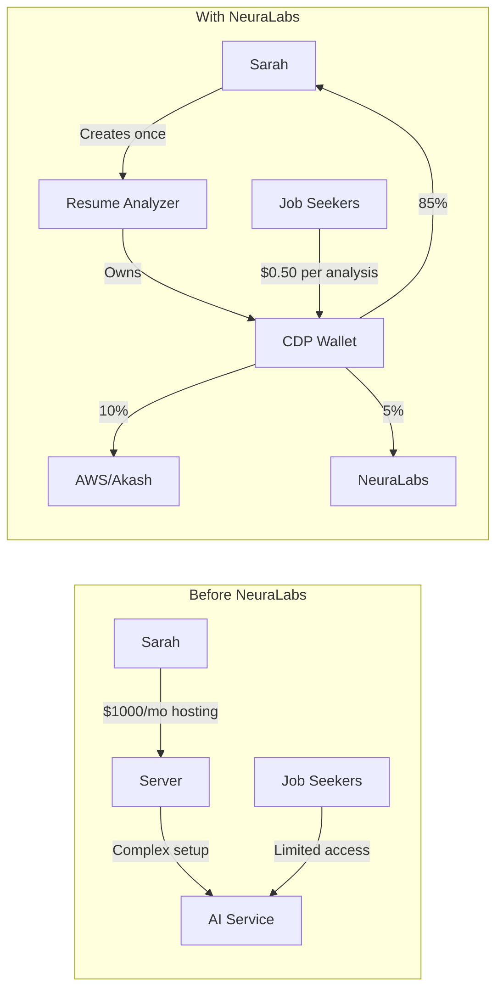

**Results:**
- 🚀 Deployment: 2 hours vs 2 weeks
- 💰 Costs: $0 upfront vs $1000
- 📈 Revenue: Direct 85% vs Platform 70%
- 🌍 Reach: Global vs Regional

### 2. Enterprise AI Migration

```javascript
// Before: Centralized AI with privacy concerns
const oldSystem = {
    deployment: "AWS only",
    dataExposure: "High",
    costs: "$50K/month",
    control: "Limited"
};

// After: Hybrid NeuraLabs deployment
const neuralabsSystem = {
    deployment: "AWS Bedrock + On-prem Akash",
    dataExposure: "Zero - encrypted flows",
    costs: "Pay-per-use, 70% reduction",
    control: "Full ownership via NFTs"
};
```

### 3. AI-to-AI Economy

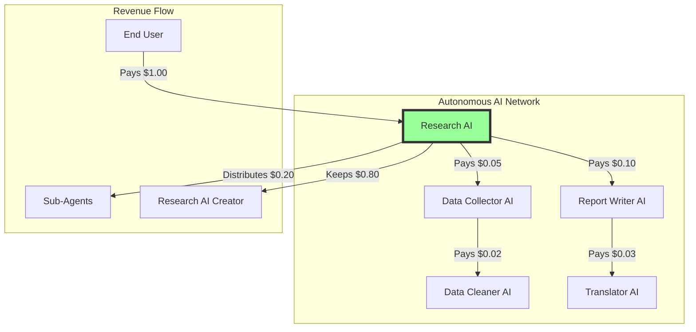

---

## 🗺️ Roadmap

### Phase 1: Foundation (Q4 2024) ✅
- [x] Core smart contracts on Base
- [x] CDP wallet integration
- [x] X402 payment protocol
- [x] AWS Bedrock integration
- [x] Visual flow builder

### Phase 2: Intelligence Layer (Q1-Q2 2025) 🚧
- [ ] Agent-to-agent communication protocol
- [ ] Multi-agent workflow orchestration
- [ ] Advanced X402 payment routing
- [ ] Cross-chain agent deployment
- [ ] Enhanced AWS model selection

### Phase 3: Ecosystem Expansion (Q3-Q4 2025) 📋
- [ ] Decentralized agent marketplace
- [ ] CDP wallet delegation features
- [ ] Advanced monetization models
- [ ] Governance token launch
- [ ] Enterprise partnerships

### Phase 4: The Singularity (2026+) 🚀
- [ ] Self-improving AI agents
- [ ] Autonomous agent creation
- [ ] Million-agent networks
- [ ] New economic paradigms

---

## 🛠️ Technical Specifications

### Smart Contract Addresses (Base Sepolia)

```javascript
const contracts = {
    MasterAccessControl: "0x...",
    NFTContract: "0x...",
    NFTAccessControl: "0x...",
    Monetization: "0x...",
    UserAgentWallet: "0x...",
    NFTAgentWallet: "0x..."
};
```

### Performance Metrics

| Metric | Value | vs Traditional |
|--------|-------|----------------|
| Agent Creation Time | <2 minutes | 95% faster |
| Transaction Cost | $0.01 | 97% cheaper |
| Time to Revenue | Immediate | 30 days faster |
| Global Availability | 100% | No restrictions |
| Uptime | 99.99% | Enterprise grade |

### Security Features

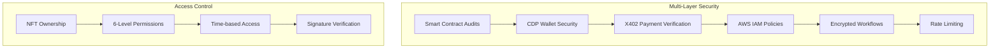

---

## 🤝 Join the Revolution

### For Developers
- 💻 Build AI agents without infrastructure
- 💰 Earn from every interaction
- 🌍 Deploy globally in minutes
- 🔧 Use familiar tools (Node.js, Python)

### For Enterprises
- 🔒 Keep data completely private
- 💸 Pay only for what you use
- 🚀 Scale instantly with demand
- 📊 Full cost transparency

### For Users
- 🎯 Access specialized AI services
- 💳 Micro-payments via X402
- 🔍 Transparent pricing
- ⚡ Instant access


## 🏆 Why NeuraLabs Wins

### Best Use of Coinbase CDP
- **First platform** enabling AI agents with autonomous wallets
- **Innovative dual-wallet architecture** for security
- **Seamless integration** with Base chain
- **Novel use case** pushing CDP boundaries

### Best Use of X402
- **Micropayment orchestration** at unprecedented scale
- **NeuraLedger** solving the pre-authorization challenge
- **6-to-1 transaction reduction** via intelligent batching
- **Real-world utility** for AI monetization

### Best Use of AWS Bedrock
- **Decentralized access layer** for enterprise AI
- **Multi-model orchestration** with cost optimization
- **Hybrid architecture** combining AWS with Akash
- **Democratizing access** to advanced AI models

---

<div align="center">

### 🚀 **Ready to Build the Future of AI?**

[**Get Started**](https://app.neuralabs.org) | [**Read Docs**](https://docs.neuralabs.org) | [**Join Discord**](https://discord.gg/neuralabs)

**NeuraLabs** - Where AI Agents Become Autonomous Economic Entities

*Powered by Coinbase CDP, X402, AWS Bedrock, and Base Chain*

</div>