# NFT Monetization System - Detailed Documentation

## Table of Contents
1. [System Architecture Overview](#system-architecture-overview)
2. [Contract Interaction Flows](#contract-interaction-flows)
3. [Detailed Contract Specifications](#detailed-contract-specifications)
4. [State Transitions](#state-transitions)
5. [Security Model](#security-model)
6. [Integration Guide](#integration-guide)

## System Architecture Overview

The NFT Monetization System consists of 6 interconnected smart contracts that work together to provide a comprehensive IP monetization platform.

### High-Level Architecture

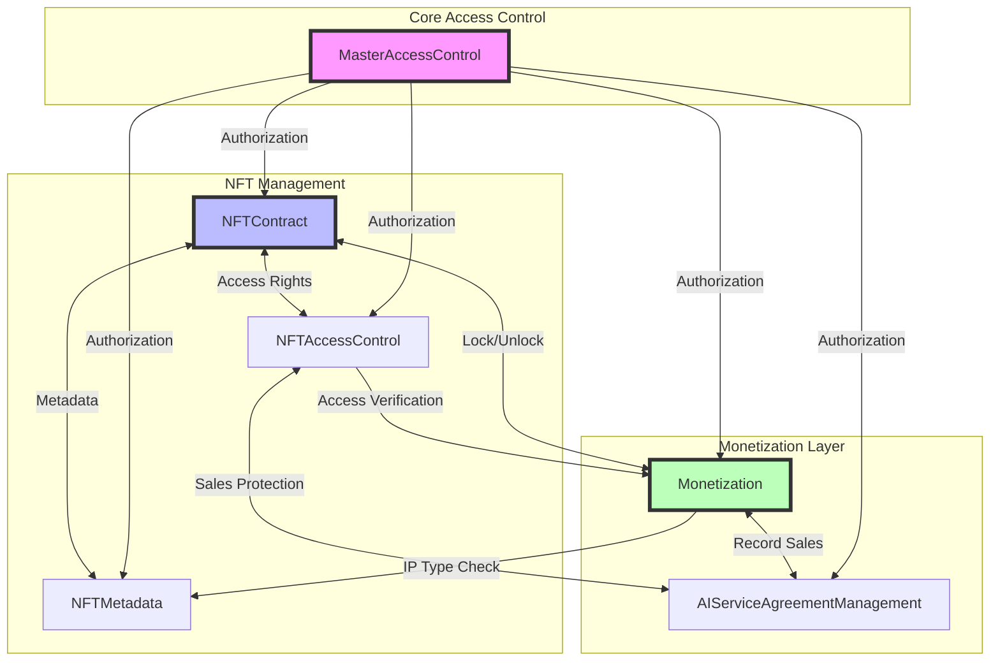

## Contract Interaction Flows

### 1. NFT Creation and Setup Flow

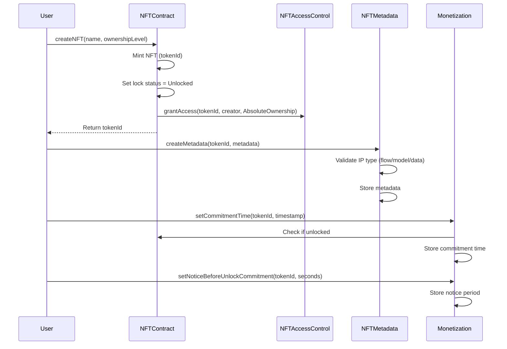

### 2. Monetization Enable Flow

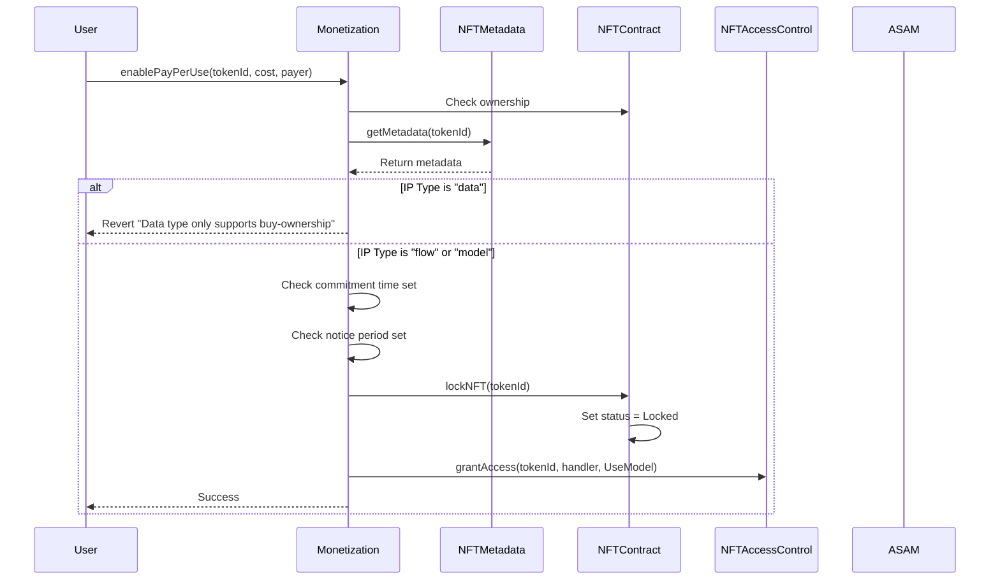

### 3. Purchase Access Flow

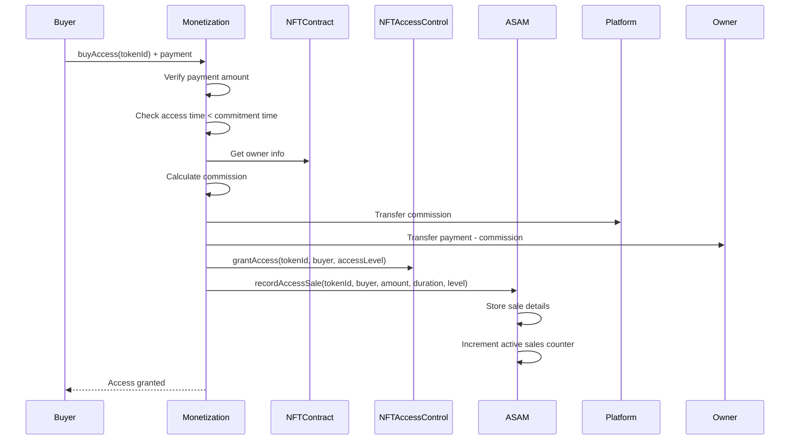

### 4. Buy Ownership Flow (with Lock Protection)

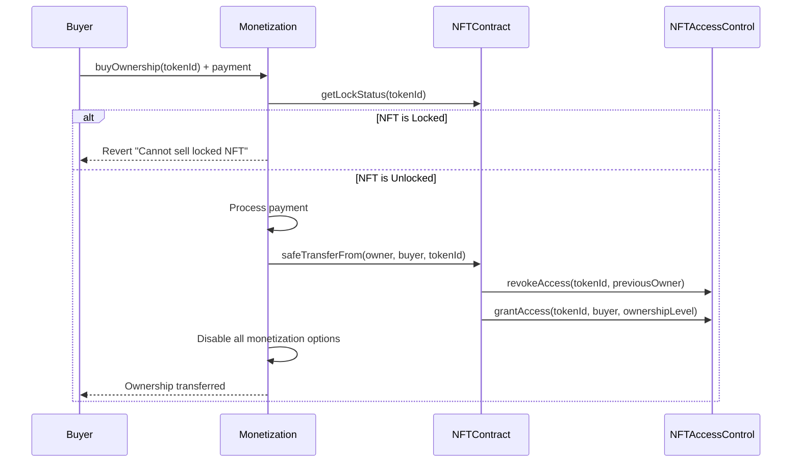

### 5. Unlock Process Flow

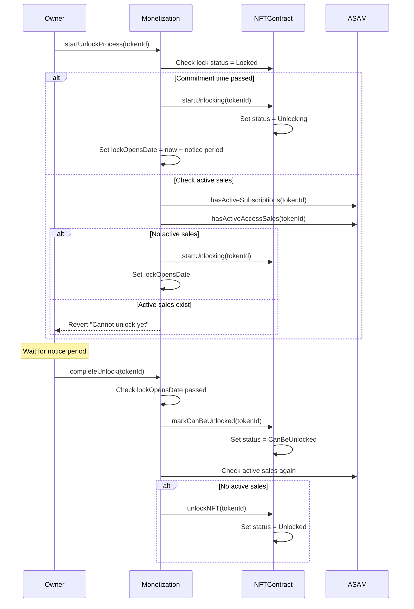

### 6. Access Revocation with Sales Protection

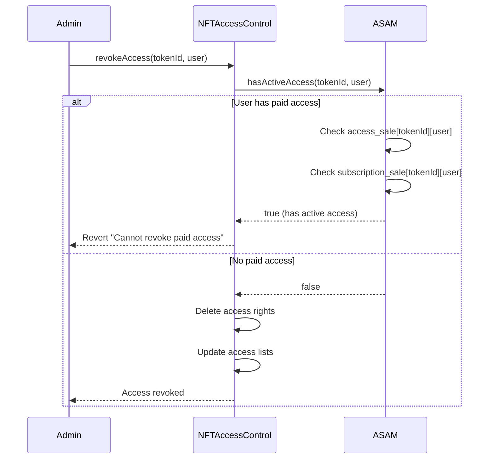

## Detailed Contract Specifications

### 1. MasterAccessControl

**Purpose**: Central authorization hub for all cross-contract calls.

**Key Functions**:
- `grantAccess(address _contract, address _caller)`: Grant permission for caller to access contract
- `revokeAccess(address _contract, address _caller)`: Revoke permission
- `grantSelfAccess(address _addressToGrant)`: Contract grants access to itself
- `hasAccess(address _contract, address _caller)`: Check if caller has access
- `selfCheckAccess(address _addressToCheck)`: Contract checks if address has access to it

**State Variables**:
- `mapping(address => mapping(address => bool)) accessRights`: Nested mapping of permissions

### 2. NFTContract

**Purpose**: Core NFT implementation with locking mechanism.

**Lock States**:
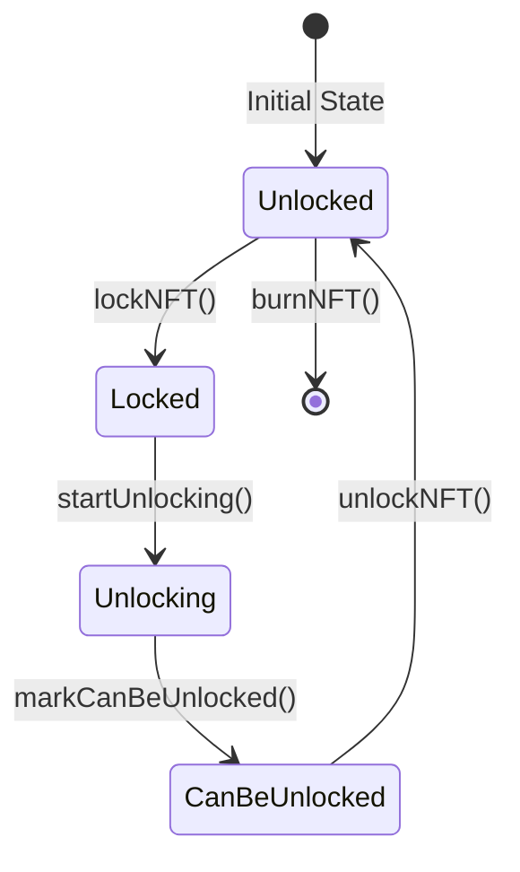

**Key Functions**:
- `createNFT(string _name, uint8 _levelOfOwnership)`: Mint new NFT
- `burnNFT(uint256 _tokenId)`: Destroy NFT (only when unlocked)
- `lockNFT(uint256 _tokenId)`: Lock NFT for monetization
- `transferNFT(uint256 _tokenId, address _to)`: Transfer NFT (only when unlocked)

**State Variables**:
- `mapping(uint256 => NFTInfo) nfts`: NFT information
- `mapping(uint256 => LockStatus) locked`: Lock status per NFT
- `uint256 totalSupply`: Total minted NFTs

### 3. NFTAccessControl

**Access Levels**:
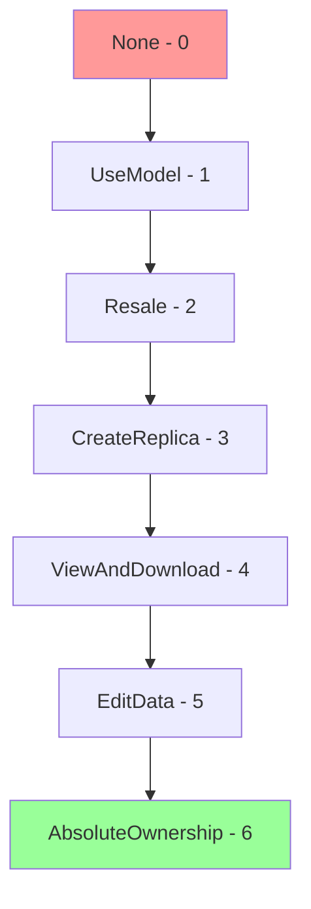

**Key Functions**:
- `grantAccess(uint256 _nftId, address _user, AccessLevel _level)`: Grant access
- `revokeAccess(uint256 _nftId, address _user)`: Revoke access (with sales protection)
- `setMaxAccessLevel(uint256 _nftId, AccessLevel _level)`: Set maximum grantable level
- `checkMinimumAccess(uint256 _nftId, address _user, AccessLevel _level)`: Verify access

**State Variables**:
- `mapping(uint256 => mapping(address => AccessLevel)) nftAccess`: User access levels
- `mapping(uint256 => AccessLevel) defaultAccessLevel`: Default access per NFT
- `mapping(uint256 => AccessLevel) maxAccessLevel`: Maximum access per NFT

### 4. NFTMetadata

**Purpose**: Manage IP-specific metadata with type validation.

**IP Type Restrictions**:
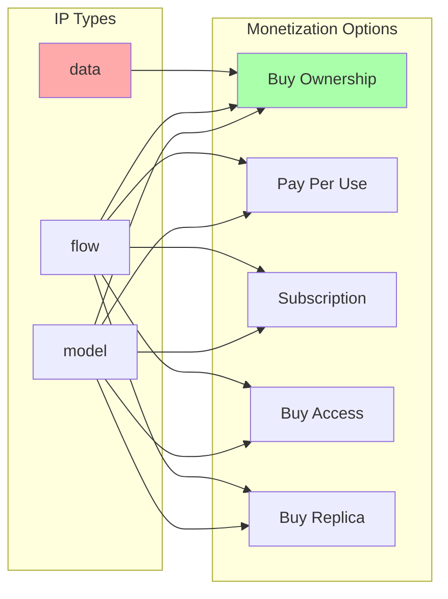

**Key Functions**:
- `createMetadata(uint256 _nftId, Metadata _metadata)`: Create metadata entry
- `updateMetadata(uint256 _nftId, Metadata _metadata)`: Update (requires EditData access)
- `replicateNFT(uint256 _nftId, uint256 _replicaNFTId)`: Copy metadata for replica

**Metadata Structure**:
```solidity
struct Metadata {
    string image;
    string intellectual_property_type; // "flow", "model", or "data"
    bool encrypted;
    string encryption_id;
    string intellectual_property_id;
    string intellectual_property_storage; // "neuralabs", "neuralabs-decentralized", "custom"
    string md5;
    string version;
}
```

### 5. AIServiceAgreementManagement

**Purpose**: Track and protect paid access rights.

**Key Functions**:
- `recordAccessSale(uint256 _nftId, address _user, uint256 _amount, uint256 _duration, AccessLevel _level)`: Record purchase
- `recordSubscriptionSale(uint256 _nftId, address _user, uint256 _amount, uint256 _duration)`: Record subscription
- `hasActiveAccess(uint256 _nftId, address _user)`: Check if user has paid access
- `batchReevaluate(uint256 _nftId, address[] _users)`: Cleanup expired access

**State Variables**:
- `mapping(uint256 => mapping(address => AccessSaleDetails)) access_sale`: Access purchases
- `mapping(uint256 => mapping(address => SubscriptionDetails)) subscription_sale`: Subscriptions
- `mapping(uint256 => uint256) total_active_access_sales`: Active sales counter
- `mapping(uint256 => uint256) total_active_subscriptions`: Active subscription counter

### 6. Monetization

**Purpose**: Handle all monetization models and payment flows.

**Monetization Options Binary Representation**:
```
Bit 0: Pay-per-use
Bit 1: Subscription
Bit 2: Buy-access
Bit 3: Buy-ownership
Bit 4: Buy-replica

Example: 10101 = Pay-per-use + Buy-access + Buy-replica enabled
```

**Key Functions**:
- `enablePayPerUse/Subscription/BuyAccess/BuyOwnership/BuyReplica()`: Enable options
- `disablePayPerUse/Subscription/BuyAccess/BuyOwnership/BuyReplica()`: Disable options
- `buyOwnership(uint256 _nftId)`: Purchase NFT (requires unlocked)
- `buyReplica(uint256 _nftId)`: Purchase replica NFT
- `buyAccess(uint256 _nftId)`: Purchase temporary access
- `setAllMonetizationOptions()`: Composite function for batch configuration

**State Variables**:
- `mapping(uint256 => uint8) monetization_combination`: Enabled options bitmap
- `mapping(uint256 => PayPerUseStruct) payPerUseData`: Pay-per-use config
- `mapping(uint256 => SubscriptionStruct) subscriptionData`: Subscription config
- `mapping(uint256 => BuyAccessStruct) buyAccessData`: Buy-access config
- `mapping(uint256 => BuyOwnershipStruct) buyOwnershipData`: Buy-ownership config
- `mapping(uint256 => BuyReplicaStruct) buyReplicaData`: Buy-replica config
- `mapping(uint256 => uint256) commitmentTime`: Lock commitment timestamp
- `mapping(uint256 => uint256) noticeBeforeUnlockCommitment`: Notice period
- `mapping(uint256 => uint256) lockOpensDate`: Unlock process start time

## State Transitions

### NFT Lifecycle State Machine

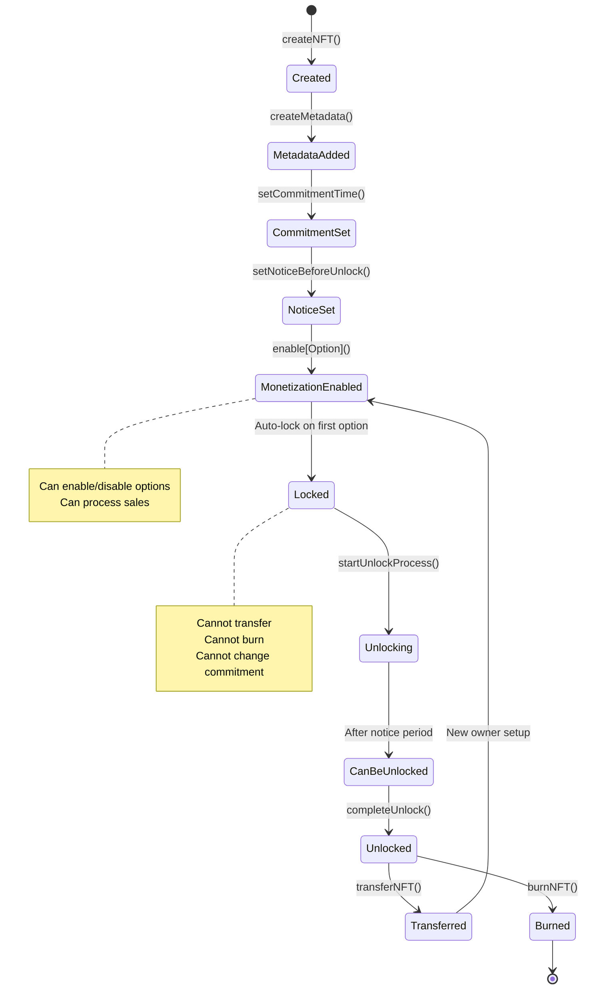

### Access Level Progression

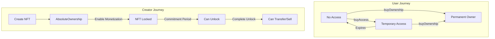

## Security Model

### 1. Authorization Hierarchy

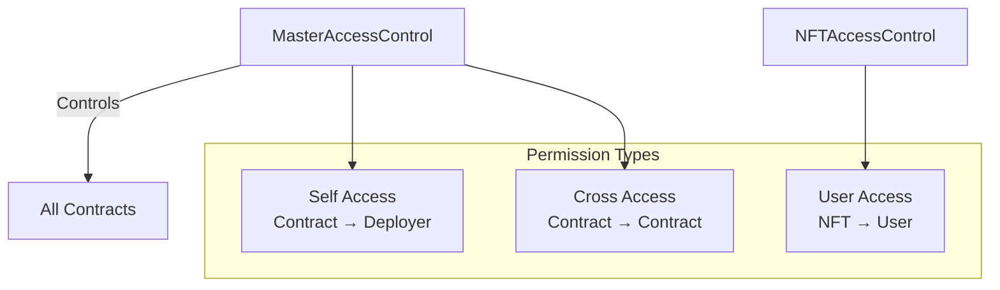

### 2. Sales Protection Mechanism

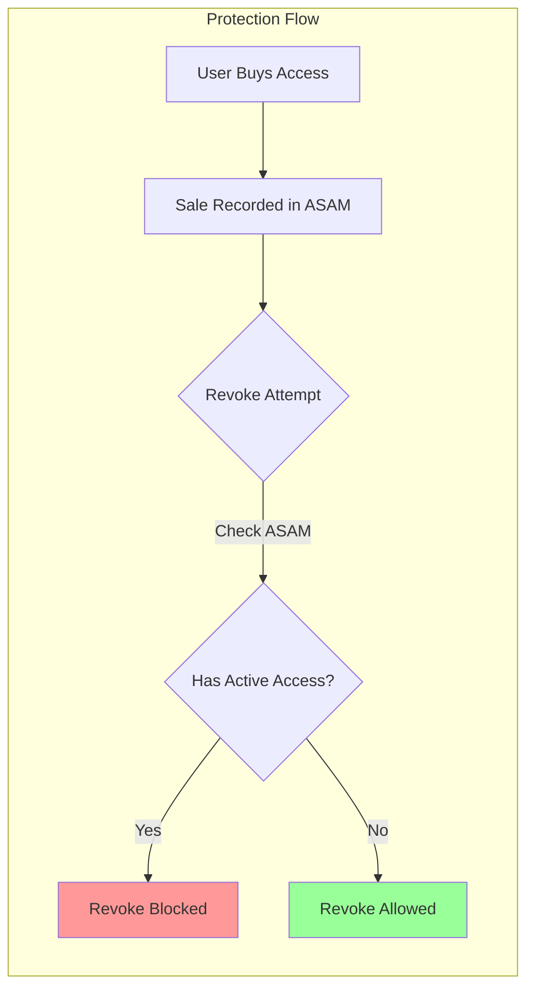

### 3. Lock Protection States

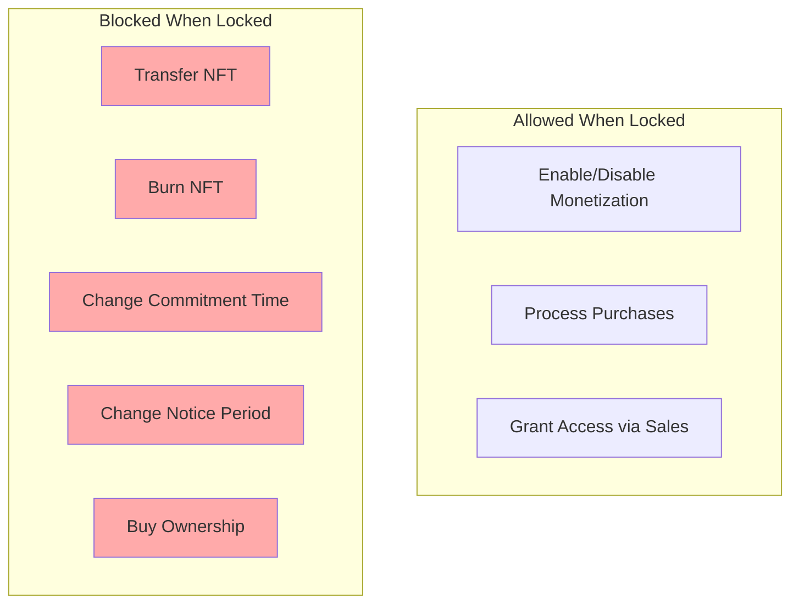

## Integration Guide

### 1. Basic NFT Creation

```javascript
// 1. Create NFT
const tx1 = await nftContract.createNFT("AI Model v1", 6);
const tokenId = tx1.logs[0].args.tokenId;

// 2. Add metadata
const metadata = {
    image: "ipfs://Qm...",
    intellectual_property_type: "model",
    encrypted: false,
    encryption_id: "",
    intellectual_property_id: "model-001",
    intellectual_property_storage: "neuralabs",
    md5: "d41d8cd98f00b204e9800998ecf8427e",
    version: "1.0.0"
};
await nftMetadata.createMetadata(tokenId, metadata);
```

### 2. Enable Monetization

```javascript
// Set commitment (required for most options)
const futureDate = Math.floor(Date.now() / 1000) + (365 * 24 * 60 * 60); // 1 year
await monetization.setCommitmentTime(tokenId, futureDate);
await monetization.setNoticeBeforeUnlockCommitment(tokenId, 7 * 24 * 60 * 60); // 7 days

// Enable options
await monetization.enablePayPerUse(tokenId, 
    ethers.utils.parseUnits("10", 6), // $10 USDC
    owner.address // owner pays platform fees
);

await monetization.enableBuyOwnership(tokenId,
    ethers.utils.parseEther("1"), // 1 ETH
    6 // Full ownership level
);
```

### 3. Purchase Flow

```javascript
// Buy access
await monetization.buyAccess(tokenId, {
    value: ethers.utils.parseEther("0.1")
});

// Buy ownership (only if unlocked)
await monetization.buyOwnership(tokenId, {
    value: ethers.utils.parseEther("1")
});
```

### 4. Unlock Process

```javascript
// Start unlock
await monetization.startUnlockProcess(tokenId);

// Wait for notice period...

// Complete unlock
await monetization.completeUnlock(tokenId);
```

## Best Practices

1. **Always Set Commitment Before Monetization**: For pay-per-use, subscription, and buy-access
2. **Check IP Type**: Data type only supports buy-ownership
3. **Monitor Lock Status**: Cannot sell ownership of locked NFTs
4. **Track Active Sales**: Use AIServiceAgreementManagement to monitor active users
5. **Plan Unlock Strategy**: Consider notice period for user communication

## Error Messages

Common revert messages and their meanings:

- `"Data type only supports buy-ownership"`: Trying to enable restricted option on data IP
- `"Cannot sell locked NFT - commitment active"`: Attempting buy-ownership on locked NFT
- `"Cannot revoke paid access"`: Trying to revoke access from user with active purchase
- `"Commitment time not set"`: Enabling option without setting commitment
- `"Cannot change commitment while locked"`: Attempting to modify commitment on locked NFT
- `"Access time exceeds commitment"`: Buy-access duration extends beyond commitment period

## Gas Optimization Tips

1. Use `setAllMonetizationOptions()` for batch configuration
2. Minimize storage writes by planning monetization setup
3. Use `batchReevaluate()` for cleaning up multiple expired accesses
4. Consider commitment periods to reduce lock/unlock transactions

## Future Enhancements

1. **Dynamic Pricing**: Implement price curves based on demand
2. **Revenue Sharing**: Multi-party revenue distribution
3. **Subscription Tiers**: Multiple subscription levels with different benefits
4. **Access Delegation**: Allow access holders to delegate temporarily
5. **Batch Operations**: More batch functions for gas efficiency

## Viewing Diagrams

### Mermaid Diagrams
The Mermaid diagrams in this documentation can be viewed using:
- GitHub/GitLab (automatically renders in markdown)
- Mermaid Live Editor: https://mermaid.live/
- VS Code with Mermaid extension
- Any markdown viewer with Mermaid support

### Graphviz Diagram
To generate the comprehensive system diagram from `contracts-diagram.dot`:

```bash
# Generate PNG
dot -Tpng contracts-diagram.dot -o contracts-diagram.png

# Generate SVG (scalable)
dot -Tsvg contracts-diagram.dot -o contracts-diagram.svg

# Generate PDF
dot -Tpdf contracts-diagram.dot -o contracts-diagram.pdf
```

Online viewer: https://dreampuf.github.io/GraphvizOnline/

The Graphviz diagram shows:
- All contracts with their state variables, functions, and events
- All structs and enums with their fields
- Contract-to-contract references (blue arrows)
- Function calls between contracts (green arrows)
- Authorization relationships (red dashed arrows)
- Data storage relationships (dotted arrows)